# Adventures in Network Automation

***Disclaimer: The creators of GNS3 no longer recommend using Dynamips' Cisco IOS images, since the devices that use those images are no longer supported by Cisco. They recommend using more up-to-date images, such as QEMU or those available through Cisco's Virtual Internet Routing Lab (VIRL). However, since this tutorial is only a general introduction to network automation using Python, we will use the freely-available Dynamips images.***

***In addition, Cisco Packet Tracer, while an excellent tool, is not suitable for our purposes, since it cannot interact with the host or integrated development environments (IDEs) on those hosts.***

## Introduction

Recently, for personal and professional reasons, I've delved into programming networking devices from within and without. Normally, in order to interact with a device like a switch, you must connect to it physically, via a serial or Ethernet cable. Once connected, you would access the command-line interface (CLI), and enter commands manually or upload a script, usually written in Cisco's Tool Command Language (TCL).

This is fine if you have one switch or router, but if you have dozens or hundreds of devices, this can become a full-time job. Wouldn't it be easier to write an application, let's say in Python, that can connect to a device and enter the commands for you? The answer is yes; you can write such a script, especially with Python, using modules such as subprocess and pexpect.

The bad news is that, normally, to test the script, you will need a physical device. You just can't download an Internetwork Operating System (IOS) image, and then interact with it using a hypervisor like VirtualBox. However, there are some great tools, like the Graphical Network Simulator-3 (GNS3), which can virtualize IOS images. Also, with a little tweaking, they can let you test your code against a virtual network device.

This tutorial is broken down into three parts:

- [Installing GNS3 in CentOS](#installing-gns3-in-centos "Installing GNS3")
- [Setting up the environment](#setting-up-the-environment "Setting up the environment")
- [Running the Labs](#running-the-labs "Running the Labs")

>**NOTE** - Many thanks to David Bombal, Paul Browning, and many other incredible coders and network gurus (you know who you are :thumbsup: ).

-----

## Installing GNS3 in CentOS

Installing GNS on [Windows](https://docs.gns3.com/docs/getting-started/installation/windows/ "GNS3 Windows Install"), or Linux operating systems, such as [Ubuntu or Debian](https://docs.gns3.com/docs/getting-started/installation/linux "GNS3 Linux Install"), is pretty straight forward. However, we will be using CentOS 7.9 for labs and demos in this repository, and GNS3 doesn't work straight-out-of-the-box with Fedora, Red Hat Linux (RHEL), and CentOS.

>**NOTE** - Why are we using CentOS? First, this is my daily OS. Second...
>- Approximately [20% of servers running Linux](https://w3techs.com/technologies/details/os-linux "Usage statistics of Linux for websites") use Fedora, Red Hat Linux (RHEL), and CentOS. RHEL is also second, behind Microsoft, in [paid enterprise OS subscriptions](https://www.idc.com/getdoc.jsp?containerId=US46684720 "Worldwide Server Operating Environments Market Shares, 2019").
>- Many companies and government agencies, such as NASA and the DOD, use Red Hat Linux (i.e., the "commercial" version of CentOS), since it is a trusted OS which is [Protection Profile (PP) compliant](https://www.commoncriteriaportal.org/products/ "Certified Common Criteria Products").

To get started, download the latest ISO image of CentOS 7 from [the CentOS download page](https://www.centos.org/download/ "Download") and install it in a virtual machine. If you are not familiar with creating virtual machines, we recommend you review the instructions on the following sites:

- [Oracle VM VirtualBox User Manual](https://www.virtualbox.org/manual/ "Oracle VM VirtualBox User Manual")

- [VMware Workstation Player Documentation](https://docs.vmware.com/en/VMware-Workstation-Player/index.html "VMware Workstation Player Documentation")

- [Getting Started with Virtual Machine Manager](https://access.redhat.com/documentation/en-us/red_hat_enterprise_linux/7/html/virtualization_getting_started_guide/chap-virtualization_manager-introduction "Getting Started with Virtual Machine Manager")

>**NOTE** - The focus of this tutorial is to use GNS3 to test our scripts, not to install operating systems or create virtual machines. There are many websites dedicated to setting up OS's and VM's, and we will not repeat those steps here.
> 
>However, whether you use VMWare or VirtualBox, make sure you:
> 
> **1. Allocate 2048 MB of RAM to your machine  (e.g., in VirtualBox...):**
> 
>    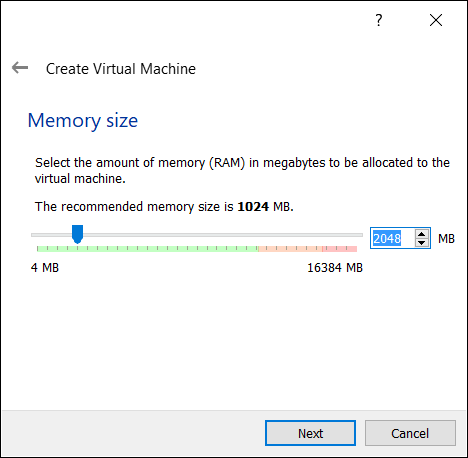
>  
> **2. Allocate at least 16 GB of hard disk space to your machine (e.g., in VirtualBox...):**
> 
>    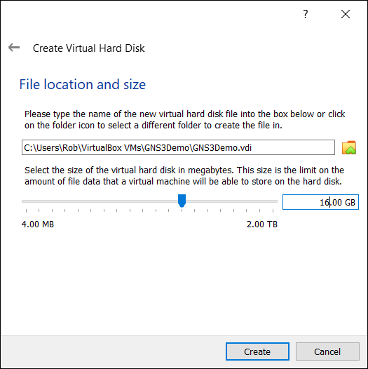**
> 
> **3. Allocate two processors to your machine (e.g., in VirtualBox...):**
> 
>    
> 
> **4. Add another network interface to your system (e.g., in VirtualBox...):**
> 
>    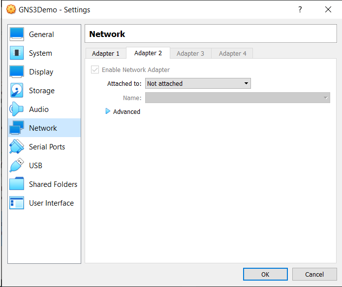
>
> You can make the same changes in VMWare in the **Settings** window:
> 
>    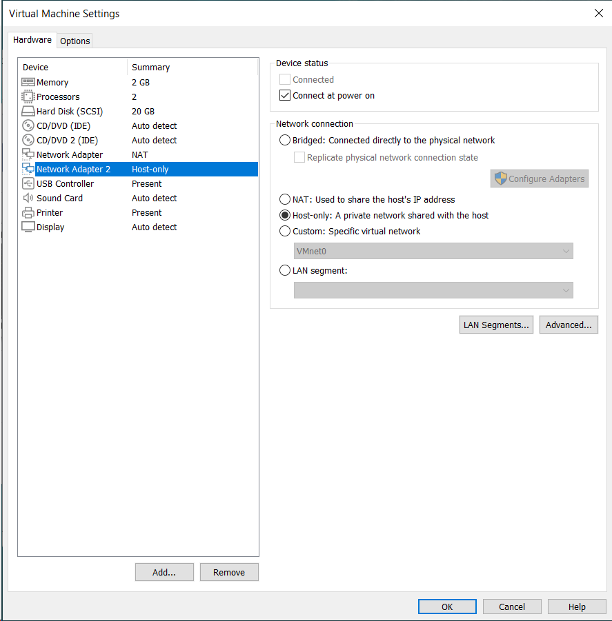

Once you have finished creating your virtual machine, open a Terminal and clone this repository:

```
git clone https://github.com/garciart/Automation.git
```

Now for the setup: There are a lot of good posts and articles on how to install GNS3 on CentOS. However, each of them are slightly different, so, to make life easier, we distilled them into [one executable shell script](gns3_setup_centos "CentOS Setup Script"). Before you run the script, we recommend you open it in an editor and look at its commands and comments, so you can become familiar with GNS3's dependencies.

Using elevated privileges, make the shell script executable, run it, and check the output for any errors.:

```
sudo chmod +x gns3_setup_centos
sudo ./gns3_setup_centos > setup_output.txt
grep -i -e "error" -e "warning" setup_output.txt
```

If there are no errors, continue to [Setting up the environment](#setting-up-the-environment "Setting up the environment").

-----

## Setting up the environment

In order for your code to interact with the switch, you will need to connect your host computer with virtual devices in GNS3. To do so in Linux, you will need to create a TUN/TAP interface for GNS3 to use to connect to your host interface using a bridge.

>**NOTE** - TUN (network TUNnel) works with IP packets (Layer 3/Network). TAP (network TAP) works with Ethernet frames (Layer 2/Data).

Before we start, here's the subnet info for the network:

```
- Network Address: 192.168.1.0/24
- Subnet Mask: 255.255.255.0 (ff:ff:ff:00)
- GNS3 Host Device IP Address: 192.168.1.1/32
- Gateway IP Address: 192.168.1.1/32
- Total Number of Hosts: 256
- Number of Usable Hosts: 254
- Usable IP Range: 192.168.1.1 - 192.168.1.254
- Broadcast Address: 192.168.1.255
- IP Class and Type: C (Private)
```

When you ran [gns3_setup_centos](gns3_setup_centos "CentOS Setup Script"), you installed bridge-utils, a utility which creates and manages Ethernet bridge devices. We will use this utility to connect the host machine and GNS3 virtual devices.

The [gns3_run](gns3_run "CentOS Run Script") script sets up your environment, runs GNS3, and resets your environment when you exit GNS3. Please open the gns3_run file and examine it. This script does the following:

1. Identifies the Ethernet interface and its IP address (if assigned).
2. Creates a network TAP interface: GNS3 devices will connect to this interface. By the way, ```ethtool -i tap0``` and ```ip link show type tap``` will both report the tap (Layer 2) is a tun (Layer 3), but ```ip tuntap show``` will report the interface correctly as a tap. Check out [Paul Gorman's Linux Bridges and Virtual Networking](https://paulgorman.org/technical/linux-bridges-and-virtual-networking.txt.html "Paul Gorman's Linux Bridges and Virtual Networking") for more details.
3. Creates a network bridge that connects the host machine to the tap interface.
4. Starts GNS3.

>**NOTE** - You will not be able to connect to the Internet through your Ethernet interface until you exit GNS3

When you exit GNS3, the script will close the bridge and tap, and reset the network, which will allow you to econnect to the Internet, etc.

## Running the Labs

Start GNS3 by inputting ```sudo gns3_run``` in a Terminal.

>**NOTE** - You must run the script. Do not run GNS3 from the Application menu or clicking the GNS3 icon.

When GNS3 starts, you will see a dialog asking you to create a new project. Enter "g001_ping" in the ***Name*** textbox and click the **OK** button.

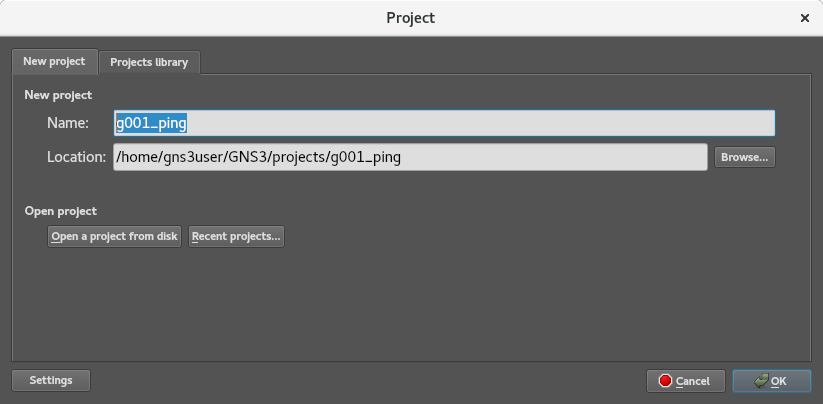

In the main menu, click **Edit -> Preferences** or <kbd>Ctrl</kbd>+<kbd>Shift</kbd>+<kbd>P</kbd>. The **Preferences** window should appear. In the left-hand menu, click on **Server** and ensure that the value in the ***Host Binding*** textbox is "192.168.1.1":


Once again, look on the left-hand menu in the **Preferences** window, and select **Dynamips -> IOS Routers:**

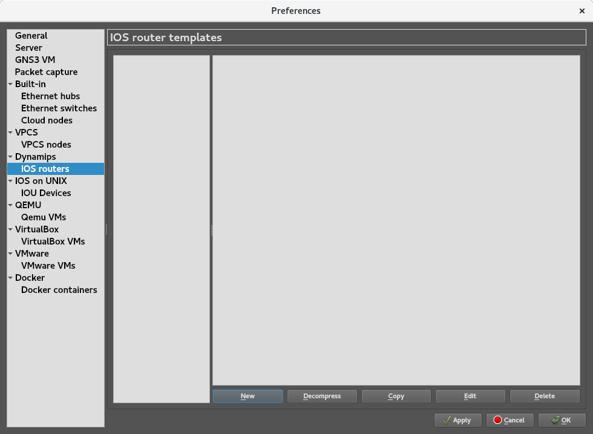

When the **New IOS Router Template window** appears, ensure ***New Image*** is selected, and then click **Browse**:

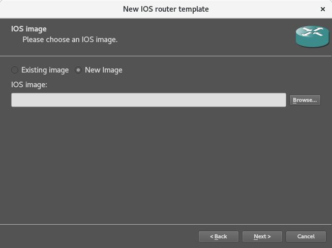

When you installed GNS3, you also downloaded the IOS image for a Cisco 3745 Router. Select the image when the file window appears:

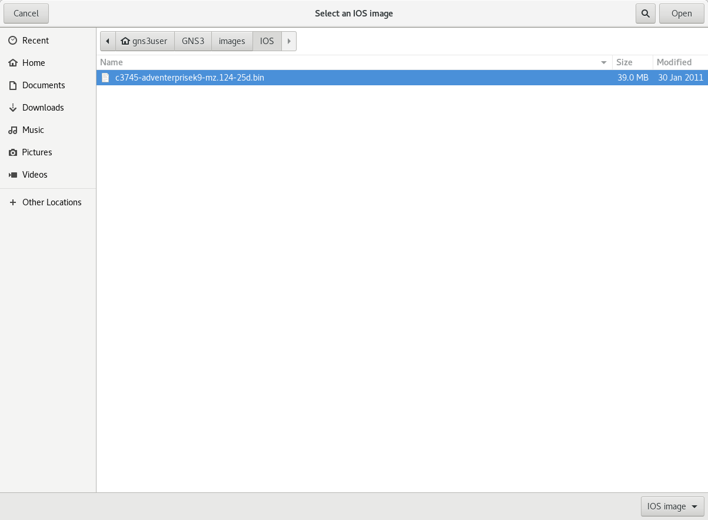

When asked, "Would like to decompress this IOS image?", click **Yes**:


Back in the **New IOS Router Template window**, click **Next >:**


When it comes to customizing the router's details, use the default values for both the name and memory and click on **Next >** for each:

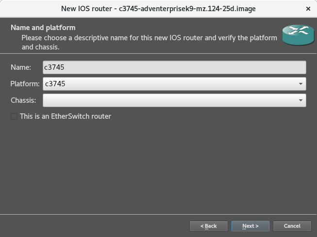


Here is the back of a 3745 Router. As you can see, it has two (2) built-in FastEthernet interfaces (GT96100-FE), which correspond to FastEthernet 0/0 and 0/1, as well as an auxilary and console port. By the way, when you interact with the router through the terminal in GNS3, you are using a simulated connection to the console port.

The 3745 also has three WAN interface card (WIC) slots along the top of the router, and four (4) network module slots on the bottom half of the router.

For Network adapters, you have three options; we want all three for training. Place one option each in an open slot:

- NM-1FE-TX 1-Port 10/100 Mbps Fast Ethernet Network Module
- NM-4T 4 port Synchronous Serial Network Module
- NM-16ESW 16-Port 10/100 Mbps Fast Ethernet Switch (EtherSwitch) Module


For WAN Interface Cards (WICs), we have two options. Once again, place an option in each of the first open slots:

- WIC-1T One port serial (DB60, Cisco 60-pin "5-in-1" connector )
- WIC-2T Two port serial (DB60, Cisco 60-pin "5-in-1" connector )

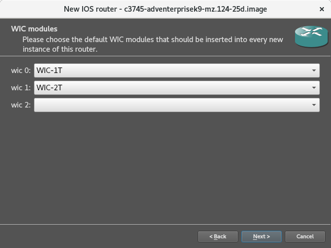

Finally, accept the default Idle-PC value and click **Finish:** 


The IOS template's details appear. Note the memory for the Personal Computer Memory Card International Association (PCMCIA) disk0. This is the device's CompactFlash (CF) memory card, used to store the system image, configuration files, and more. It cannot be 0, and the cards hold 32, 64, and 128 MiB of memory. Click on **Edit** to change it:

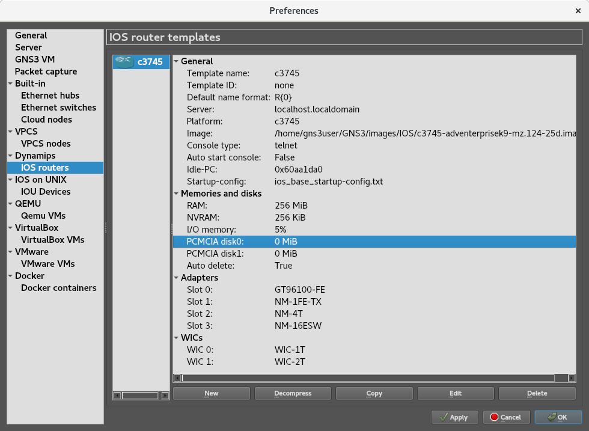

Set the PCMCIA disk0 to 32 MiB and click **OK**:

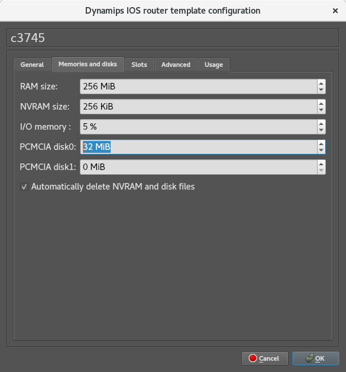

This brings you back to the template details page; click **OK** to return to the main window:

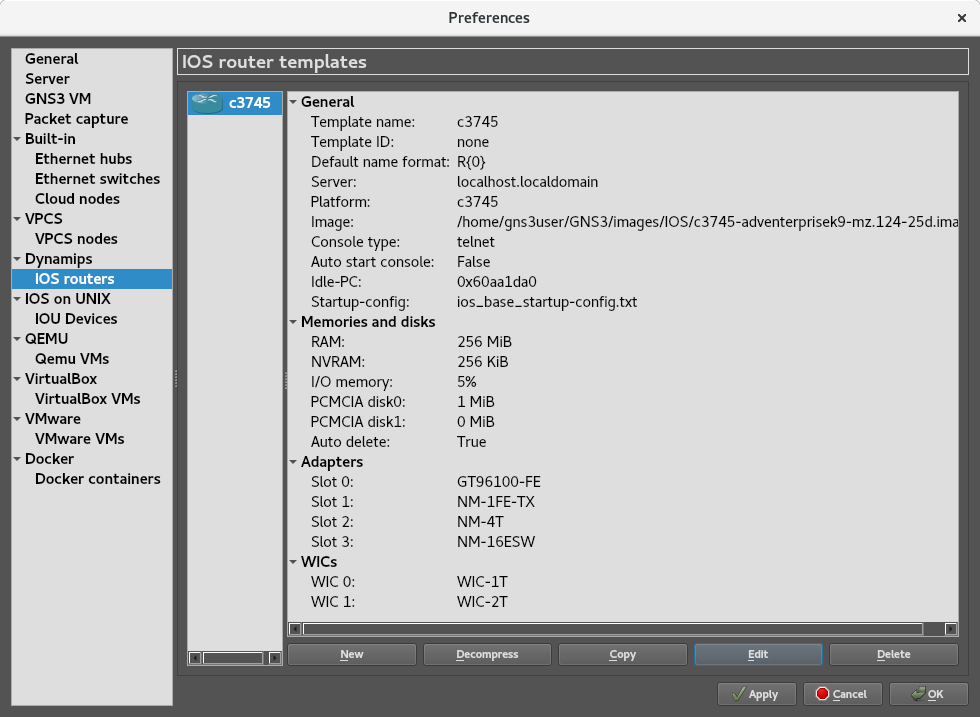

Once you blah, blah, blah...

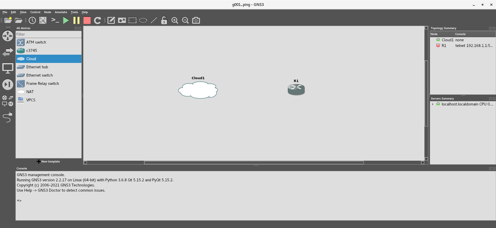

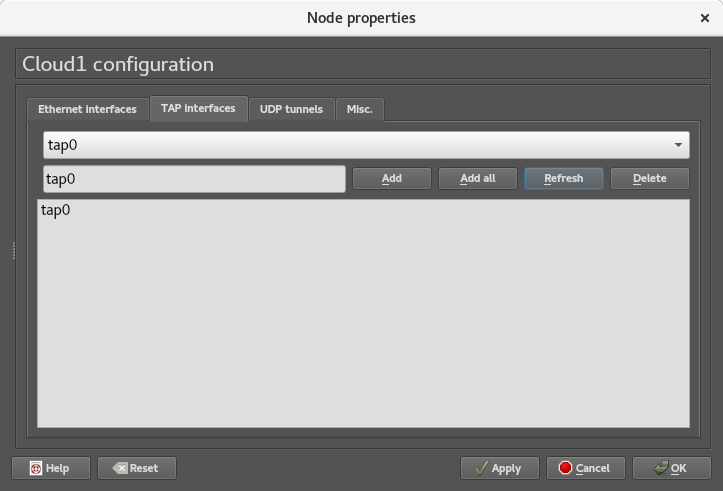

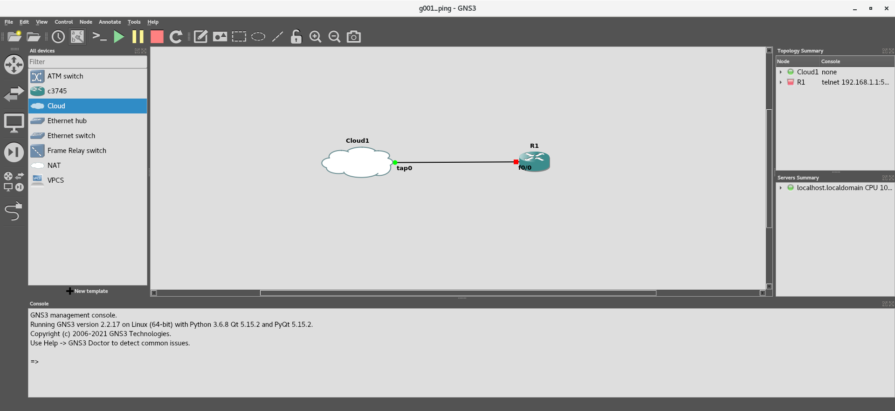

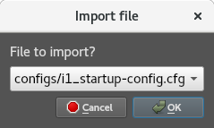

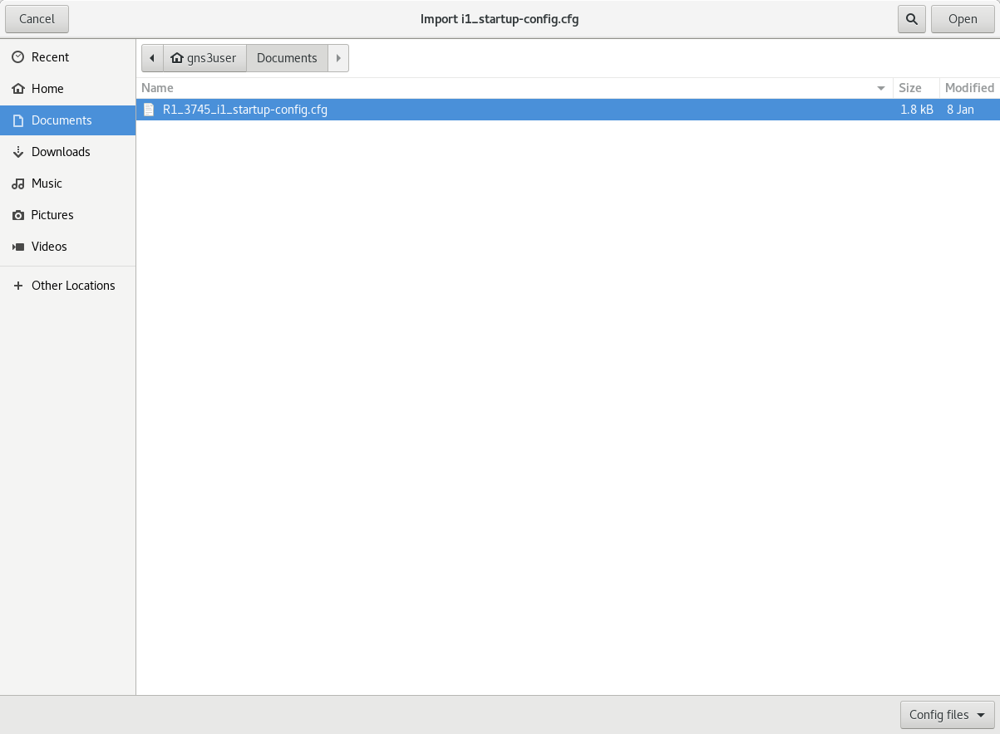

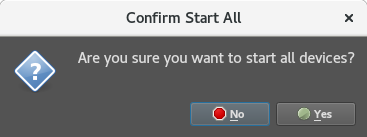

One way to detect hosts on your subnet is to run ```nmap -sP 192.168.1.1-255```:


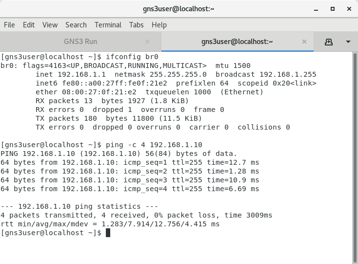

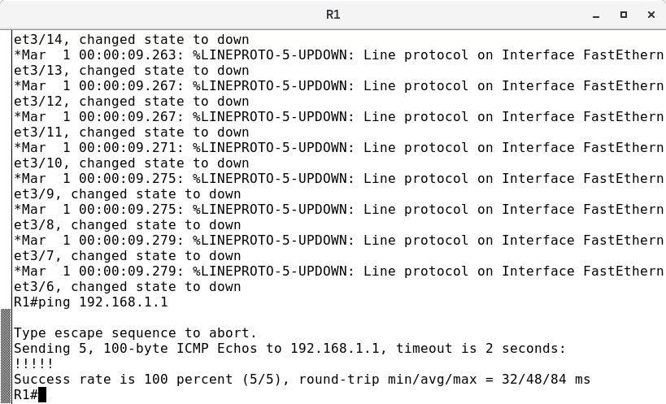

>**NOTE** - We will use nmap and other CLI tools in this tutorial. Therefore, open a terminal and ensure you have installed the following packages:
> ```
> - sudo yum -y install net-tools
> - sudo yum -y install nmap
> - sudo yum -y install lsof
> ```

