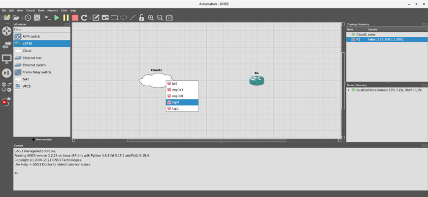
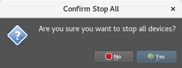

# Adventures in Network Automation


***Disclaimer: The creators of GNS3 no longer recommend using Dynamips' Cisco IOS images, since the devices that use those images are no longer supported by Cisco. They recommend using more up-to-date images, such as those available through Cisco's Virtual Internet Routing Lab (VIRL). However, since this tutorial is only a general introduction to network automation using Python, we will use freely available Dynamips images.***

***In addition, Cisco Packet Tracer, while an excellent tool, is a network emulator, not a simulator, and is too limited for our purposes.***

## Introduction

Normally, to interact with certain network devices, such as unconfigured Layer-3 switches, you would need to connect to them physically, via serial or Ethernet cables, through their console or auxilary ports. Once connected, you would use their command line interface (CLI) to enter Internetwork Operating System (IOS) commands manually, or to upload a script written in a specialized language, such as Cisco's Tool Command Language (TCL). This is fine if you have one device. However, manually configuring dozens or hundreds of devices can be exhausting.

Any chance we can automate the process using Python? The answer is yes, and you can write such a script using modules such as subprocess and pexpect.

The bad news is that to test the script, you would need a physical device. You just cannot run an IOS image in a hypervisor like VirtualBox. However, there are some great tools, like Graphical Network Simulator-3 (GNS3), which can run IOS images. Also, with a little tweaking, you can run your code against the virtual network device from a Terminal or an IDE.

This tutorial is broken down into three parts:

- [Installing GNS3 in CentOS](#installing-gns3-in-centos "Installing GNS3")
- [Setting up the environment](#setting-up-the-environment "Setting up the environment")
- [Running the Labs](#running-the-labs "Running the Labs")

>**NOTE** - Thanks to David Bombal, Paul Browning, and many other incredible network gurus and coders (you know who you are :thumbsup: ).

-----

## Installing GNS3 in CentOS

Installing GNS3 on [Windows](https://docs.gns3.com/docs/getting-started/installation/windows/ "GNS3 Windows Install") or certain Linux operating systems, such as [Ubuntu or Debian](https://docs.gns3.com/docs/getting-started/installation/linux "GNS3 Linux Install"), is pretty straight forward. However, we will be using CentOS 7.9 for the labs and demos in this repository, and GNS3 does not work straight-out-of-the-box with Fedora, Red Hat Linux (RHEL), or CentOS.

>**NOTE** - Why are we using CentOS for this tutorial?
>- I use Fedora, RHEL, and CentOS, and I could not find a tutorial that captured all the steps to get GNS3 working on a Fedora family OS.
>- It is harder, and it will help you can become familiar with GNS3's dependencies if you want to use another OS.
>- Approximately [20% of servers running Linux](https://w3techs.com/technologies/details/os-linux "Usage statistics of Linux for websites") use Fedora, RHEL, and CentOS. RHEL is also second, behind Microsoft, in [paid enterprise OS subscriptions](https://www.idc.com/getdoc.jsp?containerId=US46684720 "Worldwide Server Operating Environments Market Shares, 2019").
>- Many companies and government agencies, such as NASA and the DOD, use Red Hat Linux (i.e., the "commercial" version of CentOS), since it is a trusted OS which is [Protection Profile (PP) compliant](https://www.commoncriteriaportal.org/products/ "Certified Common Criteria Products").

To get started, download the latest ISO image of CentOS 7 from [the CentOS download page](https://www.centos.org/download/ "Download") and install it in a virtual machine. If you are not familiar with creating virtual machines, I recommend you review the instructions on the following sites:

- [Oracle VM VirtualBox User Manual](https://www.virtualbox.org/manual/ "Oracle VM VirtualBox User Manual")

- [VMware Workstation Player Documentation](https://docs.vmware.com/en/VMware-Workstation-Player/index.html "VMware Workstation Player Documentation")

- [Getting Started with Virtual Machine Manager](https://access.redhat.com/documentation/en-us/red_hat_enterprise_linux/7/html/virtualization_getting_started_guide/chap-virtualization_manager-introduction "Getting Started with Virtual Machine Manager")

>**NOTE** - The focus of this tutorial is to use GNS3 to test our scripts, not to install operating systems or create virtual machines. There are many websites dedicated to setting up OS's and VM's, and I will not repeat those steps here. However, whether you use VirtualBox or VMWare, make sure you:
> 
> 1. Allocate **2048 MB** of RAM for your machine (e.g., in VirtualBox...):
> 
>    
>  
>2. Allocate at least **16 GB** of hard disk space for your machine (e.g., in VirtualBox...):
> 
>    **
> 
>3. Allocate **two** processors for your machine (e.g., in VirtualBox...):
> 
>    
> 
>4. Add another network interface to your machine. Make it private and isolate it from the outside world, by connecting it to a **LAN segment** in VMWare or attaching it to an **Internal Network** in VirtualBox (shown):
> 
>    
>
> In VMWare, you can make all the above changes to your VM in **Settings**:
> 
>    
>
> In Virtual Machine Manager, you can make all the above changes to your VM in **Virtual Machine Details**:
> 
>    

Once you have finished creating your virtual machine, spin it up, and update and upgrade the OS.

```
sudo yum -y update
sudo yum -y upgrade
```

>**NOTE** - If you are using VirtualBox, I recommend installing Guest Additions, which will make interacting with your VM easier, by adding features like cut-and-paste, shared folders, etc. Check out Aaron Kili's great article, ["Install VirtualBox Guest Additions in CentOS, RHEL & Fedora."](https://www.tecmint.com/install-virtualbox-guest-additions-in-centos-rhel-fedora/ "Install VirtualBox Guest Additions in CentOS, RHEL & Fedora") Just remember to execute the following commands in a Terminal before running the Guest Additions' ISO:
>
>```
>sudo yum -y install epel-release
>sudo yum -y update
>sudo yum install make gcc kernel-headers kernel-devel perl dkms bzip2
>sudo export KERN_DIR=/usr/src/kernels/$(uname -r)
>```
>
>Do not forget to reboot your VM as well.

Next, open a Terminal and install git:

```sudo yum -y install git```

Clone this repository; it should appear in your home directory (e.g., ```/home/gns3user/Automation```):

```
git clone https://github.com/garciart/Automation.git
```

Now for the setup: There are a few good posts and articles on how to install GNS3 on CentOS. However, each of them is slightly different, so, to make life easier, I distilled them into [one executable shell script](gns3_setup_centos "CentOS Setup Script"). Before you run the script, I highly recommend you open it in an editor and look at its commands and comments, so you can become familiar with GNS3's dependencies.

Using elevated privileges, make the shell script executable and run it, piping any errors and the output into a text file. This will take a while:

>**NOTE** - Do not run any commands as **root**! Otherwise, some files and executables will end up in the wrong place or have the wrong permissions, and GNS3 will not work.

```
cd Automation
sudo chmod +x gns3_setup_centos
./gns3_setup_centos 2>&1 | tee setup_output.txt # DO NOT RUN AS SUDO 
grep -i -e "error" -e "warning" setup_output.txt
```

Installation will take a few minutes, but once it is complete, check the text file for any errors. Correct any errors or, if necessary, delete the VM and start over again. Otherwise, if there are no errors, you can delete the output file and reboot the VM:

```
rm setup_output.txt
sudo reboot now
```

>**NOTE** - For the labs, you will need images for the Cisco 3745 Multiservice Access Router, with Advanced Enterprise Services, and the Cisco 7206 VXR Router. Both are older routers, but their IOS's are available for download, and they are sufficient for our labs.
>
>The [gns3_setup_centos](gns3_setup_centos "CentOS Setup Script") shell script attempts to download the files from the [tfr.org](http://tfr.org "tfr.org") website, but if that fails, you can download the files from other websites, and I have also included them in this repository in the ```IOS``` folder. Just remember to place them in the ```/GNS3/images/IOS``` folder in your home directory (e.g., ```/home/gns3user/GNS3/images/IOS```). Also, remember to check the md5 hash after downloading, to ensure you have not downloaded malware; you can use our included script, [file_hash_check.py](file_hash_check.py), to check the hashes). Here are the names of the files, their hashes, and some additional information:
>
>- **Cisco 3745 Multiservice Access Router:**
>   * IOS version 12.4.25d (Mainline):
>   * File Name: c3745-adventerprisek9-mz.124-25d.bin
>   * MD5: 563797308a3036337c3dee9b4ab54649
>   * Flash Memory: 64MB
>   * DRAM: 256MB
>   * End-of-Sale Date: 2007-03-27
>   * End-of-Support Date: 2012-03-27
>   * IOS End-of-Support Date: 2016-01-31
>- **Cisco 7206 VXR 6-Slot Router:**
>   * IOS version 12.4.25g (Mainline):
>   * File Name: c7200-a3jk9s-mz.124-25g.bin
>   * MD5: 3a78cb61831b3ef1530f7402f5986556
>   * Flash Memory: 64MB
>   * DRAM: 256MB
>   * End-of-Sale Date: 2012-09-29 
>   * End-of-Support Date: 2017-09-30
>   * IOS End-of-Support Date: 2016-01-31

-----

## Setting up the environment

Before we start, here is the subnet information for the network:

```
- Network Address: 192.168.1.0/24
- Subnet Mask: 255.255.255.0 (ff:ff:ff:00)
- GNS3 Host Device IP Address: 192.168.1.1/32
- Gateway IP Address: 192.168.1.1/32
- Total Number of Hosts: 256
- Number of Usable Hosts: 254
- Usable IP Range: 192.168.1.2 - 192.168.1.254
- Broadcast Address: 192.168.1.255
- IP Class and Type: C (Private)
```

Now, let us create a virtual network. As we stated before, we will create virtual network devices in GNS3, which will exist within their own virtual local area network (VLAN). However, writing and debugging Bash and Python scripts in GNS3 is cumbersome and limited. Our host machine is much more capable, with its Terminal and IDEs. We want to code on our host machine and test the code in GNS3. Therefore, we want to connect the GNS3 VLAN to our host machine. To do this, we will:

- Create a virtual network bridge.
- Assign the bridge an IPv4 address.
- Connect the host's isolated network interface to the bridge.
- Create a Layer 2 TAP interface.
- Connect the router to the bridge through the TAP.
- Bind the GNS3 VLAN gateway to the bridge.

>**NOTE** - All of the following commands are contained in an interactive, executable script named ["gns3_run"](gns3_run "Automated GNS3 configuration and executable"). I highly recommend that you first setup and run GNS3 manually, so you can understand how GNS3 bridging works. Afterwards, you can use the script to start GNS3.

First, we need to find out the name of our host machine's isolated Ethernet network adapter. We do not want to use the primary interface, since we will be overwriting the IP address and other information.

Per RedHat's [Consistent Network Device Naming conventions](https://access.redhat.com/documentation/en-us/red_hat_enterprise_linux/7/html/networking_guide/ch-consistent_network_device_naming "Consistent Network Device Naming"), network interfaces for Ethernet will start with ```em```, ```en```, and ```et``` (e.g., ```em1```, ```eth0```, etc.) in CentOS. Open a Terminal and look for your isolated network interface, by inputting ```ip addr show label e*```:

```
$ ip addr show label e*

2: enp0s3: <BROADCAST,MULTICAST,UP,LOWER_UP> mtu 1500 qdisc pfifo_fast state UP group default qlen 1000
    link/ether 08:00:27:cf:12:5e brd ff:ff:ff:ff:ff:ff
    inet 10.0.2.15/24 brd 10.0.2.255 scope global noprefixroute dynamic enp0s3
       valid_lft 81729sec preferred_lft 81729sec
    inet6 fe80::91fc:27c4:403f:848f/64 scope link noprefixroute 
       valid_lft forever preferred_lft forever
3: enp0s8: <BROADCAST,MULTICAST,UP,LOWER_UP> mtu 1500 qdisc pfifo_fast state UP group default qlen 1000
    link/ether 08:00:27:87:ff:e2 brd ff:ff:ff:ff:ff:ff
```

Look for the interface that does not have an IP address (i.e., no inet). In this case, the isolated interface is named ```enp0s8```. 

We will now "bridge" the host machine and GNS3 together:

```
sudo brctl addbr br0 # Create the bridge
sudo ip tuntap add tap0 mode tap # Add the tap device
sudo ip link set tap0 up promisc on # Configure the tap
sudo brctl addif br0 tap0 # Add the tap to the bridge
sudo ip link set enp0s8 up promisc on # Configure selected Ethernet connection
sudo brctl addif br0 enp0s8 # Add the selected Ethernet connection to the bridge
sudo ip link set br0 up # Start the bridge
sudo ip addr add 192.168.1.1/24 dev br0
sudo brctl stp br0 on # Enable Spanning Tree Protocol (STP)
```

>**NOTE** - Why do we need a TAP? Why not just connect to the bridge? Yes, for a simple network, like our example, you can connect directly to the bridge. However, later, we will create subnetworks in GNS3, separating their connections through Layer 2 TAP interfaces, so just get into the habit of connecting to a TAP instead of directly to the bridge.

Check the configuration and the bridge by inputting ```ip addr show dev br0``` and ```brctl show br0```:

```
$ ip addr show dev br0

8: br0: <BROADCAST,MULTICAST,UP,LOWER_UP> mtu 1500 qdisc noqueue state UP group default qlen 1000
    link/ether 08:00:27:87:ff:e2 brd ff:ff:ff:ff:ff:ff
    inet 192.168.1.1/24 scope global br0
       valid_lft forever preferred_lft forever
    inet6 fe80::a00:27ff:fe87:ffe2/64 scope link 
       valid_lft forever preferred_lft forever

$ brctl show br0

bridge name  bridge id          STP enabled  interfaces
br0          8000.08002787ffe2  yes          enp0s8
                                             tap0
```

Start GNS3:

```
gns3
```

>**NOTE** - If you run into any errors, exit GNS3 and check your IP addresses.

A Setup wizard will appear. Select **Run appliances on my local computer** and click **Next >**:


>**NOTE** - If a **Project** window appears instead, click on **Cancel**. select **Edit** -> **Preferences**, or press <kbd>Ctrl</kbd>+<kbd>Shift</kbd>+<kbd>P</kbd>. Select **Server** and make sure that **Enable local server** is checked and **Host binding** is set to ```192.168.1.1```:
>
>

In **Local sever configuration**, under **Host binding**, select the bridge's IP address (```192.168.1.1```):


After a few minutes, a **Local server status** pop-up dialog will appear, letting you know that a "Connection to the local GNS3 server has been successful!". Click **Next >** to continue:


At the **Summary** pop-up dialog, click **Finish**:


>**NOTE** - If you run into any errors or you have to exit or restart GNS3, select **Edit** -> **Preferences**, or press <kbd>Ctrl</kbd>+<kbd>Shift</kbd>+<kbd>P</kbd>. Select **Server** and make sure that **Enable local server** is checked and **Host binding** is set to ```192.168.1.1```: 
>
>

When the GNS3 graphical user interface reappears, click **Edit -> Preferences** or <kbd>Ctrl</kbd>+<kbd>Shift</kbd>+<kbd>P</kbd>. The **Preferences** window should appear. In the left-hand menu, click on **Dynamips -> IOS Routers** and click on **New:**


When the **New IOS Router Template** pop-up dialog appears, ensure ***New Image*** is selected, and then click **Browse**:


When you installed GNS3, you also downloaded the IOS image for a Cisco 3745 Router. Select the image when the **Select an IOS image** file dialog appears and click **Open** at the top:


When asked, "Would like to decompress this IOS image?", click **Yes**:


Back in the **New IOS Router Template** dialog window, click **Next >:**


When it comes to customizing the router's details, use the default values for both the name and memory and click on **Next >** for each:


The **Network adapters** dialog appears, prefilled with a built-in adapter:


The Cisco 3745 is a customizable router, capable of supporting different network configurations, based on the selected cards and modules. Here is the back of a Cisco 3745 Router:


 In between the power supply modules, from top to bottom, the 3745 has:
 
 - Three (3) WAN interface card (WIC) slots (uncovered in the image).
 - Built-in Modules:
     - A console (labeled in light blue) and an auxilary port (labeled in black) on the left. By the way, when you interact with the router directly in a GNS3 console, you are using a simulated connection to the Console port.
     - A CompactFlash (CF) memory card slot in the center, which can use 32, 64, and 128 MiB memory cards.
     - The **GT96100-FE Network Adapter**, with two (2) built-in FastEthernet interfaces (GT96100-FE), which correspond to FastEthernet 0/0 and 0/1 (labeled in yellow), on the right. Our Python scripts will interact with the router through Ethernet ports.
- Four (4) network adapter module slots (two uncovered and two covered in the image).

For network adapter modules, you have three options:

- NM-1FE-TX 1-Port 10/100 Mbps Fast Ethernet Network Adapter


- NM-4T 4 port Synchronous Serial Network Adapter


- NM-16ESW 16-Port 10/100 Mbps Fast Ethernet Switch (EtherSwitch) Adapter


Did you notice that, aside from the built-in GT96100-FE module, there are six open slots, but you can only use four of them? That is because the 3745 only has four open slots for network adapters.

Fill open slots 1, 2, and 3 with a module and click on **Next >**:


The **WIC modules** dialog appears:


For WAN Interface Cards (WICs), we have three slots, but only two options:

- WIC-1T One port serial module (DB60, Cisco 60-pin "5-in-1" connector )


- WIC-2T Two port serial module (DB60, Cisco 60-pin "5-in-1" connector )


 
 Go ahead and place a WIC in open slots 1 and 2, and leave slot 3 empty. Click on **Next >** when done:


>**NOTE** - For more information on these modules and other configurations, check out the [Cisco 3700 Series Router Hardware](https://www.cisco.com/web/ANZ/cpp/refguide/hview/router/3700.html "
CISCO 3700 Series Router Hardware View") page. If the site becomes unavailable, I have also included [a pdf copy here.](/3700.pdf "CISCO 3700 Series Router Hardware View")

Finally, accept the default Idle-PC value and click **Finish:** 


The IOS template's details appear. Note the memory for the Personal Computer Memory Card International Association (PCMCIA) disk0. This is the device's CompactFlash (CF) memory card, used to store the system image, configuration files, and more. It cannot be 0, and the cards hold 32, 64, and 128 MiB of memory. Click on **Edit** to change it:


In the **Dynamips IOS router template configuration** pop-up dialog, select the **Memories and disks** tab. Set the PCMCIA disk0 to 64 MiB and click **OK**:


This brings you back to the template details window. Take a moment to look it over; there is some good information here, such as the name of the startup configuration file, which you will edit later:


## Running the Labs

>**Note** - If you like, check out [https://docs.gns3.com/docs/using-gns3/beginners/the-gns3-gui](https://docs.gns3.com/docs/using-gns3/beginners/the-gns3-gui "The GNS3 GUI") to learn the different parts of the GNS3 Graphical User Interface (GUI).

Now that you have finished setting up your lab environment, click on **File** ->  **New blank project**, or press  <kbd>Ctrl</kbd>+<kbd>N</kbd>, to create a new project. If GNS3 is not running, make sure that you have set up your network bridge, and start GNS3 by inputting ```gns3``` in a Terminal (the **Project** window should appear).

A pop-up dialog will appear, asking you to create a new project. Enter ```lab000``` in the ***Name*** textbox and click the **OK** button.


Click **View** -> **Docks** -> **All templates**:


All the devices you can use in your lab will appear in a docked window next to the Devices Toolbar on the right.

>**NOTE** - In the **View** dropdown menu, there are several options that will make your life easier. I recommend both **Snap to grid**, which will keep your workspace orderly, and **Show/Hide interface labels**, which will allow you to see your connection points at a glance.

Select a **Cloud** and place it in the Workspace, then select a **c3745** and place it on the Workspace. Note that the router's hostname is **R1**:


Select the "Add a link" icon at the bottom of the Devices Toolbar:


Move the cross-hair over **Cloud1** and select the TAP interface name (e.g., **tap0**):



Connect the other end to the built-in **FastEthernet0/0** port in **R1**:


Notice that, while the devices are connect, nothing is being transmitted, because the router is not on:


Let us fix that. Click on the green **Play** icon in the GNS3 Toolbar above the Workspace. When asked, "Are you sure you want to start all devices?", click **Yes**:


You will see that all the nodes are now green, both in the Workspace and the Topology Summary in the top left hand corner:


By the way, note the console information for R1 in the the Topology Summary. This means that, even though it does not have an IP address yet, you can connect to R1 using Telnet through the Console port on the back of the 3745.

Let us do that now: open a Terminal and input the following command:

```
telnet 192.168.1.1 5001
```

You should see output similar to the following:

```
Trying 192.168.1.1...
Connected to 192.168.1.1.
Escape character is '^]'.
Connected to Dynamips VM "R1" (ID 1, type c3745) - Console port
Press ENTER to get the prompt.
*Mar  1 00:00:04.627: %LINK-5-CHANGED: Interface FastEthernet0/0, changed state to administratively down
...
*Mar  1 00:00:07.499: %LINEPROTO-5-UPDOWN: Line protocol on Interface FastEthernet3/6, changed state to down

R1#
```

You are now connected to the router through the Console port. Before we continue, let us take care of some housekeeping.

When we first configured the router, we gave it a default IOS image (c3745-adventerprisek9-mz.124-25d.bin). However, when the router first starts, it looks for an IOS image in flash memory. This is because the 3745 can store multiple IOS's in flash memory; you tell the router which one you want to use, by inputting ```boot system flash:<the IOS filename>.bin``` at a configuration prompt and saving it in the start-up configuration file. If the router does not find an IOS there, it will look in its Read-Only Memory (ROM) for a default IOS.

Our router will do this because we have not formatted our flash memory, preventing us from uploading another IOS. As a matter of fact, you may see the following error:

```
PCMCIA disk 0 is formatted from a different router or PC. A format in this router is required before an image can be booted from this device
```

In this lab, we will not need another IOS, but we do want to use our flash memory, so let us fix our memory issue, by inputting the following command:

```
format flash:
```

You will be asked to confirm the format operation twice. Press <kbd>Enter</kbd> both times:

```
Format operation may take a while. Continue? [confirm]
Format operation will destroy all data in "flash:".  Continue? [confirm]
```

You should see output similar to the following:

```
Format: Drive communication & 1st Sector Write OK...
Writing Monlib sectors.
.........................................................................................................................
Monlib write complete 
..
Format: All system sectors written. OK...

Format: Total sectors in formatted partition: 130911
Format: Total bytes in formatted partition: 67026432
Format: Operation completed successfully.

Format of flash complete

R1#
```

Input ```show flash``` to see what is in the drive:

```
No files on device
66875392 bytes available (0 bytes used)

R1#
```

Now, press <kbd>Ctrl</kbd>+<kbd>]</kbd> to leave R1 and input "q" to exit Telnet. Go back to the GNS3 GUI, click the red **Stop** icon in the GNS3 Toolbar above the Workspace. When asked, "Are you sure you want to stop all devices?", click Yes::

>Do not click on **Reload**! **Reload** will load the default settings, erasing any changes you have made. You will learn how to save configurations later.



After a few seconds, click on the green **Play** icon in the GNS3 Toolbar above the Workspace. When asked, "Are you sure you want to start all devices?", click **Yes**:


All the nodes should turn green.

## The Code:

To recap, we:

1. Accessed the device through Telnet.
2. Entered Privileged EXEC Mode
3. Formated the device's flash memory.
4. Closed the connection.

Like I stated earlier, this is easy to do for one device, but not for one hundred. Let us put these steps into a simple python script.

This is a bare-bones script that automates everything we did earlier. The heart of the script is the ```child```. Once spawned, we will use it to send commands to the device, expecting a certain result. Remember to make the script executable (i.e., ```chmod 755 lab000-telnet.py```) before running it (```python3 lab000-telnet.py```):

```
#!/usr/bin/python3
"""Lab 000: Telnet into a device and format the flash memory.
To run this lab:

* Start GNS3 by executing "gn3_run" in a Terminal window.
* Select lab000 from the Projects library.
* Start all devices.
* Make this script executable (i.e., "chmod 755 lab000-telnet.py")
* Run this script (i.e., "python3 lab000-telnet.py")
"""
from __future__ import print_function

import sys
import time

import pexpect

print("Connecting to the device and formatting the flash memory...")

# Connect to the device and allow time for any boot messages to clear
child = pexpect.spawn("telnet 192.168.1.1 5001")
time.sleep(10)
child.sendline("\r")

# Check for a prompt, either R1> (User EXEC mode) or R1# (Privileged EXEC Mode)
# and enable Privileged EXEC Mode if in User EXEC mode.
index = child.expect_exact(["R1>", "R1#", ])
if index == 0:
    child.sendline("enable\r")
    child.expect_exact("R1#")

# Format the flash memory. Look for the final characters of the following strings:
# "Format operation may take a while. Continue? [confirm]"
# "Format operation will destroy all data in "flash:".  Continue? [confirm]"
# "66875392 bytes available (0 bytes used)"
#
child.sendline("format flash:\r")
child.expect_exact("Continue? [confirm]")
child.sendline("\r")
child.expect_exact("Continue? [confirm]")
child.sendline("\r")
child.expect_exact("Format of flash complete", timeout=120)
child.sendline("show flash\r")
child.expect_exact("(0 bytes used)")

# Close Telnet and disconnect from device
child.sendcontrol("]")
child.sendline('q\r')

print("Successfully connected to the device and formatted the flash memory.")
```

Output:

```
$ python3 lab000-telnet.py

Hello, friend.
Connecting to the device and formatting the flash memory...
Successfully connected to the device and formatted the flash memory.
Script complete. Have a nice day.
```

I have also included a script with error detection in the **labs** folder, named [lab000-telnet.py](labs/lab000-telnet.py "Telnet lab"). If you want to experiment with debugging, stop the devices and run [lab000-telnet.py](labs/lab000-telnet.py "Telnet lab"). The script will fail, and provide you with detailed information on why.

**Congratulations!** You have automated a common networking task using Python. You can explore the other labs in the **labs** folder or you can exit GNS3. Remember to shut down the bridge and restart the network when you are finished:

```
sudo ip link set br0 down # Stop the bridge
sudo brctl delif br0 enp0s8 # Remove the default Ethernet connection from the bridge
sudo brctl delif br0 tap0 # Remove the tap from the bridge
sudo brctl delbr br0 # Delete the bridge
sudo ip link set tap0 down # Stop the tap
sudo ip link delete tap0 # Delete the tap
sudo ip link set enp0s8 promisc off # Reset the selected Ethernet interface
sudo systemctl restart network # Check your OS; may use service networking restart 
```

## P.S. -

As I stated before, when you installed GNS3 with my script, it added an interactive, executable script named ["gns3_run"](gns3_run "Automated GNS3 configuration and executable") to the ```/usr/bin``` folder. Now that you have learned how to setup the network environment for GNS3 manually, I recommend you use the script from now on to run GNS3. Simply type in ```gns3_run``` in a Terminal, and select the isolated Ethernet interface; enter your password, if prompted. Do not run as ```sudo```, or GNS3 will incorrectly use the ```root``` directories, instead of the user directories:

```
Setting up GNS3...
Available ethernet interfaces:
enp0s3
enp0s8
Enter an ethernet interface for GNS3 to use: enp0s8
Good to go!
[sudo] password for gns3user: 

Network interface configuration:
br0: flags=4163<UP,BROADCAST,RUNNING,MULTICAST>  mtu 1500
...
...
Bridge information:
bridge name	bridge id		STP enabled	interfaces
br0		8000.08002787ffe2	yes		enp0s8
							tap0

Starting GNS3...
```

By the way, I still recommend running GNS3 from the Terminal, instead of from the Application menu icon, so you can see any network errors or issues that may occur.
