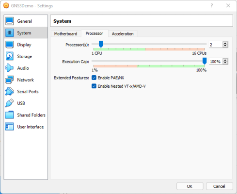
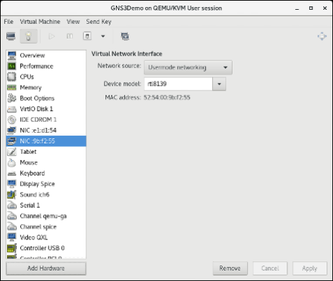
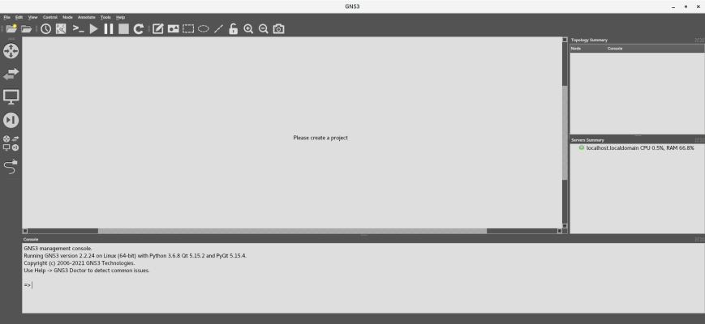
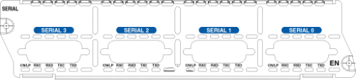
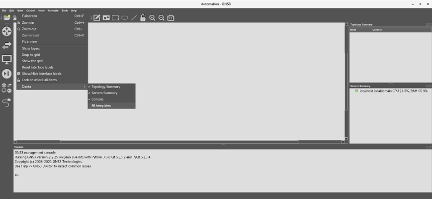

# Adventures in Network Automation


***Disclaimer: The creators of GNS3 no longer recommend using Dynamips' Cisco IOS images, since the devices that use those images are no longer supported by Cisco. They recommend using more up-to-date images, such as those available through Cisco's Virtual Internet Routing Lab (VIRL). However, since this tutorial is only a general introduction to network automation using Python, we will use the freely available Dynamips images.***

***In addition, Cisco Packet Tracer, while an excellent tool, is a network emulator, not a simulator, and not suitable for our purposes.***

## Introduction

Manually configuring a network device is not a difficult process. You simply access the device's command line interface (CLI) through its console or auxiliary port, and enter the commands manually or upload a script written in a specialized language, such as Cisco's Tool Command Language (TCL). Sometimes, though, you may accidentally skip a step or enter a wrong IP address, making the configuration process more difficult and time-consuming.

Now, imagine if you had to configure or update dozens or hundreds of devices. Chances are that you will make a few mistakes along the way. In addition, depending on the number of devices, by the time you were done, you would need to do another update!  

Can we automate the process, using a scripting language such as Python? The answer is ***yes***, but the bad news is that each time you would like to test a script, you would need to "spin-up" a physical device. This may not always be practical; in some cases, you would have to take the device (and possibly the cabinet) offline.  

However, there are some great tools, like Graphical Network Simulator-3 (GNS3), which can run Cisco Internetwork Operating System (IOS) images, and, with a little tweaking, allow you to test your code against *multiple* virtual network devices, without having to take them offline, from a Terminal or an IDE.

This tutorial is broken down into three parts:

- [Installing GNS3](#installing-gns3 "Installing GNS3")
- [Setting up the environment](#setting-up-the-environment "Setting up the environment")
- [Running the Labs](#running-the-labs "Running the Labs")

>**NOTE** - Thanks to [David Bombal](https://davidbombal.com/), [Paul Browning](https://www.amazon.com/101-Labs-CompTIA-Paul-Browning/dp/1726841294 "101 Labs"), and many other incredible network gurus and coders (you know who you are :thumbsup: ).

-----

## Installing GNS3

Installing GNS3 on [Windows](https://docs.gns3.com/docs/getting-started/installation/windows/ "GNS3 Windows Install") or certain Linux operating systems, such as [Ubuntu or Debian](https://docs.gns3.com/docs/getting-started/installation/linux "GNS3 Linux Install"), is pretty straight forward. However, we will be using CentOS 7.9 for the labs and demos in this repository, and GNS3 does not work straight-out-of-the-box with Fedora, Red Hat Linux (RHEL), or CentOS.

>**NOTE** - Why did I pick CentOS for this tutorial?
>- I use Fedora, RHEL, and CentOS, and I could not find a tutorial that captured all the steps to get GNS3 working on a Fedora family OS.
>- Many companies and government agencies, such as NASA and the DOD, use Red Hat Linux, the commercial version of CentOS, since it is a trusted OS which is [Protection Profile (PP) compliant](https://www.commoncriteriaportal.org/products/ "Certified Common Criteria Products").
>- It was hard, but fun. Plus, I got to learn GNS3's dependencies, which will allow me to install it on other OS's.

To get started, download the latest ISO image of CentOS 7 from [the CentOS download page](https://www.centos.org/download/ "Download") and install it in a virtual machine. If you are not familiar with creating virtual machines, I recommend you review the instructions on the following sites:

- [Oracle VM VirtualBox User Manual](https://www.virtualbox.org/manual/ "Oracle VM VirtualBox User Manual")

- [VMware Workstation Player Documentation](https://docs.vmware.com/en/VMware-Workstation-Player/index.html "VMware Workstation Player Documentation")

- [Getting Started with Virtual Machine Manager](https://access.redhat.com/documentation/en-us/red_hat_enterprise_linux/7/html/virtualization_getting_started_guide/chap-virtualization_manager-introduction "Getting Started with Virtual Machine Manager")

Regardless of the hypervisor you use, make sure you:

1. Allocate **2048 MB** of RAM for your machine (e.g., in VirtualBox...):


 
2. Allocate at least **16 GB** of hard disk space for your machine (e.g., in VirtualBox...):

**

3. Allocate **two** processors for your machine (e.g., in VirtualBox...):



4. Add another network interface to your machine. Make it private and isolate it from the outside world, by connecting it to a **LAN segment** in VMWare or attaching it to an **Internal Network** in VirtualBox (shown):


In VMWare, you can make all the above changes to your VM in **Settings**:


In Virtual Machine Manager, you can make all the above changes to your VM in **Virtual Machine Details**:



Once you have finished creating your virtual machine, spin it up, and update and upgrade the OS.

```
sudo yum -y update
sudo yum -y upgrade
```

>**NOTE** - If you are using VirtualBox, I recommend installing Guest Additions, which will make interacting with your VM easier, by adding features like cut-and-paste, shared folders, etc. Check out Aaron Kili's great article, ["Install VirtualBox Guest Additions in CentOS, RHEL & Fedora."](https://www.tecmint.com/install-virtualbox-guest-additions-in-centos-rhel-fedora/ "Install VirtualBox Guest Additions in CentOS, RHEL & Fedora") Just remember to execute the following commands in a Terminal before running the software on the Guest Additions' ISO:
>
>```
>sudo yum -y install epel-release
>sudo yum -y update
>sudo yum install make gcc kernel-headers kernel-devel perl dkms bzip2
>sudo reboot now
>```
>
>Do not forget to reboot your VM again after running the software on the Guest Additions' ISO.

Next, open a Terminal and install git:

```
sudo yum -y install git
```

Clone this repository; it should appear in your home directory (e.g., ```/home/gns3user/Automation```), and then enter the repository:

```
git clone https://github.com/garciart/Automation.git
cd Automation
```

Now for the setup: There are a few good posts and articles on how to install GNS3 on CentOS. However, each of them is slightly different, so, to make life easier, I distilled them into [one executable shell script](gns3_setup_centos "CentOS Setup Script"). Before you run the script, I highly recommend you look at its commands and comments, so you can become familiar with GNS3's dependencies:

>Contents of the **gns3_setup_centos** shell script:
>```
>#!/usr/bin/bash
>echo -e "Setting up GNS3..."
>echo -e "Using:"
>cat /etc/centos-release
>echo -e "Updating CentOS"
>sudo yum -y update
>sudo yum -y upgrade
># Install Python 3 and pip
>sudo yum -y install python3 # Also installs python3-setuptools
>sudo python3 -m pip install --upgrade pip
>sudo python3 -m ensurepip
>sudo yum -y install python3-devel
>sudo yum -y install python3-tools
># Install Git
>sudo yum -y install git
># Install GNS3 dependencies
>sudo yum -y groupinstall "Development Tools" # Only need gcc to run GNS3, but we will need the other tools later
>sudo yum -y install elfutils-libelf-devel # For Dynamips
>sudo yum -y install libpcap-devel # For Dynamips
>sudo yum -y install cmake # For Dynamips, VCPS, and ubridge
>sudo yum -y install glibc-static # For VCPS
>sudo yum -y install telnet # Yes, we will use Telnet
># Install Qt GUI library
>sudo yum -y install qt5-qtbase
>sudo yum -y install qt5-qtbase-devel
>sudo yum -y install qt5-qtsvg
>sudo yum -y install qt5-qtsvg-devel
># Install xterm, one of the consoles used by GNS, and resize its output
>sudo yum -y install xterm
>echo -e "! Use a truetype font and size.\nxterm*faceName: Monospace\nxterm*faceSize: 12" > ~/.Xresources
>sudo xrdb -merge ~/.Xresources
># Install GNS3
>sudo python3 -m pip install gns3-server
>sudo python3 -m pip install gns3-gui
>sudo python3 -m pip install sip # For PyQT; used to bind C++ classes with Python
>sudo python3 -m pip install pyqt5
>sudo yum -y install https://dl.fedoraproject.org/pub/epel/epel-release-latest-7.noarch.rpm # needed to install PuTTY and qemu
>sudo yum -y install putty # Get from epel
># KVM: A Linux kernel module that interacts with the virtualization features of the processor.
># QEMU: Virtualization software that emulates virtual processors and peripherals.
># QEMU-KVM: Type 1 hypervisor that runs in kernel space and QEMU: type 2 hypervisor that runs in user space
>sudo yum -y install qemu # Get from epel / Not qemu-kvm https://fedoraproject.org/wiki/How_to_use_qemu
># Install the Dynamips Cisco Emulator
>cd /tmp || exit
>git clone https://github.com/GNS3/dynamips.git
>cd dynamips || exit
>mkdir build
>cd build/ || exit
>cmake .. -DDYNAMIPS_CODE=stable
>make
>sudo make install
># Install the Virtual PC Simulator (vpcs)
>cd /tmp || exit
>sudo yum -y install svn
>svn checkout http://svn.code.sf.net/p/vpcs/code/trunk vpcs
>cd vpcs/src || exit
>./mk.sh 64
>sudo install -m 755 vpcs /usr/local/bin
># Install ubridge to connect Ethernet, TAP interfaces, and UDP tunnels, as well as capture packets.
>cd /tmp || exit
>git clone https://github.com/GNS3/ubridge.git
>cd ubridge || exit
>make
>sudo make install
>cd ~ || exit
># Get router image and configuration file
>wget -P ~/GNS3/images/IOS http://tfr.org/cisco-ios/37xx/3745/c3745-adventerprisek9-mz.124-25d.bin # Cisco 3745
>wget -P ~/GNS3/images/IOS http://tfr.org/cisco-ios/7200/c7200-a3jk9s-mz.124-25d.bin # Cisco 7206
># Used to create interfaces to connect the host to GNS3
>sudo yum -y install bridge-utils
># Install pexpect to control interactions with external devices
>sudo yum -y install pexpect # (For Python 2.7+)
>sudo python3 -m pip install pexpect # (For Python 3.6+)
># Get the script that creates a tap/loopback interface in Linux and launches GNS3
>wget -P ~/ https://raw.githubusercontent.com/garciart/Automation/master/gns3_run
># Make the start-up script executable and place it in /usr/bin
>sudo chmod 755 ~/gns3_run
>sudo mv ~/gns3_run /usr/bin/
># Optional - Modify vimrc file
>echo -e "\"My preferred vim defaults\nset tabstop=4\nset softtabstop=4\nset expandtab\nset shiftwidth=4\nset smarttab" > ~/.vimrc
>echo -e "Setup complete. Review the output of this script and fix any errors.\nRemember to reboot before starting GNS3."
>```

Using elevated privileges, make the shell script executable and run it, piping any errors and the output into a text file. This will take a while:

```
sudo chmod +x gns3_setup_centos
./gns3_setup_centos 2>&1 | tee setup_output.txt # DO NOT RUN AS SUDO 
grep -i -e "error" -e "warning" setup_output.txt
```

>**NOTE** - Do not run any commands as **root**! Otherwise, some files and executables will end up in the wrong place or have the wrong permissions, and GNS3 will not work.
>
>

Installation will take a few minutes, but once it is complete, check the text file for any errors. Correct any errors or, if necessary, delete the VM and start over again. Otherwise, if there are no errors, you can delete the output file and reboot the VM:

```
rm setup_output.txt
sudo reboot now
```

>**NOTE** - For the labs, you will use images for the Cisco 3745 Multi-Service Access Router, with Advanced Enterprise Services, and the Cisco 7206 VXR Router. Both are older routers, but their IOS's are available for download, and they are sufficient for our labs.
>
>The [gns3_setup_centos](gns3_setup_centos "CentOS Setup Script") shell script attempts to download the files from the [tfr.org](http://tfr.org "tfr.org") website, but if that fails, you can download the files from other websites, and I have also included them in this repository in the ```IOS``` folder. Just remember to place them in the ```/GNS3/images/IOS``` folder in your home directory (e.g., ```/home/gns3user/GNS3/images/IOS```). Also, remember to check the md5 hash after downloading, to ensure you have not downloaded malware; you can use our included script, [file_hash_check.py](file_hash_check.py), to check the hashes. Here are the names of the files, their hashes, and some additional information:
>
>- **Cisco 3745 Multi-Service Access Router:**
>   * IOS version 12.4.25d (Mainline):
>   * File Name: c3745-adventerprisek9-mz.124-25d.bin
>   * MD5: 563797308a3036337c3dee9b4ab54649
>   * Flash Memory: 64 MB
>   * DRAM: 256MB
>   * End-of-Sale Date: 2007-03-27
>   * End-of-Support Date: 2012-03-27
>   * IOS End-of-Support Date: 2016-01-31
>- **Cisco 7206 VXR 6-Slot Router:**
>   * IOS version 12.4.25g (Mainline):
>   * File Name: c7200-a3jk9s-mz.124-25g.bin
>   * MD5: 3a78cb61831b3ef1530f7402f5986556
>   * Flash Memory: 64 MB
>   * DRAM: 256MB
>   * End-of-Sale Date: 2012-09-29 
>   * End-of-Support Date: 2017-09-30
>   * IOS End-of-Support Date: 2016-01-31

-----

## Setting up the environment

Before we start, here is the subnet information for the network:

```
- Network Address: 192.168.1.0/24
- IP Class and Type: C (Private)
- Subnet Mask: 255.255.255.0 (ff:ff:ff:00)
- Gateway IP Address: 192.168.1.1
- Broadcast Address: 192.168.1.255
- Usable IP Range: 192.168.1.2 - 192.168.1.254
- Number of Available Hosts: 254
- Host Device IP Address: 192.168.1.10
- GNS3 Device Starting IP: 192.168.1.20
```

As we stated before, we will create virtual network devices in GNS3, which will exist within our virtual local area network (VLAN). However, writing and debugging Bash and Python scripts in GNS3 is cumbersome and limited. Our host machine is much more capable, with its Terminal and IDEs. We want to code on our host machine and test the code in GNS3. Therefore, we want to connect the GNS3 VLAN to our host machine. To do this, we will:

- Create a virtual network bridge.
- Create a Layer 2 TAP interface and connect the TAP to the bridge.
- Connect the host's isolated network interface to the bridge.
- Bind the GNS3 local server gateway to the bridge.
- Connect the router to the bridge through the TAP.

>**NOTE** - All the following commands are contained in an interactive, executable script named ["gns3_run"](gns3_run "Automated GNS3 configuration and executable"). I highly recommend that you first set up and run GNS3 manually, so you can understand how GNS3 bridging works. Afterwards, you can use the script to start GNS3.

First, we need to find out the name of our host machine's isolated Ethernet network adapter. We do not want to use the primary interface, since we will be overwriting the IP address and other information.

Per RedHat's [Consistent Network Device Naming conventions](https://access.redhat.com/documentation/en-us/red_hat_enterprise_linux/7/html/networking_guide/ch-consistent_network_device_naming "Consistent Network Device Naming"), network interfaces for Ethernet will start with ```em```, ```en```, and ```et``` (e.g., ```em1```, ```eth0```, etc.) in CentOS. Open a Terminal and look for your isolated network interface, by inputting ```ip addr show label e*```:

```
$ ip addr show label e*

2: enp0s3: <BROADCAST,MULTICAST,UP,LOWER_UP> mtu 1500 qdisc pfifo_fast state UP group default qlen 1000
    link/ether 09:af:18:be:27:cd brd ff:ff:ff:ff:ff:ff
    inet 10.0.1.100/24 brd 10.0.1.255 scope global noprefixroute dynamic enp0s3
       valid_lft 81729sec preferred_lft 81729sec
    inet6 fe80::1122:3344:5566:abcd/64 scope link noprefixroute 
       valid_lft forever preferred_lft forever
3: enp0s8: <BROADCAST,MULTICAST,UP,LOWER_UP> mtu 1500 qdisc pfifo_fast state UP group default qlen 1000
    link/ether 1a:2b:3c:4d:5e:6f brd ff:ff:ff:ff:ff:ff
```

Look for the interface that does not have an IP address (i.e., no inet). In this case, the isolated interface is named ```enp0s8```. 

We will now "bridge" the host machine and GNS3 together:

```
# Configure the bridge
sudo ip link add br0 type bridge # Create the bridge
sudo ip address add 192.168.1.1/24 dev br0 # Set the gateway IP address
sudo ip link set br0 up # Enable the bridge

# Configure the tap
sudo ip tuntap add tap0 mode tap # Create the tap
sudo ip link set tap0 up # Enable the tap
sudo ip link set tap0 master br0 # Connect the tap to the bridge

# Configure the isolated Ethernet network adapter 
sudo ip address flush dev enp0s8 # Clear out any old adapter IP address
sudo ip link set enp0s8 up # Enable the adapter
sudo ip link set enp0s8 master br0 # Connect the adapter to the bridge
sleep 3 # Allow time to make the connection
sudo ip address add 192.168.1.10/24 dev enp0s8 # Set the adapter IP address
```

>**NOTE** - Why do we need a TAP? Why not just connect to the bridge? Yes, for a simple network, like our example, you can connect directly to the bridge. However, in other labs, we will create subnetworks in GNS3, separating their connections through Layer 2 TAP interfaces, so just get into the habit of connecting to a TAP instead of directly to the bridge.

Check the configuration and the bridge by inputting ```ip addr show dev br0``` and ```brctl show br0```:

```
$ ip addr show dev br0

8: br0: <BROADCAST,MULTICAST,UP,LOWER_UP> mtu 1500 qdisc noqueue state UP group default qlen 1000
    link/ether a1:b2:c3:d4:e5:f6 brd ff:ff:ff:ff:ff:ff
    inet 192.168.1.1/24 scope global br0
       valid_lft forever preferred_lft forever
    inet6 fe80::0123:4567:89ab:cdef/64 scope link 
       valid_lft forever preferred_lft forever

$ brctl show br0

bridge name  bridge id          STP enabled  interfaces
br0          8000.08002787ffe2  no           enp0s8
                                             tap0
```

Start GNS3:

```
gns3
```

>**NOTE** - If you run into any errors, exit GNS3 and check your IP addresses.

A Setup wizard will appear. Select **Run appliances on my local computer** and click **Next >**:


>**NOTE** - If a **Project** window appears instead, click on **Cancel** and scroll down to the :eyes: below.

In **Local sever configuration**, under **Host binding**, select the bridge's IP address (```192.168.1.1```):


After a few minutes, a **Local server status** pop-up dialog will appear, letting you know that a "Connection to the local GNS3 server has been successful!". Click **Next >** to continue:


At the **Summary** pop-up dialog, click **Finish**:


:eyes: This will return to the main GNS3 Graphical User Interface (GUI):



>**Note** - If you like, check out [https://docs.gns3.com/docs/using-gns3/beginners/the-gns3-gui](https://docs.gns3.com/docs/using-gns3/beginners/the-gns3-gui "The GNS3 GUI") to learn the different parts of the GNS3 Graphical User Interface (GUI).

However, before we start on the lab, we need to make some adjustments. From the GNS3 Toolbar at the top of the GUI, select **Edit** -> **Preferences**, or press <kbd>Ctrl</kbd>+<kbd>Shift</kbd>+<kbd>P</kbd>. Select **Server** and make sure that:

- **Enable local server** is checked.
- **Host binding** is set to ```192.168.1.1```.
- **Console port range** is reduced to ```5000 TCP``` to ```5005 TCP```.


---

Now we need to add a device. For our initial labs, we will use the Cisco 3745 Multi-Service Access Router. The Cisco 3745 is a customizable router, capable of supporting different network configurations, based on the selected cards and modules. Here is the back of a Cisco 3745 Router:


 In between the power supply modules, from top to bottom, the 3745 has:
 
 - Three (3) WAN interface card (WIC) slots (uncovered in the image).
 - Built-in Modules:
     - A console (labeled in light blue) and an auxiliary port (labeled in black) on the left. By the way, when you interact with the router directly in a GNS3 console, you are using a simulated connection to the Console port.
     - An optional CompactFlash (CF) memory card slot in the center, which can use 32, 64, and 128 MiB memory cards. This card will correspond to Personal Computer Memory Card International Association (PCMCIA) disk1, accessible as ```slot0:``` in the IOS; more about this later.
     - The **GT96100-FE Network Adapter**, with two (2) built-in FastEthernet interfaces (GT96100-FE), which correspond to FastEthernet 0/0 and 0/1 (labeled in yellow), on the right.
- Four (4) network adapter module slots (two uncovered and two covered in the image).

I will explain how to fill in the slots later in this tutorial.

When the GNS3 GUI reappears, click **Edit -> Preferences** or <kbd>Ctrl</kbd>+<kbd>Shift</kbd>+<kbd>P</kbd>. The **Preferences** window should appear. In the left-hand menu, click on **Dynamips -> IOS Routers** and click on **New:**


When the **New IOS Router Template** pop-up dialog appears, ensure ***New Image*** is selected, and then click **Browse**:


When you installed GNS3, you also downloaded the IOS image for a Cisco 3745 Router. Select the image when the **Select an IOS image** file dialog appears and click **Open** at the top:


When asked, "Would like to decompress this IOS image?", click **Yes**:


Back in the **New IOS Router Template** dialog window, click **Next >:**


When it comes to customizing the router's details, use the default values for both the name and memory and click on **Next >** for each:


The **Network adapters** dialog appears, prefilled with a built-in adapter:


For network adapters, you have three options:

- NM-1FE-TX 1-Port 10/100 Mbps Fast Ethernet Network Adapter


- NM-4T 4 port Synchronous Serial Network Adapter



- NM-16ESW 16-Port 10/100 Mbps Fast Ethernet Switch (EtherSwitch) Adapter


Practice filling open slots with an adapter, but ***DO NOT CLICK ON NEXT!***:


Did you notice that, aside from the built-in GT96100-FE adapter, there are six open slots, but you can only use four of them? That is because the 3745 only has four open slots for network adapters.

Aside from the built-in network adapter, we will not need any additional network adapters yet, so empty all the slots except for **slot 0** (GNS3 will not let you delete it anyway). When complete, click on **Next >**:


The **WIC modules** dialog appears:


For WAN Interface Cards (WICs), we have three slots, but only two options:

- WIC-1T One port serial module (DB60, Cisco 60-pin "5-in-1" connector )


- WIC-2T Two port serial module (DB60, Cisco 60-pin "5-in-1" connector )


 
Go ahead and practice placing a WIC in open slots, but ***DO NOT CLICK ON NEXT!***:


This time, since the 3745 has three WIC slots, you can populate each of them with different modules, or even the same module.

We will not need any WIC modules yet, so empty all the slots and click on **Next >**:


>**NOTE** - For more information on these modules and other configurations, check out the [Cisco 3700 Series Router Hardware](https://www.cisco.com/web/ANZ/cpp/refguide/hview/router/3700.html "
CISCO 3700 Series Router Hardware View") page. If the site becomes unavailable, I have also included [a pdf copy here.](/3700.pdf "CISCO 3700 Series Router Hardware View")

Finally, accept the default Idle-PC value and click **Finish:** 


The IOS template's details appear. Note the memory settings for the Personal Computer Memory Card International Association (PCMCIA) disks:

- **PCMCIA disk0** - This is the device's built-in CompactFlash (CF) memory card, accessible as ```flash:``` in the IOS, used to store the system image, configuration files, and more. It cannot be 0, and the cards hold 32, 64, and 128 MiB of memory.
- **PCMCIA disk1** - This is the device's external and optional CF memory card, accessible as ```slot0:``` in the IOS. It can hold 0 (no card inserted), 32, 64, and 128 MiB of memory.

Click on **Edit** to increase the device's flash memory from 0 to 64 MiB:


In the **Dynamips IOS router template configuration** pop-up dialog, select the **Memories and disks** tab. Set the PCMCIA disk0 to 64 MiB and click **OK**:


This brings you back to the template details window. Take a moment to look it over; there is some good information here, such as the name of the startup configuration file, which you will edit later:


## Running the Labs

>**Note** - If you like, check out [https://docs.gns3.com/docs/using-gns3/beginners/the-gns3-gui](https://docs.gns3.com/docs/using-gns3/beginners/the-gns3-gui "The GNS3 GUI") to learn the different parts of the GNS3 Graphical User Interface (GUI).

Now that you have finished setting up your lab environment, click on **File** ->  **New blank project**, or press  <kbd>Ctrl</kbd>+<kbd>N</kbd>, to create a new project. If GNS3 is not running, make sure that you have set up your network bridge, and start GNS3 by inputting ```gns3``` in a Terminal (the **Project** window should appear).

A pop-up dialog will appear, asking you to create a new project. Enter ```lab001-telnet``` in the ***Name*** textbox and click the **OK** button.


From the GNS3 Toolbar, click **View** -> **Docks** -> **All templates**:



All the devices you can use in your lab will appear in a docked window next to the Devices Toolbar on the right.

>**NOTE** - In the **View** dropdown menu, there are several options that will make your life easier. I recommend both **Snap to grid**, which will keep your workspace orderly, and **Show/Hide interface labels**, which will allow you to see your connection points at a glance.

You may also use the "Browse all devices" to see all your available devices:


Select a **Cloud** and place it in the Workspace, then select a **c3745** and place it on the Workspace. Note that the router's hostname is **R1**:


Select the "Add a link" icon at the bottom of the Devices Toolbar:


Move the cross-hair over **Cloud1** and select the TAP interface name (e.g., **tap0**):


Connect the other end to the built-in **FastEthernet0/0** port in **R1**:


Notice that, while the devices are connected, nothing is being transmitted, because the router is not on:


Let us fix that. Click on the green **Play** icon in the GNS3 Toolbar above the Workspace. When asked, "Are you sure you want to start all devices?", click **Yes**:


You will see that all the nodes are now green, both in the Workspace and the Topology Summary in the top left-hand corner:


By the way, note the console information for R1 in the **Topology Summary** in the top left-hand corner. It tells us that, even though the device does not have an IP address yet, you can connect to R1 using Telnet through the Console port on the back of the 3745 using port 5001.

However, your port number may be different. If the Console port number is difficult to see, you can get the information by expanding the dock or right-clicking on the R1 node and selecting **Show node information**:


The pop-up dialog has a lot of good information, including which port number the Console port is using:


Open a new Terminal and Telnet into the device by inputting the following command:

```
telnet 192.168.1.1 5001
```

You will see boot up messages appear on the screen, similar to the following:

```
Trying 192.168.1.1...
Connected to 192.168.1.1.
Escape character is '^]'.
Connected to Dynamips VM "R1" (ID 1, type c3745) - Console port
Press ENTER to get the prompt.
...
Press RETURN to get started!
...
*Mar  1 00:00:05.603: %LINEPROTO-5-UPDOWN: Line protocol on Interface FastEthernet0/0, changed state to down
*Mar  1 00:00:05.699: %LINEPROTO-5-UPDOWN: Line protocol on Interface FastEthernet0/1, changed state to down
```

Once the messages have stopped appearing, press <kbd>Enter</kbd> to access a prompt. In our case, the Privileged EXEC mode prompt (```R1#```) will appear:

```
R1#
```

You are now connected to the router through the Console port. Before we continue, let us take care of some housekeeping.

When we first configured the router, we gave it a default IOS image (c3745-adventerprisek9-mz.124-25d.bin). However, when the router first starts, it looks for an IOS image in flash memory. This is because the 3745 can store multiple IOS's in flash memory; you tell the router which one you want to use, by inputting ```boot system flash:<the IOS filename>.bin``` at a configuration prompt and saving it in the start-up configuration file. If the router does not find an IOS there, it will look in its Read-Only Memory (ROM) for a default IOS.

Our router will do this because we have not formatted our flash memory, preventing us from uploading another IOS. As a matter of fact, you may see the following error:

```
PCMCIA disk 0 is formatted from a different router or PC. A format in this router is required before an image can be booted from this device
```

In this lab, we will not need another IOS, but we do want to use our flash memory, so let us fix our memory issue, by inputting the following command:

```
format flash:
```

You will be asked to confirm the format operation twice. Press <kbd>Enter</kbd> both times:

```
Format operation may take a while. Continue? [confirm]
Format operation will destroy all data in "flash:".  Continue? [confirm]
```

You should see output similar to the following:

```
Format: Drive communication & 1st Sector Write OK...
Writing Monlib sectors.
.........................................................................................................................
Monlib write complete 
..
Format: All system sectors written. OK...

Format: Total sectors in formatted partition: 130911
Format: Total bytes in formatted partition: 67026432
Format: Operation completed successfully.

Format of flash complete

R1#
```

Input ```show flash``` to see what is in the drive:

```
No files on device
66875392 bytes available (0 bytes used)

R1#
```

Now, press <kbd>Ctrl</kbd>+<kbd>]</kbd> to leave R1 and input "q" to exit Telnet. Go back to the GNS3 GUI, click the red **Stop** icon in the GNS3 Toolbar above the Workspace. When asked, "Are you sure you want to stop all devices?", click Yes::

>Do not click on **Reload**! **Reload** will load the default settings, erasing any changes you have made. You will learn how to save configurations later.


After a few seconds, click on the green **Play** icon in the GNS3 Toolbar above the Workspace. When asked, "Are you sure you want to start all devices?", click **Yes**:


All the nodes should turn green.

## The Code:

To recap, we:

1. Accessed the device through Telnet.
2. Entered Privileged EXEC Mode
3. Formatted the device's flash memory.
4. Closed the connection.

Like I stated earlier, this is easy to do for one device, but not for one hundred. Let us put these steps into a simple python script.

This is a bare-bones script that automates everything we did earlier. The heart of the script is the ```child```. Once spawned, we will use it to send commands to the device, expecting a certain result:

```
#!/usr/bin/python
"""Lab 001: Telnet into a device and format the flash memory.
To run this lab:

* Start GNS3 by executing "gn3_run" in a Terminal window.
* Add a Cloud and a C3745 router
* Connect the cloud's tap interface to the router's FastEthernet0/0 interface
* Start all devices.
* Run this script (i.e., "python lab001-telnet.py")
"""
from __future__ import print_function

import time

import pexpect

child = None
print("Connecting to the device and formatting the flash memory...")

# Connect to the device and allow time for any boot messages to clear
child = pexpect.spawn("telnet 192.168.1.1 5001")
time.sleep(5)
child.sendline("\r")

# Check for a prompt, either R1> (User EXEC mode) or R1# (Privileged EXEC Mode)
# and enable Privileged EXEC Mode if in User EXEC mode.
index = child.expect_exact(["R1>", "R1#", ])
if index == 0:
    child.sendline("enable\r")
    child.expect_exact("R1#")

# Format the flash memory. Look for the final characters of the following strings:
# "Format operation may take a while. Continue? [confirm]"
# "Format operation will destroy all data in "flash:".  Continue? [confirm]"
# "66875392 bytes available (0 bytes used)"
#
child.sendline("format flash:\r")
child.expect_exact("Continue? [confirm]")
child.sendline("\r")
child.expect_exact("Continue? [confirm]")
child.sendline("\r")
child.expect_exact("Format of flash complete", timeout=120)
child.sendline("show flash\r")
child.expect_exact("(0 bytes used)")

# Close Telnet and disconnect from device
child.sendcontrol("]")
child.sendline('q\r')

print("Successfully connected to the device and formatted the flash memory.")
```

Run the script, and you will get the following output:

```
$ python lab001-telnet.py

Hello, friend.
Connecting to the device and formatting the flash memory...
Successfully connected to the device and formatted the flash memory.
Script complete. Have a nice day.
```

By the way, if you are still are connected to the device through Telnet in a Terminal window, you will see your program run:

```
R1#format flash:
Format operation may take a while. Continue? [confirm]
Format operation will destroy all data in "flash:".  Continue? [confirm]
Format: Drive communication & 1st Sector Write OK...
Writing Monlib sectors.
.........................................................................................................................
Monlib write complete 
..
Format: All system sectors written. OK...

Format: Total sectors in formatted partition: 130911
Format: Total bytes in formatted partition: 67026432
Format: Operation completed successfully.

Format of flash complete
R1#show flash
No files on device

66875392 bytes available (0 bytes used)

R1#
```

I have also included a script with error detection in the **labs** folder, named [lab001-telnet.py](labs/lab001-telnet.py "Telnet lab"). If you want to experiment with debugging, stop the devices and run [lab001-telnet.py](labs/lab001-telnet.py "Telnet lab"). The script will fail, and provide you with detailed information on why.

**Congratulations!** You have automated a common networking task using Python. You can explore the other labs in the **labs** folder, or you can exit GNS3. Remember to shut down the bridge and its connections when you are finished; enter your password if prompted. If you like, you may also restart the network:

```
sudo ip link set enp0s8 down # Disable the network adpater
sudo ip link set tap0 down # Disable the tap
sudo ip link delete tap0 # Remove the tap
sudo ip link set br0 down # Disable the bridge
sudo ip link delete br0 # Remove the bridge

# Optional
sudo systemctl restart network # Check your OS; may use service networking restart
```

## Post Script:

As I stated before, when you installed GNS3 with my script, it added an interactive, executable script named ["gns3_run"](gns3_run "Automated GNS3 configuration and executable") to the ```/usr/bin``` folder. Now that you have learned how to set up the network environment for GNS3 manually, I recommend you use ["gns3_run"](gns3_run "Automated GNS3 configuration and executable") from now on to start GNS3. Simply type in ```gns3_run``` in a Terminal, and select the isolated Ethernet interface; enter your password, if prompted:

```
Setting up GNS3...
Available ethernet interfaces:
enp0s3
enp0s8
Enter an ethernet interface for GNS3 to use: enp0s8
Good to go!
[sudo] password for gns3user: 

Network interface configuration:
3: enp0s8: <BROADCAST,MULTICAST,UP,LOWER_UP> mtu 1500 qdisc pfifo_fast master br0 state UP group default qlen 1000
    link/ether 1a:2b:3c:4d:5e:6f brd ff:ff:ff:ff:ff:ff
    inet 192.168.1.10/24 scope global eth0
       valid_lft forever preferred_lft forever
8: br0: <BROADCAST,MULTICAST,UP,LOWER_UP> mtu 1500 qdisc noqueue state UP group default qlen 1000
    link/ether a1:b2:c3:d4:e5:f6 brd ff:ff:ff:ff:ff:ff
    inet 192.168.1.1/24 scope global br0
       valid_lft forever preferred_lft forever
    inet6 fe80::0123:4567:89ab:cdef/64 scope link 
       valid_lft forever preferred_lft forever
9: tap0: <BROADCAST,MULTICAST,UP,LOWER_UP> mtu 1500 qdisc pfifo_fast master br0 state UP group default qlen 1000
    link/ether ab:cd:ef:01:23:45 brd ff:ff:ff:ff:ff:ff
    inet6 fe80::fedc:ba98:7654:3210/64 scope link 
       valid_lft forever preferred_lft forever

Bridge information:
bridge name  bridge id          STP enabled  interfaces
br0          8000.08002787ffe2  no           enp0s8
                                             tap0

Starting GNS3...
```

Do not forget to return to the Terminal window when you exit GNS3 to finish execution of the script; enter your password if prompted:

```
Resetting the network...
[sudo] password for gns3user: 

Network interface configuration:
3: enp0s8: <BROADCAST,MULTICAST> mtu 1500 qdisc pfifo_fast state DOWN group default qlen 1000
    link/ether 08:00:27:c7:b0:0f brd ff:ff:ff:ff:ff:ff
    inet 192.168.1.10/24 scope global enp0s8
       valid_lft forever preferred_lft forever

Script complete. Have a nice day.
```

By the way, do not run the script as ```sudo```, or GNS3 will incorrectly attempt to use the ```root``` directories, instead of the user directories, resulting in errors:


Good luck!
