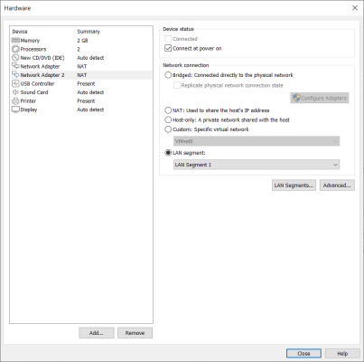

# Adventures in Network Automation

***Disclaimer: The creators of GNS3 no longer recommend using Dynamips' Cisco IOS images, since the devices that use those images are no longer supported by Cisco. They recommend using more up-to-date images, such as QEMU or those available through Cisco's Virtual Internet Routing Lab (VIRL). However, since this tutorial is only a general introduction to network automation using Python, we will use the freely-available Dynamips images.***

***In addition, Cisco Packet Tracer, while an excellent tool, is not suitable for our purposes, since it cannot interact with the host or integrated development environments (IDEs) on those hosts.***

## Introduction

Recently, for personal and professional reasons, I've delved into programming networking devices from within and without. Normally, in order to interact with a device like a switch, you must connect to it physically, via a serial or Ethernet cable. Once connected, you would access the command-line interface (CLI), and enter commands manually or upload a script, usually written in Cisco's Tool Command Language (TCL).

This is fine if you have one switch or router, but if you have dozens or hundreds of devices, this can become a full-time job. Wouldn't it be easier to write an application, let's say in Python, that can connect to a device and enter the commands for you? The answer is yes; you can write such a script, especially with Python, using modules such as subprocess and pexpect.

The bad news is that, normally, to test the script, you will need a physical device. You just can't download an Internetwork Operating System (IOS) image, and then interact with it using a hypervisor like VirtualBox. However, there are some great tools, like the Graphical Network Simulator-3 (GNS3), which can virtualize IOS images. Also, with a little tweaking, they can let you test your code against a virtual network device.

This tutorial is broken down into three parts:

- [Installing GNS3 in CentOS](#installing-gns3-in-centos "Installing GNS3")
- [Setting up the environment](#setting-up-the-environment "Setting up the environment")
- [Running the Labs](#running-the-labs "Running the Labs")

>**NOTE** - Thanks to David Bombal, Paul Browning, and many other incredible network gurus and coders (you know who you are :thumbsup: ).

-----

## Installing GNS3 in CentOS

Installing GNS on [Windows](https://docs.gns3.com/docs/getting-started/installation/windows/ "GNS3 Windows Install"), or Linux operating systems, such as [Ubuntu or Debian](https://docs.gns3.com/docs/getting-started/installation/linux "GNS3 Linux Install"), is pretty straight forward. However, we will be using CentOS 7.9 for labs and demos in this repository, and GNS3 doesn't work straight-out-of-the-box with Fedora, Red Hat Linux (RHEL), and CentOS.

>**NOTE** - Why are we using CentOS for this tutorial?
>- Approximately [20% of servers running Linux](https://w3techs.com/technologies/details/os-linux "Usage statistics of Linux for websites") use Fedora, RHEL, and CentOS. RHEL is also second, behind Microsoft, in [paid enterprise OS subscriptions](https://www.idc.com/getdoc.jsp?containerId=US46684720 "Worldwide Server Operating Environments Market Shares, 2019").
>- Many companies and government agencies, such as NASA and the DOD, use Red Hat Linux (i.e., the "commercial" version of CentOS), since it is a trusted OS which is [Protection Profile (PP) compliant](https://www.commoncriteriaportal.org/products/ "Certified Common Criteria Products").
>- I use Fedora, RHEL, or CentOS quite a bit, and I could not find a tutorial that captured all the steps involved in integrating GNS3 with the Fedora OS family.

To get started, download the latest ISO image of CentOS 7 from [the CentOS download page](https://www.centos.org/download/ "Download") and install it in a virtual machine. If you are not familiar with creating virtual machines, we recommend you review the instructions on the following sites:

- [Oracle VM VirtualBox User Manual](https://www.virtualbox.org/manual/ "Oracle VM VirtualBox User Manual")

- [VMware Workstation Player Documentation](https://docs.vmware.com/en/VMware-Workstation-Player/index.html "VMware Workstation Player Documentation")

- [Getting Started with Virtual Machine Manager](https://access.redhat.com/documentation/en-us/red_hat_enterprise_linux/7/html/virtualization_getting_started_guide/chap-virtualization_manager-introduction "Getting Started with Virtual Machine Manager")

>**NOTE** - The focus of this tutorial is to use GNS3 to test our scripts, not to install operating systems or create virtual machines. There are many websites dedicated to setting up OS's and VM's, and we will not repeat those steps here.
> 
>However, whether you use VirtualBox or VMWare, make sure you:
> 
> 1. Allocate **2048 MB** of RAM to your machine  (e.g., in VirtualBox...):
> 
>    
>  
>2. Allocate at least **16 GB** of hard disk space to your machine (e.g., in VirtualBox...):
> 
>    **
> 
>3. Allocate **two** processors to your machine (e.g., in VirtualBox...):
> 
>    
> 
>4. Add another network interface to your system. Make it private and isolate it from the outside world, by attaching it to an **Internal Network** in VirtualBox (shown) or connecting it to a **LAN segment** in VMWare:
> 
>    
>
> In VMWare, you can make all the above changes to your VM, in **Settings**:
> 
>    

Once you have finished creating your virtual machine, update and upgrade the OS.

>**NOTE** - If you are uing VirtualBox, we recommend installing Guest Additions, which will make interacting with your VM easier, by adding features like cut-and-paste from the host, etc. Check out [Aaron Kili's great article for TecMint on how to do that.](https://www.tecmint.com/install-virtualbox-guest-additions-in-centos-rhel-fedora/ "Install VirtualBox Guest Additions in CentOS, RHEL & Fedora") Just remember to execute the following commands before running the Guest Additions' ISO:
>
>```
>sudo yum -y install epel-release
>sudo yum -y update
>sudo yum install make gcc kernel-headers kernel-devel perl dkms bzip2
>sudo export KERN_DIR=/usr/src/kernels/$(uname -r)
>```
>
>Don't forget to reboot as well.

Open a Terminal and install git:

```sudo yum -y install git```

Next, clone this repository; it should appear in your home directory (e.g., ```/home/gns3user/Automation```):

```
[gns3user@localhost ~]$ git clone https://github.com/garciart/Automation.git
```

Now for the setup: There are a lot of good posts and articles on how to install GNS3 on CentOS. However, each of them are slightly different, so, to make life easier, we distilled them into [one executable shell script](gns3_setup_centos "CentOS Setup Script"). Before you run the script, we highly recommend you open it in an editor and look at its commands and comments, so you can become familiar with GNS3's dependencies.

Using elevated privileges, make the shell script executable and run it, piping the output into a text file. The install will take a few minutes, but once it is complete, check the text file for any errors.:

```
sudo chmod +x gns3_setup_centos
sudo ./gns3_setup_centos > setup_output.txt
grep -i -e "error" -e "warning" setup_output.txt
```

Examine and correct any errors; if necessary, delete the VM and start over again. Otherwise, if there are no errors, you can delete the output file and reboot the VM:

```
rm setup_output.txt
sudo reboot now
```

>**NOTE** - For the labs, you will need images for the Cisco 3745 Multiservice Access Router, with Advanced Enterprise Services, and the Cisco 7206 VXR Router. Both are older routers, but their Internetwork Operating Systems (IOS) are available for download, and they are sufficient for our labs.
>
>The [gns3_setup_centos](gns3_setup_centos "CentOS Setup Script") attempts to download the file from the [tfr.org](http://tfr.org "tfr.org") website, but if that fails, you can download the IOS' from other websites, and we have included them in this repository in the ```IOS``` folder. Just remember to place them in the ```/GNS3/images/IOS``` folder in your home directory (e.g., ```/home/gns3user/GNS3/images/IOS```). Also, remember to check the md5 hash after downloading, to ensure you have not downloaded malware (you can use our included script, [hash_checker.py](hash_checker.py), to check the hashes). Here are the names of the files, their hashes, and some additional information:
>
>- **Cisco 3745 Multiservice Access Router:**
>   * IOS version 12.4.25d (Mainline):
>   * File Name: c3745-adventerprisek9-mz.124-25d.bin
>   * MD5: 563797308a3036337c3dee9b4ab54649
>   * Flash Memory: 64MB
>   * DRAM: 256MB
>   * End-of-Sale Date: 2007-03-27
>   * End-of-Support Date: 2012-03-27
>   * IOS End-of-Support Date: 2016-01-31
>- **Cisco 7206 VXR 6-Slot Router:**
>   * IOS version 12.4.25g (Mainline):
>   * File Name: c7200-a3jk9s-mz.124-25g.bin
>   * MD5: 3a78cb61831b3ef1530f7402f5986556
>   * Flash Memory: 64MB
>   * DRAM: 256MB
>   * End-of-Sale Date: 2012-09-29 
>   * End-of-Support Date: 2017-09-30
>   * IOS End-of-Support Date: 2016-01-31

-----

## Setting up the environment

Before we start, here's the subnet information for the network:

```
- Network Address: 192.168.1.0/24
- Subnet Mask: 255.255.255.0 (ff:ff:ff:00)
- GNS3 Host Device IP Address: 192.168.1.1/32
- Gateway IP Address: 192.168.1.1/32
- Total Number of Hosts: 256
- Number of Usable Hosts: 254
- Usable IP Range: 192.168.1.2 - 192.168.1.254
- Broadcast Address: 192.168.1.255
- IP Class and Type: C (Private)
```

In CentOS, network interfaces for Ethernet will start with ```em```, ```en```, and ```et``` (e.g., ```em1```, ```eth0```, etc.). Open a Terminal and look for your isolated network interface, by inputting ```ip addr show label e*```:

```
[gns3user@localhost ~]$ ip addr show label e*
2: enp0s3: <BROADCAST,MULTICAST,UP,LOWER_UP> mtu 1500 qdisc pfifo_fast state UP group default qlen 1000
    link/ether 08:00:27:cf:12:5e brd ff:ff:ff:ff:ff:ff
    inet 10.0.2.15/24 brd 10.0.2.255 scope global noprefixroute dynamic enp0s3
       valid_lft 81729sec preferred_lft 81729sec
    inet6 fe80::91fc:27c4:403f:848f/64 scope link noprefixroute 
       valid_lft forever preferred_lft forever
3: enp0s8: <BROADCAST,MULTICAST,UP,LOWER_UP> mtu 1500 qdisc pfifo_fast state UP group default qlen 1000
    link/ether 08:00:27:87:ff:e2 brd ff:ff:ff:ff:ff:ff
[gns3user@localhost ~]$ 
```

Look for the interface that does not have an IP address. In this case, the isolated interface is named ```enp0s8```. Give the interface an IPv4 address, by inputting ```sudo ip addr add 192.168.1.1/24 dev enp0s8```. Do not forget to add the subnet (```/24```), or the ```ip``` program, by default, will set a netmask of 255.255.255.255 (```/32```), which will allow only one host on the isolated network, instead of a netmask of 255.255.255.0  (```/24```), which will allow the 256 hosts we want:

```
[gns3user@localhost ~]$ sudo ip addr add 192.168.1.1/24 dev enp0s8
[sudo] password for gns3user: 
[gns3user@localhost ~]$ ip addr show enp0s8
3: enp0s8: <BROADCAST,MULTICAST,UP,LOWER_UP> mtu 1500 qdisc pfifo_fast state UP group default qlen 1000
    link/ether 08:00:27:87:ff:e2 brd ff:ff:ff:ff:ff:ff
    inet 192.168.1.1/24 scope global enp0s8
       valid_lft forever preferred_lft forever
[gns3user@localhost ~]$ 
```

Open a Terminal and start GNS3:

```
gns3
```

>**NOTE** - If you run into any errors, exit GNS3 and check your IP addresses.

A Setup wizard will appear. Select **Run appliances on my local computer** and click **Next >**:


In **Local sever configuration**, under **Host binding**, select the isolated interface:


After a few minutes, a **Local server status** pop-up dialog will appear, letting you know that a "Connection to the local GNS3 server has been successful!". Click **Next >** to continue:


At the **Summary** pop-up dialog, click **Finish**:


>**NOTE** - If you run into any errors or you have to exit or restart GNS3, select **Edit** -> **Preferences**, or press <kbd>Ctrl</kbd>+<kbd>Shift</kbd>+<kbd>P</kbd>. Select **Server** and set the **Host binding** to the the isolated interface's IP address: 
>
>

## Running the Labs

Click on **File** ->  **New blank project**, or press  <kbd>Ctrl</kbd>+<kbd>N</kbd>, to create a new project. If GNS3 is not running, make sure that you have given your isolated Ethernet interface an IP address of ```192.168.1.1```, and start GNS3 by inputting ```gns3``` in a Terminal (the **Project** window should appear).

A pop-up dialog will appear, asking you to create a new project. Enter ```lab000``` in the ***Name*** textbox and click the **OK** button.


When the GNS3 graphical user interface reappears, click **Edit -> Preferences** or <kbd>Ctrl</kbd>+<kbd>Shift</kbd>+<kbd>P</kbd>. The **Preferences** window should appear. In the left-hand menu, click on **Server** and ensure that the value in the ***Host Binding*** textbox is ```192.168.1.1```:


Once again, look in the left-hand menu in **Preferences**, and select **Dynamips -> IOS Routers** and click on **New:**


When the **New IOS Router Template** pop-up dialog appears, ensure ***New Image*** is selected, and then click **Browse**:


When you installed GNS3, you also downloaded the IOS image for a Cisco 3745 Router. Select the image when the **Select an IOS image** file dialog appears and click **Open** at the top:


When asked, "Would like to decompress this IOS image?", click **Yes**:


Back in the **New IOS Router Template** dialog window, click **Next >:**


When it comes to customizing the router's details, use the default values for both the name and memory and click on **Next >** for each:


The Cisco 3745 is a customizable router, capable of supporting different network configurations, based on the selected cards and modules. Here is the back of a Cisco 3745 Router:


 In between the power supply modules, from top to bottom, the 3745 has:
 
 - Three (3) WAN interface card (WIC) slots (uncovered in the image).
 - Built-in Modules:
     - A console (labeled in light blue) and an auxilary port (labeled in black) on the left. By the way, when you interact with the router directly in a GNS3 console, you are using a simulated connection to the Console port.
     - A CompactFlash (CF) memory card slot in the center, which can use 32, 64, and 128 MiB memory cards.
     - Two (2) built-in FastEthernet interfaces (GT96100-FE), which correspond to FastEthernet 0/0 and 0/1 (labeled in yellow), on the right. Our Python scripts will interact with the router through the Ethernet cable, using either Telnet or SSH.
- Four (4) network adapter module slots (two uncovered and two covered in the image).

For network adapter modules, you have three options:

- NM-1FE-TX 1-Port 10/100 Mbps Fast Ethernet Network Module
- NM-4T 4 port Synchronous Serial Network Module
- NM-16ESW 16-Port 10/100 Mbps Fast Ethernet Switch (EtherSwitch) Module

Did you notice that, aside from the built-in GT96100-FE module, there are six open slots, but you can only use four of them? That is because the 3745 only has four open slots for network adapters. Fill open slots 1, 2, and 3 with a module:


For WAN Interface Cards (WICs), we have three slots, but only two options:

- WIC-1T One port serial (DB60, Cisco 60-pin "5-in-1" connector )
- WIC-2T Two port serial (DB60, Cisco 60-pin "5-in-1" connector )

 Go ahead and place a WIC in open slots 1 and 2, and leave slot 3 empty:


>**NOTE** - For more information on these modules and other configurations, check out the [Cisco 3700 Series Router Hardware](https://www.cisco.com/web/ANZ/cpp/refguide/hview/router/3700.html "
CISCO 3700 Series Router Hardware View") page. If the site becomes unavailable, we have also included [a pdf copy here.](/3700.pdf "CISCO 3700 Series Router Hardware View")

Finally, accept the default Idle-PC value and click **Finish:** 


The IOS template's details appear. Note the memory for the Personal Computer Memory Card International Association (PCMCIA) disk0. This is the device's CompactFlash (CF) memory card, used to store the system image, configuration files, and more. It cannot be 0, and the cards hold 32, 64, and 128 MiB of memory. Click on **Edit** to change it:


In the **Dynamips IOS router template configuration** pop-up dialog, select the **Memories and disks** tab. Set the PCMCIA disk0 to 64 MiB and click **OK**:


This brings you back to the template details window. Take a moment to look it over; there is some good information here, such as the name of the startup configuration file, which you will edit later:


Once you are done, click **OK** to return to the the GNS3 Graphical User Interface (GUI).

>**Note** - If you like, check out [https://docs.gns3.com/docs/using-gns3/beginners/the-gns3-gui](https://docs.gns3.com/docs/using-gns3/beginners/the-gns3-gui "The GNS3 GUI") to learn the different parts of the GNS3 Graphical User Interface (GUI).

Now that you have finished setting up your lab environment, click **View** -> **Docks** -> **All templates**:


All the devices you can use in your lab will appear in a docked window next to the Devices Toolbar on the right.

Select a **Cloud** and place it in the Workspace, then select a **c3745** and place it on the Workspace. Note that the router's hostname is **R1**:


Select the "Add a link" icon at the bottom of the Devices Toolbar:


Move the cross-hair over **Cloud1** and select your isolated Ethernet interface name (e.g., **enp0s8**):


Connect the other end to built-in **FastEthernet0/0** port in **R1**:


Notice that, while the devices are connect, nothing is being transmitted, because the router is not on:


Let us fix that. Click on the green **Play** icon in the GNS3 Toolbar above the Workspace. When asked, "Are you sure you want to start all devices?", click **Yes**:


You will see that all the nodes are now green, both in the Workspace and the Topology Summary in the top left hand corner:


By the way, note the console information for R1 in the the Topology Summary. This means that, even though it does not have an IP address yet, you can connect to R1 using Telnet through the Console port on the back of the 3745.

Let us do that now: open a Terminal and input the following command:

```
telnet 192.168.1.1 5001
```

You should see output similar to the following:

```
Trying 192.168.1.1...
Connected to 192.168.1.1.
Escape character is '^]'.
Connected to Dynamips VM "R1" (ID 1, type c3745) - Console port
Press ENTER to get the prompt.
*Mar  1 00:00:04.627: %LINK-5-CHANGED: Interface FastEthernet0/0, changed state to administratively down
...
*Mar  1 00:00:07.499: %LINEPROTO-5-UPDOWN: Line protocol on Interface FastEthernet3/6, changed state to down
R1#
```

You are now connected to the router through the Console port. Before we continue, let us take care of some housekeeping.

When we first configured the router, we gave it a default IOS image (c3745-adventerprisek9-mz.124-25d.bin). However, when the router first starts, it looks for an IOS image in flash memory. This is because the 3745 can store multiple IOS's in flash memory; you tell the router which one you want to use, by inputting ```boot system flash:<the IOS filename>.bin``` at a configuration prompt and saving it in the start-up configuration file. If the router does not find an IOS there, it will look in its Read-Only Memory (ROM) for a default IOS.

Our router will do this because we have not formatted our flash memory, preventing us from uploading another IOS. As a matter of fact, you may see the following error:

```
PCMCIA disk 0 is formatted from a different router or PC. A format in this router is required before an image can be booted from this device
```

In this lab, we will not need another IOS, but we do want to use our flash memory, so let us fix our memory issue, by inputting the following command:

```
R1#format flash:
```

You will be asked to confirm the format operation twice. Press <kbd>Enter</kbd> both times:

```
Format operation may take a while. Continue? [confirm]
Format operation will destroy all data in "flash:".  Continue? [confirm]
```

You should see output similar to the following:

```
Format: Drive communication & 1st Sector Write OK...
Writing Monlib sectors.
.........................................................................................................................
Monlib write complete 
..
Format: All system sectors written. OK...

Format: Total sectors in formatted partition: 130911
Format: Total bytes in formatted partition: 67026432
Format: Operation completed successfully.

Format of flash complete
R1#show flash
No files on device

66875392 bytes available (0 bytes used)

R1#
```

Input ```show flash``` to see what is in the drive:

```
No files on device

66875392 bytes available (0 bytes used)

R1#
```

Now, press <kbd>Ctrl</kbd>+<kbd>]</kbd> to leave R1 and input "q" to exit Telnet. Go back to the GNS3 GUI, click the red **Stop** icon in the GNS3 Toolbar above the Workspace. When asked, "Are you sure you want to stop all devices?", click Yes::

>Do not click on **Reload**!


After a few seconds, click on the green **Play** icon in the GNS3 Toolbar above the Workspace. When asked, "Are you sure you want to start all devices?", click **Yes**:


All the nodes shoud turn green.

In the real world, you interact with the router using Ethernet, not the Console port. However, you will not be able to connect to the router through Ethernet until you give it an IP address.

Telnet back into the router using ```telnet 192.168.1.1 5001```.

Using Cisco's Tool Command Language (TCL), check the status of the router's internet protocol interfaces:

```
R1#show ip interface brief
Interface                  IP-Address      OK? Method Status                Protocol
FastEthernet0/0            unassigned      YES unset  administratively down down
...
Vlan1                      unassigned      YES unset  up                    down
```

Let us get a little more information about the port we will use for our Ethernet connection, FastEthernet0/0:

```
R1#show ip interface FastEthernet0/0
FastEthernet0/0 is administratively down, line protocol is down
  Internet protocol processing disabled
```

Okay, FastEthernet0/0 is down and not configured. We will give it an IP address of 192.168.1.10 and and bring the port up:

```
R1#enable
R1#configure terminal
```

When you see the message ```Enter configuration commands, one per line.  End with CNTL/Z.```, interface with the Ethernet port. Assign it an IP address and bring it up, using the following commands:

```
R1(config)#interface FastEthernet0/0
R1(config-if)#ip address 192.168.1.10 255.255.255.0
R1(config-if)#no shutdown
R1(config-if)#
```

Wait a few seconds; you will see messages like the following appear:

```
*Mar  1 00:16:01.151: %LINK-3-UPDOWN: Interface FastEthernet0/0, changed state to up
*Mar  1 00:16:02.151: %LINEPROTO-5-UPDOWN: Line protocol on Interface FastEthernet0/0, changed state to up
```

Exit the interface configuration mode, using the following commands:

```
R1(config-if)#exit
```

Before we leave, we have to set a basic password, so we can access the device, otherwise, you will receive a ```Password required, but none set``` error.

```
R1(config)#line vty 0 4
R1(config)#password cisco
R1(config)#login
R1(config)#end
R1#
```

Once again, wait a few seconds for the messages to clear:

```
*Mar  1 00:16:39.299: %SYS-5-CONFIG_I: Configured from console by console
```

Next, save the changes to the running configuration, then replace the startup configuration file with the running configuration; this will make the changes permanent: 

```
R1#write memory
Building configuration...
[OK]
R1#copy running-config startup-config
Destination filename [startup-config]? 
Building configuration...
[OK]
R1#
```

Press <kbd>Ctrl</kbd>+<kbd>]</kbd> to leave R1 and input "q" to exit Telnet. Go back to the GNS3 GUI, but this time, right click on R1, and click on Reload:


Normally, when you reload a device, it will load the default settings, erasing any changes you made. However, since you transfered the running configuration to the startup configuration in the NVRAM, the router will now remember your settings.

Ping the device from the Terminal:

```
$ ping -c 4 192.168.1.10
PING 192.168.1.10 (192.168.1.10) 56(84) bytes of data.
64 bytes from 192.168.1.10: icmp_seq=1 ttl=255 time=16.6 ms
64 bytes from 192.168.1.10: icmp_seq=2 ttl=255 time=10.9 ms
64 bytes from 192.168.1.10: icmp_seq=3 ttl=255 time=10.9 ms
64 bytes from 192.168.1.10: icmp_seq=4 ttl=255 time=2.02 ms

--- 192.168.1.10 ping statistics ---
4 packets transmitted, 4 received, 0% packet loss, time 3003ms
rtt min/avg/max/mdev = 2.028/10.153/16.660/5.237 ms
```

Now, instead of telneting through a port, you will telnet into the device using the IP address you assigned it earlier: 

```
$ telnet 192.168.1.10
Trying 192.168.1.10...
Connected to 192.168.1.10.
Escape character is '^]'.


User Access Verification

Password: 
R1>
```