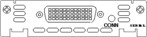
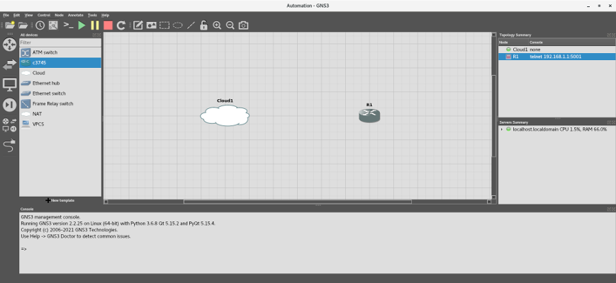

# Adventures in Network Automation


***NOTE - While I do not expect you to be an expert in any of the technologies that I cover in this tutorial, I expect that:***

- ***You have used the Linux Terminal before***
- ***You understand the basics of computer networking, and the TCP/IP or OSI models***
- ***You have programmed in Python before***

---

***Disclaimer: The creators of GNS3 no longer recommend using Dynamips' Cisco Internetwork Operating Systems (IOS) images, since Cisco no longer supports those devices or their IOS's. They recommend you use newer images, such as those available through Cisco's Virtual Internet Routing Lab (VIRL). However, since this tutorial is only a general introduction to network automation using Python, you will use the freely available Dynamips images instead.***

***In addition, while Cisco Packet Tracer is an excellent tool, its ability to interact with host devices is limited, and it is not suitable for our purposes.***

## Introduction

Configuring a network device for Layer 3 communications is not a difficult process. First, you connect to the device's console or auxiliary port through a serial connection from a host computer. Next, you access the device's command line interface (CLI) using PuTTY or Minicom, and then enter the commands to set the device's IPv4 address manually. Once you have enabled Layer 3 communications on the device, you can further provision it over Ethernet by uploading a pre-built configuration, or using tools such as Ansible or Puppet.

However, imagine how long it would take to provision or update dozens, or even hundreds of devices. In addition, chances are that you will make a few mistakes along the way, such as accidentally skipping a step or entering a wrong IP address, making the process more difficult and time-consuming.

Automating the process using a scripting language, such as Python, is a better option. The bad news is that each time you want to test your code, you would need to "spin-up" a physical device, which may take time or require you to take the device or the network offline.  

However, there are some great tools, like Graphical Network Simulator-3 (GNS3), which, with a little tweaking, allow you to test your code quickly against *multiple* network devices, in a virtual environment.

This tutorial is broken down into several parts:

- [What is GNS3?](#what-is-gns3 "What is GNS3?")
- [Installing GNS3](#installing-gns3 "Installing GNS3")
- [Setting up the Environment](#setting-up-the-environment "Setting up the Environment")
- [Adding a Device](#adding-a-device "Adding a Device")
- [Your First Exercise](#your-first-exercise "Your First Exercise")
- [PS: Easy Start Script](#ps-easy-start-script "PS: Easy Start Script")
- [PPS: RHEL8 and Rocky](#pps-rhel8-and-rocky "PPS: RHEL8 and Rocky")
- [PPPS: Using a Virtual Machine](#ppps-using-a-virtual-machine "PPPS: Using a Virtual Machine")

-----

## What is GNS3?

Graphical Network Simulator-3 is a network software emulator, written in Python. It is a hypervisor platform that allows you to run and connect virtual network devices to each other, and, if needed, to real devices as well. GNS3 consists of a server, which runs the virtual devices, and a graphical user interface (GUI), which lets you build network topologies quickly. It was first released in 2008, and it has been downloaded over 18 million times. While it is free and open source (GNU GPL, i.e., "copyleft"), with an active community of over two million members, it is also used by companies such as Google, NASA, AT&T, and Walmart.

-----

## Installing GNS3

Installing GNS3 on [Windows](https://docs.gns3.com/docs/getting-started/installation/windows/ "GNS3 Windows Install") or certain Linux operating systems, such as [Ubuntu or Debian](https://docs.gns3.com/docs/getting-started/installation/linux "GNS3 Linux Install"), is pretty straight forward. However, you will be using CentOS 7.9 for the demo, and GNS3 does not work straight-out-of-the-box with Fedora, Red Hat Linux (RHEL), or CentOS.

>**NOTE** - I picked CentOS for this tutorial because I use Red Hat Linux (RHEL) and CentOS quite a bit, and I could not find a tutorial that captured all the steps to get GNS3 working on a Fedora family OS. It was fun, and the process helped me learn GNS3's dependencies. In addition, many companies and government agencies, such as Northrup Grumman and NASA, use RHEL, since it is a trusted OS which is [Protection Profile (PP) compliant](https://www.commoncriteriaportal.org/products/ "Certified Common Criteria Products").

>**NOTE** - If you are using Windows, or you do not want to or cannot install GNS3 natively, you can use a virtual machine. See the post-post-post-script, [PPPS: Using a Virtual Machine](#ppps-using-a-virtual-machine "PPPS: Using a Virtual Machine"), for details.

Open a Terminal and install git:

```sudo yum -y install git```

Clone this repository; it will appear in your home directory under the name ```network-automation```:

```git clone https://github.com/garciart/network-automation.git```

Enter the repository when complete:

```cd network-automation```

Now for the setup: There are a few good posts and articles on how to install GNS3 on CentOS. However, each of them is slightly different, so, to make life easier, I distilled them into the following list of commands:

>**NOTE** - Do not run any commands as **root**! Otherwise, some files and executables will end up in the wrong place or have the wrong permissions, and GNS3 will not work.
>
>

```
sudo yum -y install https://dl.fedoraproject.org/pub/epel/epel-release-latest-7.noarch.rpm # needed to install PuTTY and qemu
sudo yum -y update
# Install Python 3 and pip
sudo yum -y install python3 # Also installs python3-setuptools
sudo python3 -m pip install --upgrade pip
sudo python3 -m ensurepip
sudo yum -y install python3-devel
sudo yum -y install python3-tools
# Install pip support for Python 2
sudo yum -y install python2-pip
# Install Git
sudo yum -y install git
# Install GNS3 dependencies
sudo yum -y groupinstall "Development Tools" # Only need gcc to run GNS3, but we will need the other tools later
sudo yum -y install elfutils-libelf-devel # For Dynamips
sudo yum -y install libpcap-devel # For Dynamips
sudo yum -y install cmake # For Dynamips, VCPS, and ubridge
sudo yum -y install glibc-static # For VCPS
# Install Qt GUI library
sudo yum -y install qt5-qtbase
sudo yum -y install qt5-qtbase-devel
sudo yum -y install qt5-qtsvg
sudo yum -y install qt5-qtsvg-devel
# Install xterm, one of the consoles used by GNS, and resize its output
sudo yum -y install xterm
echo -e "! Use a truetype font and size.\nxterm*faceName: Monospace\nxterm*faceSize: 12" > ~/.Xresources
sudo xrdb -merge ~/.Xresources
# Install GNS3
sudo python3 -m pip install gns3-server --upgrade
sudo python3 -m pip install gns3-gui --upgrade
sudo python3 -m pip install sip # For PyQT; used to bind C++ classes with Python
sudo python3 -m pip install pyqt5
sudo yum -y install putty # Get from epel
# KVM: A Linux kernel module that interacts with the virtualization features of the processor.
# QEMU: Virtualization software that emulates virtual processors and peripherals.
# QEMU-KVM: Type 1 hypervisor that runs in kernel space and QEMU: type 2 hypervisor that runs in user space
sudo yum -y install qemu # Get from epel / Not qemu-kvm https://fedoraproject.org/wiki/How_to_use_qemu
# Install the Dynamips Cisco Emulator
cd /tmp || exit
git clone https://github.com/GNS3/dynamips.git
cd /tmp/dynamips || exit
mkdir -p /tmp/dynamips/build
cd /tmp/dynamips/build/ || exit
cmake .. -DDYNAMIPS_CODE=stable
make
sudo make install
# Install the Virtual PC Simulator (vpcs)
cd /tmp || exit
sudo yum -y install svn
svn checkout http://svn.code.sf.net/p/vpcs/code/trunk vpcs
cd /tmp/vpcs/src || exit
./mk.sh 64
sudo install -m 755 vpcs /usr/local/bin
# Install ubridge to connect Ethernet, TAP interfaces, and UDP tunnels, as well as capture packets.
cd /tmp || exit
git clone https://github.com/GNS3/ubridge.git
cd /tmp/ubridge || exit
make
sudo make install
cd ~/ || exit
# Get router image and configuration file
wget -nc -P ~/GNS3/images/IOS http://tfr.org/cisco-ios/37xx/3745/c3745-adventerprisek9-mz.124-25d.bin # Cisco 3745
wget -nc -P ~/GNS3/images/IOS http://tfr.org/cisco-ios/7200/c7200-a3jk9s-mz.124-25d.bin # Cisco 7206
# Used to create interfaces to connect the host to GNS3
sudo yum -y install bridge-utils
# Install modules to control interactions with external devices
sudo python2 -m pip install pexpect # (For Python 2.7+)
sudo python3 -m pip install pexpect # (For Python 3.6+)
sudo python2 -m pip install paramiko # (For Python 2.7+)
sudo python3 -m pip install paramiko # (For Python 3.6+)
sudo yum -y install ansible
# Install Selenium for Firefox
sudo yum -y install firefox
python3 -m pip install selenium
wget -nc https://github.com/mozilla/geckodriver/releases/download/v0.30.0/geckodriver-v0.30.0-linux64.tar.gz --directory-prefix ~/Downloads
sudo tar -xzf ~/Downloads/geckodriver-v0.30.0-linux64.tar.gz -C /usr/local/bin/
# Get the script that creates a tap/loopback interface in Linux and launches GNS3
wget -nc -P ~/ https://raw.githubusercontent.com/garciart/Automation/master/gns3_run
# Make the start-up script executable and place it in /usr/bin
sudo chmod 755 ~/gns3_run
sudo mv ~/gns3_run /usr/bin/
# Required for the labs
sudo yum -y install telnet
sudo yum -y install tftp tftp-server*
sudo yum -y install ntp
sudo yum -y install vsftpd
sudo yum -y install httpd
# Install SSH support, including ssh, scp, sftp, sshd, ssh-keygen, etc.
sudo yum -y install openssh
sudo yum -y install openssh-clients
sudo yum -y install openssh-server
sudo yum -y install mod_ssl openssl
sudo mkdir -p /var/lib/tftpboot
sudo chmod 777 /var/lib/tftpboot
sudo yum -y autoremove
sudo yum -y clean all
# Optional - Modify vimrc file
echo -e "\"My preferred vim defaults\nset tabstop=4\nset softtabstop=4\nset expandtab\nset shiftwidth=4\nset smarttab" > ~/.vimrc
```

Now, the first time you install GNS3, I suggest you open a Linux Terminal and enter each of the above lines, one at a time, and study their output. Look up any commands or programs you are unfamiliar with.

>If you run into errors downloading IOS images from the [tfr.org](http://tfr.org "tfr.org") website, Google is your friend, and I have also included them in this repository in the ```IOS``` folder. Just remember to place them in the ```/GNS3/images/IOS``` folder in your home directory (e.g., ```/home/gns3user/GNS3/images/IOS```). Also, remember to check the md5 hash after downloading, to ensure you have not downloaded malware; you can use our included script, [file_hash_check.py](file_hash_check.py), to check the hashes.

If you need to reinstall GNS3, you can use the [executable script](gns3_setup_centos "CentOS Setup Script") I created and included in this repo. Make the shell script executable and run it, piping any errors and the output into a text file. It will take a while to finish, so be patient:

```
sudo chmod +x gns3_setup_centos
./gns3_setup_centos 2>&1 | tee setup_output.txt # DO NOT RUN AS SUDO 
grep -i -e "error" -e "warning" setup_output.txt
```

Installation will take a few minutes, but once it is complete, check ```setup_output.txt``` for any errors. Correct any errors or, if necessary, delete the VM and start over again. Otherwise, if there are no errors, you can delete the output file and reboot the VM:

```
rm setup_output.txt
sudo reboot now
```

>**NOTE** - To make life easier, I created a desktop shortcut, named "Network Automation", to run our batch script, ```gns3_run```. If you would like to do the same, open a Terminal and enter the following commands:
>
>```
>sudo cp /usr/local/share/applications/gns3.desktop /usr/local/share/applications/net-auto-demo.desktop
>sudo sed --in-place 's/Terminal=false/Terminal=true/g' /usr/local/share/applications/net-auto-demo.desktop
>sudo sed --in-place 's/Exec=gns3 %f/Exec=gns3_run/g' /usr/local/share/applications/net-auto-demo.desktop
>sudo sed --in-place 's/Name=GNS3/Name=Network Automation/g' /usr/local/share/applications/net-auto-demo.desktop
>```
>
>The icon will appear in both the **Education** and **Internet** application groups.

>**NOTE** - I use editors, such as ```vi``` and ```nano```, to quickly fix code when I am working on actual devices, but I recommend using a code editor or IDE when writing a script from scratch. If configured correctly, they can catch syntax and semantic errors, improving the quality of your code. My favorites are **VS Code** and **PyCharm**; here are links to their installation instructions for Linux:
>
>- [Running Visual Studio Code on Linux](https://code.visualstudio.com/docs/setup/linux "Running Visual Studio Code on Linux")
>- [Install PyCharm](https://www.jetbrains.com/help/pycharm/installation-guide.html "Install PyCharm")
>
>Regardless of the editor you use:
>
>- When asked to set up an interpreter, remember that I used CentOS 7.9 and Python 2.7 for this project.
>- To improve your code, I recommend installing the **SonarLint** plugin. In VS Code, click on the **Extensions** icon (or press <kbd>Ctrl</kbd>+<kbd>Shift</kbd>+<kbd>X</kbd>) and enter ```sonarlint``` in the search box. In PyCharm, click on the gear icon (:gear:) in the top right-hand corner and select ```Plugins...``` When the **Plugins** window appears, enter ```sonarlint``` in the search box.

-----

## Setting up the Environment

Before you start, here is the subnet information for the network:

```
- Network Address: 192.168.1.0/24
- IPv4 Class and Type: C (Private)
- Subnet Mask: 255.255.255.0 (ff:ff:ff:00)
- GNS3 Server IPv4 Address: 192.168.1.1
- Broadcast Address: 192.168.1.255
- Usable IPv4 Range: 192.168.1.2 - 192.168.1.254
- Number of Available Hosts: 254
- Host Device IPv4 Address: 192.168.1.10
- GNS3 Device Starting IPv4: 192.168.1.20
```

Writing and debugging Bash and Python scripts in GNS3 is cumbersome and limited. Our host machine is much more capable, with its Terminal and IDEs. Therefore, to code on our host machine and test against GNS3, you will connect the host machine to the GNS3 server by:

- Creating a virtual network bridge.
- Binding the GNS3 local server's IPv4 address to the bridge.
- Connecting the host's isolated network interface to the bridge.
- Creating Layer 2 TAP interfaces and connecting the TAPs to the bridge.
- Connecting devices to the host through the TAPs on the bridge.

First, you need to find out the name of our host machine's isolated Ethernet network adapter.

> **NOTE** - You do not want to use the VM's primary network interface, since you will be overwriting its IP address and other information.

Per RedHat's [Consistent Network Device Naming conventions](https://access.redhat.com/documentation/en-us/red_hat_enterprise_linux/7/html/networking_guide/ch-consistent_network_device_naming "Consistent Network Device Naming"), network interfaces for Ethernet adapters will start with ```em```, ```en```, and ```et``` (e.g., ```em1```, ```eth0```, etc.) in CentOS. Open a Terminal and look for your isolated network interface, by inputting ```ip addr show label e*```:

```
$ ip addr show label e*

2: enp0s3: <BROADCAST,MULTICAST,UP,LOWER_UP> mtu 1500 qdisc pfifo_fast state UP group default qlen 1000
    link/ether 09:af:18:be:27:cd brd ff:ff:ff:ff:ff:ff
    inet 10.0.1.100/24 brd 10.0.1.255 scope global noprefixroute dynamic enp0s3
       valid_lft 81729sec preferred_lft 81729sec
    inet6 fe80::1122:3344:5566:abcd/64 scope link noprefixroute 
       valid_lft forever preferred_lft forever
3: enp0s8: <BROADCAST,MULTICAST,UP,LOWER_UP> mtu 1500 qdisc pfifo_fast state UP group default qlen 1000
    link/ether 1a:2b:3c:4d:5e:6f brd ff:ff:ff:ff:ff:ff
```

Look for the interface that does not have an IPv4 address (i.e., no ```inet``` information). In this case, the isolated interface is named ```enp0s8```. 

You will now attach the host machine and the GNS3 server using a "bridge":

```
# Configure the bridge
sudo ip link add br0 type bridge # Create the bridge
sudo ip address add 192.168.1.1/24 dev br0 # Set the bridge IPv4 address
sudo ip link set br0 up # Enable the bridge

# Configure the tap
sudo ip tuntap add tap0 mode tap # Create the tap
sudo ip link set tap0 up # Enable the tap
sudo ip link set tap0 master br0 # Connect the tap to the bridge

# Add another tap, for flexibility
sudo ip tuntap add tap1 mode tap # Create the tap
sudo ip link set tap1 up # Enable the tap
sudo ip link set tap1 master br0 # Connect the tap to the bridge

# Configure the isolated Ethernet network adapter 
sudo ip address flush dev enp0s8 # Clear out any old adapter IP address
sudo ip link set enp0s8 up # Enable the adapter
sudo ip link set enp0s8 master br0 # Connect the adapter to the bridge
sleep 3 # Allow time to make the connection
sudo ip address add 192.168.1.10/24 dev enp0s8 # Set the adapter IP address
```

>**NOTE** - Why do you need a TAP? Why not just connect a device directly to the bridge? Yes, for a simple network, like our example, you can connect a device directly to the host through the bridge. However, you may need to connect multiple devices to the host through Layer 2 TAP interfaces (e.g., tap1, tap2, etc.), so just get into the habit of connecting to a TAP instead of directly to the bridge.

Check the configuration and the bridge by inputting ```ip addr show dev br0``` and ```brctl show br0```:

```
$ ip addr show dev br0

8: br0: <BROADCAST,MULTICAST,UP,LOWER_UP> mtu 1500 qdisc noqueue state UP group default qlen 1000
    link/ether a1:b2:c3:d4:e5:f6 brd ff:ff:ff:ff:ff:ff
    inet 192.168.1.1/24 scope global br0
       valid_lft forever preferred_lft forever
    inet6 fe80::0123:4567:89ab:cdef/64 scope link 
       valid_lft forever preferred_lft forever

$ brctl show br0

bridge name  bridge id          STP enabled  interfaces
br0          8000.08002787ffe2  no           enp0s8
                                             tap0
```

Start GNS3:

```gns3```

>**NOTE** - If you run into any errors, exit GNS3 and check your IPv4 addresses.

>***NOTE - All the above commands are contained in an interactive, executable script named ["gns3_run"](gns3_run "Automated GNS3 configuration and executable"). I highly recommend that from this point forward, you use the script to run GNS3.***

---

A Setup wizard will appear. Select **Run appliances on my local computer** and click **Next >**:


>**NOTE** - If a **Project** window appears instead, click on **Cancel** and scroll down to the :eyes: <a id="eyes">below</a>.

In **Local sever configuration**, under **Host binding**, select the bridge's IPv4 address (```192.168.1.1```):


After a few minutes, a **Local server status** pop-up dialog will appear, letting you know that a "Connection to the local GNS3 server has been successful!". Click **Next >** to continue:


At the **Summary** pop-up dialog, click **Finish**:


> :eyes: - <span id="eyes">This will return you to the main GNS3 Graphical User Interface (GUI)<span>:


>**Note** - If you like, check out [https://docs.gns3.com/docs/using-gns3/beginners/the-gns3-gui](https://docs.gns3.com/docs/using-gns3/beginners/the-gns3-gui "The GNS3 GUI") to learn the different parts of the GNS3 Graphical User Interface (GUI).

However, before you start the exercise, you need to make some adjustments. From the GNS3 Toolbar at the top of the GUI, select **Edit** -> **Preferences**, or press <kbd>Ctrl</kbd>+<kbd>Shift</kbd>+<kbd>P</kbd>. Select **Server** and make sure that:

- **Enable local server** is checked.
- **Host binding** is set to ```192.168.1.1```.
- **Console port range** is reduced to ```5000 TCP``` to ```5005 TCP```.


---

## Adding a device

Now you need to add a device. For the exercise, you will use the Cisco 3745 Multi-Service Access Router, with Advanced Enterprise Services. The Cisco 3745 is a customizable router, capable of supporting different network configurations, based on which cards or modules are installed. It is an older router, but its IOS is available for download, and it is sufficient for conducting the exercise. Here is some additional information:
>
>- **Cisco 3745 Multi-Service Access Router:**
>   * IOS version 12.4.25d (Mainline):
>   * File Name: c3745-adventerprisek9-mz.124-25d.bin
>   * MD5: 563797308a3036337c3dee9b4ab54649
>   * Flash Memory: 64 MB
>   * DRAM: 256MB
>   * End-of-Sale Date: 2007-03-27
>   * End-of-Support Date: 2012-03-27
>   * IOS End-of-Support Date: 2016-01-31

Here is the back of a Cisco 3745 Router:


 In between the power supply modules, from top to bottom, the 3745 has:
 
 - Three (3) WAN interface card (WIC) slots (uncovered in the image).
 - Built-in Modules (from left-to-right):
     - A console port (labeled in light blue) and an auxiliary port (labeled in black). By the way, when you interact with the router directly in a GNS3 console, you are using a simulated connection to the Console port.
     - An optional CompactFlash (CF) memory card slot in the center, which can use 32, 64, and 128 MiB memory cards. This card will correspond to Personal Computer Memory Card International Association (PCMCIA) disk1, accessible as ```slot0:``` in the IOS; more about this later.
     - The **GT96100-FE Network Adapter**, with two (2) built-in FastEthernet interfaces (GT96100-FE), which correspond to FastEthernet 0/0 and 0/1 (labeled in yellow).
- Four (4) network adapter module slots (two uncovered and two covered in the image).

I will explain how to fill in the slots later in this tutorial.

When the GNS3 GUI reappears, click **Edit -> Preferences** or <kbd>Ctrl</kbd>+<kbd>Shift</kbd>+<kbd>P</kbd>. The **Preferences** window should appear. In the left-hand menu, click on **Dynamips -> IOS Routers** and click on **New:**


When the **New IOS Router Template** pop-up dialog appears, ensure ***New Image*** is selected, and then click **Browse**:


When you installed GNS3, you also downloaded the IOS image for a Cisco 3745 Router. Select the image when the **Select an IOS image** file dialog appears and click **Open** at the top:


When asked, "Would like to decompress this IOS image?", click **Yes**:


Back in the **New IOS Router Template** dialog window, click **Next >:**


When it comes to customizing the router's details, use the default values for both the name and memory and click on **Next >** for each:


The **Network adapters** dialog appears, prefilled with a built-in adapter:


For network adapters, you have three options:

- NM-1FE-TX 1-Port 10/100 Mbps Fast Ethernet Network Adapter


- NM-4T 4 port Synchronous Serial Network Adapter


- NM-16ESW 16-Port 10/100 Mbps Fast Ethernet Switch (EtherSwitch) Adapter


Practice filling open slots with an adapter, but ***DO NOT CLICK ON NEXT!***:


Did you notice that, aside from the built-in GT96100-FE adapter, there are six open slots, but you can only use four of them? That is because the 3745 only has four open slots for network adapters, as shown in the picture above.

Aside from the built-in network adapter, you will not need any additional network adapters yet, so empty all the slots except for **slot 0** (GNS3 will not let you delete it anyway). When complete, click on **Next >**:


The **WIC modules** dialog appears:


For WAN Interface Cards (WICs), you have three slots, but only two options:

- WIC-1T One port serial module (DB60, Cisco 60-pin "5-in-1" connector )



- WIC-2T Two port serial module (DB60, Cisco 60-pin "5-in-1" connector )


 
You will not need any WIC modules yet, so make sure all the slots are empty, and click on **Next >**.

>**NOTE** - For more information on these modules and other configurations, check out the [Cisco 3700 Series Router Hardware](https://www.cisco.com/web/ANZ/cpp/refguide/hview/router/3700.html "
CISCO 3700 Series Router Hardware View") page. If the site becomes unavailable, I have also included [a pdf copy here.](/3700.pdf "CISCO 3700 Series Router Hardware View")

Finally, accept the default Idle-PC value and click **Finish:** 


The IOS template's details appear. Note the memory settings for the Personal Computer Memory Card International Association (PCMCIA) disks:

- **PCMCIA disk0** - This is the device's built-in CompactFlash (CF) memory card, accessible as ```flash:``` in the IOS, used to store the system image, configuration files, and more. It cannot be 0, and the cards hold 32, 64, and 128 MiB of memory.
- **PCMCIA disk1** - This is the device's external and optional CF memory card, accessible as ```slot0:``` in the IOS. It can hold 0 (no card inserted), 32, 64, and 128 MiB of memory.

Click on **Edit** to increase the device's flash memory from 0 to 64 MiB:


In the **Dynamips IOS router template configuration** pop-up dialog, select the **Memories and disks** tab. Set the PCMCIA disk0 to 64 MiB. While you are here, make sure **Automatically delete NVRAM and disk files** is unselected; otherwise, you will have to reformat the flash memory each time you reload the device:


When you are done, click **OK** to continue.

Once you return to the template details window, make sure the memory for **PCMCIA disk0** is **64 MiB** and **Auto delete** is set to **False**.


## Your First Exercise

### Part 1: Create the Network

>**Note** - If you like, check out [https://docs.gns3.com/docs/using-gns3/beginners/the-gns3-gui](https://docs.gns3.com/docs/using-gns3/beginners/the-gns3-gui "The GNS3 GUI") to learn the different parts of the GNS3 Graphical User Interface (GUI).

Now that you have finished setting up the exercise environment, click on **File** ->  **New blank project**, or press  <kbd>Ctrl</kbd>+<kbd>N</kbd>, to create a new project. If GNS3 is not running, enter ```gns3_run``` in a Terminal.

The **Project** pop-up dialog will appear, asking you to create a new project. Enter ```Automation``` in the ***Name*** textbox and click the **OK** button.


From the GNS3 Toolbar, click **View** -> **Docks** -> **All templates** (or **All devices**):


All the devices you can use in the exercise will appear in a docked window next to the Devices Toolbar on the right.

>**NOTE** - In the **View** dropdown menu, there are several options that will make your life easier. I recommend both **Snap to grid**, which will keep your Workspace orderly, and **Show/Hide interface labels**, which will allow you to see your connection points at a glance.

You may also click the "Browse all devices" icon to see all of your available devices:


Select a **Cloud** and place it in the Workspace, then select a **c3745** and place it on the Workspace. Note that the router's hostname is **R1**:



Select the "Add a link" icon at the bottom of the Devices Toolbar:


Move the cross-hair over **Cloud1** and select the TAP interface name (e.g., **tap0**):


Connect the other end to the built-in **FastEthernet0/0** port in **R1**:


Notice that, while the devices are connected, nothing is being transmitted, because the router is not on:


Let us fix that. Click on the green **Play** icon in the GNS3 Toolbar above the Workspace. When asked, "Are you sure you want to start all devices?", click **Yes**:


You will see that all the nodes are now green, both in the Workspace and the **Topology Summary** in the top left-hand corner:


By the way, note the console information for **R1** in the **Topology Summary** in the top left-hand corner. It tells us that, even though the device does not have an IPv4 address yet, you can connect to **R1** using Telnet through the Console port on the back of the 3745 using port 5001.

However, your port number may be different. If the Console port number is difficult to see, you can get the information by expanding the dock or right-clicking on the **R1** node and selecting **Show node information**:


The pop-up dialog has a lot of good information, including which port number the Console port is using:


---

### Part 2: Dry Run through the Console Port

Now, before we begin to code, you will perform a dry run by entering the commands directly in a console terminal, as you would do with a real device.

>**NOTE** - Normally, you cannot Telnet into a device until you assign the device an IPv4 address. To do solve this chicken-or-egg problem, you would:
>
>- Connect an RS232 Port to RJ45 Ethernet cable from the host to the device's Console port.
>- Open a terminal emulator, such as PuTTY or minicom, and connect to the device through the host's serial port 0 (e.g., ```/dev/ttyS0```, ```/dev/ttyACM0```, etc.) at 9600 baud, 8 data bits, no parity, and 1 stop bit (9600 8N1).
>- Enter the necessary commands to set the IPv4 address.
> 
>However, GNS3 uses [*reverse Telnet*](https://en.wikipedia.org/wiki/Reverse_telnet "Reverse Telnet"). The GNS3 server assigns a port number to all the virtual devices in the **Workspace**, and you can access the device through the server IPv4 address and its Console port number. Connecting to a device using Reverse Telnet is similar to connecting to a device through its Console port (or Auxiliary port, if enabled) using a serial cable. However, you will not be able to open a Secure Shell (SSH) connection using this method.

Open a new Terminal and Telnet into the device by inputting the following command:

```telnet 192.168.1.1 5001```

You will see boot-up messages appear on the screen, similar to the following:

```
Trying 192.168.1.1...
Connected to 192.168.1.1.
Escape character is '^]'.
Connected to Dynamips VM "R1" (ID 1, type c3745) - Console port
Press ENTER to get the prompt.
...
Press RETURN to get started!
...
*Mar  1 00:00:05.603: %LINEPROTO-5-UPDOWN: Line protocol on Interface FastEthernet0/0, changed state to down
*Mar  1 00:00:05.699: %LINEPROTO-5-UPDOWN: Line protocol on Interface FastEthernet0/1, changed state to down
```

Once the messages have stopped appearing, press <kbd>Enter</kbd> to access a prompt. In our case, the **Privileged EXEC mode** prompt (```R1#```) will appear:

```R1#```

You are now connected to the router through the Console port. Next, get the device's hardware and software information by inputting the following command:

```show version```

After a few seconds, you will see the following output (press <kbd>Space</kbd> when the ```--More--``` prompt appears):

```
Cisco IOS Software, 3700 Software (C3745-ADVENTERPRISEK9-M), Version 12.4(25d), RELEASE SOFTWARE (fc1)
Technical Support: http://www.cisco.com/techsupport
Copyright (c) 1986-2010 by Cisco Systems, Inc.
Compiled Wed 18-Aug-10 08:18 by prod_rel_team

...

151K bytes of NVRAM.
65536K bytes of ATA System CompactFlash (Read/Write)
Configuration register is 0x2102
R1#
```

Exit Telnet by pressing <kbd>Ctrl</kbd>+<kbd>]</kbd>, and inputting <kbd>q</kbd>. Once you have exited Telnet, go to the GNS3 GUI and reload the device:


---

### Part 3: Using Python and Pexpect

Go back to the Linux Terminal, and, at the prompt, enter the following command to start the Python interpreter:

```python```

After a few seconds, you will see the following output:

```
Python 2.7.5 (default, Nov 16 2020, 22:23:17) 
[GCC 4.8.5 20150623 (Red Hat 4.8.5-44)] on linux2
Type "help", "copyright", "credits" or "license" for more information.
>>> 
```

In Python, you will interact with the device using the **Pexpect** module. Pexpect creates or "spawns" a session with another device, known as a "child". Using commands such as  ```sendline``` and ```expect```, you can interact with the device through the child.

First, at the ```>>>``` prompt, import the module into the interpreter:

```>>> import pexpect```

Second, create a Telnet child process:

```>>> child = pexpect.spawn("telnet 192.168.1.1 5001")```

If you look at previous boot-up messages, you will notice that the string, ```Press RETURN to get started```, always appears after reloading the device. Therefore, this is a good message to look for to make sure you are connected:

```>>> child.expect("Press RETURN to get started")```

After a few seconds, you will see the following output:

```0```

```0```? What does that mean? Well, ```expect(...)``` collects the output of the child during the spawn call. It takes lists of search strings and scrapes the output for any text that matches the items in the list. If it finds a match, it returns the index of that match, and, since you only have one search string, the index will be 0 (BTW, Pexpect will convert single strings to a list). If it does not find a match within 30 seconds (the default setting), it will return a -1 and a TIMEOUT exception.

Pexpect will move its "cursor" to the end of the last match and begin subsequent searches from that point. This prevents Pexpect from continuing to match the same string, over and over again. 

Right now, do what the prompt asks, by sending a carriage return:

```>>> child.sendline("\r")```

>**NOTE - End-of-line (EOL) issues:** Pexpect's ```sendline()``` sends a line feed (```\n```) after the text. However, depending on:
>- The physical port used to connect to the device (e.g., VTY, Console, etc.)
>- The protocol (e.g., Telnet, SSH, etc.)
>- The network port (e.g., 23, 2000, 4000, etc.)
>- The terminal emulator (e.g., PuTTY, Minicom, etc.)
>- The emulation (e.g., VT100, VT102, ANSI, etc.)
>
>The device may require a carriage return (```\r```) before the line feed to create a CRLF combination (i.e., ```child.sendline('text\r')```, based on the connection. For example, when using Telnet with GNS3 and the Cisco 3745 router, you must append a carriage return to the text in each ```sendline()```.

After a few seconds, you will see the following output:

```2```

The return value states that two characters were successfully sent to the child: ```'\r'``` and ```'\n'```. That is good, and when we look for our search string of ```R1#``` in the output, we should expect to find the default **Privilege EXEC Mode** prompt:

```
>>> child.expect("R1#")
0
```

>**NOTE** - Always try to match a ```send``` with an ```expect```. If you do not, Pexpect may look for the search string in the wrong place.

Next, as you did earlier, get the device's hardware and software information. Send the command ```show version```; 14 characters, including the newline, will be sent:

```
>>> child.sendline("show version\r")
14
```

The ```show version``` command produces too much output for one Telnet screen, so it pauses the output midway with a ```--More--``` prompt, so you can examine the first part before proceeding to the second. Therefore, this time, you will expect several responses and capture the index of the response:

```
>>> index = child.expect(["R1#", "--More--", ])
>>> print(index)
1
```

As expected, Pexpect expect found ```--More--``` (index == 1), instead of ```R1#``` (index == 0). To continue, send a <kbd>Space</kbd>:

```
>>> if index == 1:
...     child.sendline(" ")
...     child.expect("R1#") # Press Enter twice to execute
... 
2
0
```

The first return value is how many characters were sent (i.e., ```' '``` and ```'\n'```). The second return value states that the ```R1#``` prompt was found, as expected.

>**NOTE** - In real life, you would not use this code. It will work, because you know there will only be one ```--More--``` prompt, but you should use a **while** statement instead, in case there are more ```--More--``` prompts.

Get the device's hardware and software information:

```
>>> print(child.before)
to comply with U.S. and local laws, return this product immediately.

A summary of U.S. laws governing Cisco cryptographic products may be found at:
http://www.cisco.com/wwl/export/crypto/tool/stqrg.html

If you require further assistance please contact us by sending email to
export@cisco.com.

Cisco 3745 (R7000) processor (revision 2.0) with 249856K/12288K bytes of memory.
Processor board ID FTX0945W0MY
R7000 CPU at 350MHz, Implementation 39, Rev 2.1, 256KB L2, 512KB L3 Cache
2 FastEthernet interfaces
DRAM configuration is 64 bits wide with parity enabled.
151K bytes of NVRAM.
65536K bytes of ATA System CompactFlash (Read/Write)

Configuration register is 0x2102
```

Now, cause an intentional error by looking for something that is not in the output:

```
>>> child.sendline("\r")
2
>>> child.expect("Automation is fun!")
```

After 30 seconds, you will see the following output (I added the line numbers):

```
01  Traceback (most recent call last):
02    File "<stdin>", line 1, in <module>
03    File "/usr/lib/python2.7/site-packages/pexpect.py", line 1311, in expect
04      return self.expect_list(compiled_pattern_list, timeout, searchwindowsize)
05    File "/usr/lib/python2.7/site-packages/pexpect.py", line 1325, in expect_list
06      return self.expect_loop(searcher_re(pattern_list), timeout, searchwindowsize)
07    File "/usr/lib/python2.7/site-packages/pexpect.py", line 1409, in expect_loop
08      raise TIMEOUT (str(e) + '\n' + str(self))
09  pexpect.TIMEOUT: Timeout exceeded in read_nonblocking().
10  <pexpect.spawn object at 0x7f067d5d1f90>
11  version: 2.3 ($Revision: 399 $)
12  command: /usr/bin/telnet
13  args: ['/usr/bin/telnet', '192.168.1.1', '5001']
14  searcher: searcher_re:
15      0: re.compile("Automation is fun!")
16  buffer (last 100 chars):
17  R1#
18  before (last 100 chars):
19  R1#
20  after: <class 'pexpect.TIMEOUT'>
21  match: None
22  match_index: None
23  exitstatus: None
24  flag_eof: False
25  pid: 24771
26  child_fd: 3
27  closed: False
28  timeout: 30
29  delimiter: <class 'pexpect.EOF'>
30  logfile: None
31  logfile_read: None
32  logfile_send: None
33  maxread: 2000
34  ignorecase: False
35  searchwindowsize: None
36  delaybeforesend: 0.05
37  delayafterclose: 0.1
38  delayafterterminate: 0.1
```

The Pexpect error message has a lot of good info. Here is an explanation of some lines that will help you diagnose problems in your code:

- **Line 01 - 08: Traceback (most recent call last):** If you were using a script, the filename; line number; and code snippet where the error occurred would appear here.
- **Line 09: pexpect.TIMEOUT:** Pexpect returned a TIMEOUT, since it could not find the search string within the allotted time (the default is 30 seconds).
- **Line 14 - 15: searcher:** The list of search items appears here. In this case, we only has one search item, ```"Automation is fun!"```.
- **Line 16 - 17: before (last 100 chars):** All the output that was searched appears here; in this case it was ```R1#```.
- **Line 21: match:** The search string that was matched; in this case it was ```None```.
- **Line 22: match_index:** The index of the search item found; in this case it was ```None```.

By the way, Pexpect generates this message for all ```expect``` calls, so you can look through it to make sure your code is working, even when there is not an error.

Cause the error again, but this time, expect the timeout:

```
>>> child.sendline("\r")
2
>>> index = child.expect(["Automation is fun!", pexpect.TIMEOUT, ])
>>> if index != 0:
...     print("Search string not found.") # Press Enter twice to execute
...
```

After a few seconds, you will see the following output:

```Search string not found.```

This time, you handled the error, displayed a custom message instead of the debug information. You can close the Telnet child and exit the Python interpreter now, by entering the following commands:

```
>>> child.close()
>>> exit()
```

Once you have exited the Python interpreter, go to the GNS3 GUI and reload the device:


---

### Part 4: Putting it all in a Script

Like I stated earlier, running this set of commands is easy to do for one device, but not for one hundred devices. Let us put these steps into a simple, bare-bones Python script, aptly named "automation.py", which automates everything you just did:

```
#!/usr/bin/python
"""Automation Demo

Project: network-automation

To run this exercise:

* Start GNS3 by executing "gn3_run" in a Terminal window.
* Add a Cloud and a C3745 router
* Connect the cloud's tap interface to the router's FastEthernet0/0 interface
* Start all devices.
* Run this script (i.e., "python automation.py")
"""
from __future__ import print_function

import time

import pexpect

print("Connecting to the device...")

# Connect to the device and allow time for any boot-up messages to clear
child = pexpect.spawn("telnet 192.168.1.1 5001")
time.sleep(5)

# Look for a welcome message to ensure the device was reloaded and you are not eavesdropping
child.expect("Press RETURN to get started")
child.sendline("\r")

# Check for a prompt, either R1> (User EXEC mode) or R1# (Privileged EXEC Mode)
# and enable Privileged EXEC Mode if in User EXEC mode.
index = child.expect_exact(["R1>", "R1#", ])
if index == 0:
    child.sendline("enable\r")
    child.expect_exact("R1#")
print("Connected to the device.")

# Get the device's hardware and software information
child.sendline("show version\r")

# Create a variable to hold the information
output = ""

# Initialize the expect index
index = -1

# Use a loop to scroll through the output
# You can also avoid the loop by sending the command, "terminal length 0"
while index != 0:
    index = child.expect(["R1#", "--More--", pexpect.TIMEOUT, ])
    output = output + (child.before)
    if index == 1:
        child.sendline(" ")
    elif index == 2:
        print("Search string not found.")
        break
print("Getting device information:\n" + output.strip().replace("\n\n", ""))

# Cause and handle an error
print("Looking for a string...")
child.sendline("\r")
index = child.expect(["Automation is fun!", pexpect.TIMEOUT, ])
if index == 0:
    print("Search string found.")
else:
    print("Search string not found.")

# Close Telnet and disconnect from device
print("Disconnecting from the device...")
child.sendcontrol("]")
child.sendline('q\r')
child.close()

print("Script complete. Have a nice day.")
```

Run the script, and you will get the following output:

```
$ python automation.py
Connecting to the device...
Connected to the device.
Getting device information:
show version
Cisco IOS Software, 3700 Software (C3745-ADVENTERPRISEK9-M), Version 12.4(25d), RELEASE SOFTWARE (fc1)
Technical Support: http://www.cisco.com/techsupport
Copyright (c) 1986-2010 by Cisco Systems, Inc.
Compiled Wed 18-Aug-10 08:18 by prod_rel_team

ROM: ROMMON Emulation Microcode
ROM: 3700 Software (C3745-ADVENTERPRISEK9-M), Version 12.4(25d), RELEASE SOFTWARE (fc1)

R1 uptime is 0 minutes
System returned to ROM by unknown reload cause - suspect boot_data[BOOT_COUNT] 0x0, BOOT_COUNT 0, BOOTDATA 19
System image file is "tftp://255.255.255.255/unknown"


This product contains cryptographic features and is subject to United
States and local country laws governing import, export, transfer and
use. Delivery of Cisco cryptographic products does not imply
third-party authority to import, export, distribute or use encryption.
Importers, exporters, distributors and users are responsible for
compliance with U.S. and local country laws. By using this product you
agree to comply with applicable laws and regulations. If you are unable
to comply with U.S. and local laws, return this product immediately.

A summary of U.S. laws governing Cisco cryptographic products may be found at:
http://www.cisco.com/wwl/export/crypto/tool/stqrg.html

If you require further assistance please contact us by sending email to
export@cisco.com.

Cisco 3745 (R7000) processor (revision 2.0) with 249856K/12288K bytes of memory.
Processor board ID FTX0945W0MY
R7000 CPU at 350MHz, Implementation 39, Rev 2.1, 256KB L2, 512KB L3 Cache
2 FastEthernet interfaces
DRAM configuration is 64 bits wide with parity enabled.
151K bytes of NVRAM.
65536K bytes of ATA System CompactFlash (Read/Write)

Configuration register is 0x2102
Looking for a string...
Search string not found.
Disconnecting from the device...
Script complete. Have a nice day.
```

---

**Congratulations!** You have automated a common networking task using Python. Remember to shut down the bridge and its connections after you exit GNS3; enter your password if prompted. If you like, you may also restart the network:

```
sudo ip link set enp0s8 down # Disable the network adpater
sudo ip link set tap0 down # Disable the tap
sudo ip link delete tap0 # Remove the tap
sudo ip link set br0 down # Disable the bridge
sudo ip link delete br0 # Remove the bridge

# Optional
sudo systemctl restart network # Check your OS; may use service networking restart
```

---

## PS: Easy Start Script

As I stated before, when you installed GNS3 with my script, it added an interactive, executable script named ["gns3_run"](gns3_run "Automated GNS3 configuration and executable") to the ```/usr/bin``` folder. Now that you have learned how to set up the network environment for GNS3 manually, I recommend you use ["gns3_run"](gns3_run "Automated GNS3 configuration and executable") from now on to start GNS3. Simply type in ```gns3_run``` in a Terminal, and select the isolated Ethernet interface; enter your password, if prompted:

```
Setting up GNS3...
Available ethernet interfaces:
enp0s3
enp0s8
Enter an ethernet interface for GNS3 to use: enp0s8
Good to go!
[sudo] password for gns3user: ********

Network interface configuration:
3: enp0s8: <BROADCAST,MULTICAST,UP,LOWER_UP> mtu 1500 qdisc pfifo_fast master br0 state UP group default qlen 1000
    link/ether 1a:2b:3c:4d:5e:6f brd ff:ff:ff:ff:ff:ff
    inet 192.168.1.10/24 scope global eth0
       valid_lft forever preferred_lft forever
8: br0: <BROADCAST,MULTICAST,UP,LOWER_UP> mtu 1500 qdisc noqueue state UP group default qlen 1000
    link/ether a1:b2:c3:d4:e5:f6 brd ff:ff:ff:ff:ff:ff
    inet 192.168.1.1/24 scope global br0
       valid_lft forever preferred_lft forever
    inet6 fe80::0123:4567:89ab:cdef/64 scope link 
       valid_lft forever preferred_lft forever
9: tap0: <BROADCAST,MULTICAST,UP,LOWER_UP> mtu 1500 qdisc pfifo_fast master br0 state UP group default qlen 1000
    link/ether ab:cd:ef:01:23:45 brd ff:ff:ff:ff:ff:ff
    inet6 fe80::fedc:ba98:7654:3210/64 scope link 
       valid_lft forever preferred_lft forever

Bridge information:
bridge name  bridge id          STP enabled  interfaces
br0          8000.08002787ffe2  no           enp0s8
                                             tap0

Starting GNS3...
```

By the way, do not run the script as ```sudo```, or GNS3 will incorrectly attempt to use the ```root``` directories, instead of the user directories, resulting in errors:


---

## PPS: RHEL8 and Rocky

I have included updated setup and run scripts for RHEL 8 or Rocky:

- [gns3_setup_rocky8](gns3_setup_rocky8 "Automated GNS3 setup for Rocky OS")
- [gns3_rocky8_run](gns3_rocky8_run "Automated GNS3 configuration and executable for Rocky OS")

Some differences include substituting ```chrony``` for ```ntp``` during setup; creating and using a virtual network interface, instead of using an internal network; and adding an additional TAP. If you already have a real interface named ```eth2```, change the name of the dummy interface to one of your choice.

---

## PPPS: Using a Virtual Machine

If you are using Windows, or you do not want to or cannot install GNS3 natively, you can use a virtual machine.

To get started, download the latest ISO image of CentOS 7 from [the CentOS download page](https://www.centos.org/download/ "Download").

Next, if you are not familiar with creating virtual machines, I recommend you review the instructions on the following sites:

- [Oracle VM VirtualBox User Manual](https://www.virtualbox.org/manual/ "Oracle VM VirtualBox User Manual")

- [VMware Workstation Player Documentation](https://docs.vmware.com/en/VMware-Workstation-Player/index.html "VMware Workstation Player Documentation")

- [Getting Started with Virtual Machine Manager](https://access.redhat.com/documentation/en-us/red_hat_enterprise_linux/7/html/virtualization_getting_started_guide/chap-virtualization_manager-introduction "Getting Started with Virtual Machine Manager")

Regardless of the hypervisor you use, make sure you:

1. Allocate **2048 MB** of RAM for your machine (e.g., in VirtualBox...):


 
2. Allocate at least **20 GB** of hard disk space for your machine (e.g., in VirtualBox...):

**

3. Allocate **two** processors for your machine and ensure that you enable Nested Intel VT-x/EPT or AMD-V/RVI (e.g., in VirtualBox...):


4. Add another network interface to your machine. Make it private and isolate it from the outside world, by connecting it to a **LAN segment** in VMWare or attaching it to an **Internal Network** in VirtualBox (shown):

>**NOTE** - If your operating system supports it, you can create a "dummy" interface instead. Open a Terminal, and enter the following commands to create an Ethernet network interface named **eth2**:
> 
>```
>sudo -S modprobe dummy
>sudo ip link add eth2 type dummy
># Ensure fake MAC address starts with an even octet
>sudo ifconfig eth2 hw ether 12:FE:34:DC:56:BA
>sudo ip link set dev eth2 up
>```


In VMWare, you can make all the above changes to your VM in **Settings**:


In Virtual Machine Manager, you can make all the above changes to your VM in **Virtual Machine Details**:


In Hyper-V Manager, you can make all the above changes to your VM in **Settings**:


Once you have finished creating your virtual machine, spin it up, and update and upgrade the OS.

```sudo yum -y upgrade```

>**NOTE** - If you are using VirtualBox, I recommend installing their Guest Additions software suite, which will make interacting with your VM easier, by adding features like cut-and-paste, shared folders, etc. Check out Aaron Kili's great article, ["Install VirtualBox Guest Additions in CentOS, RHEL & Fedora."](https://www.tecmint.com/install-virtualbox-guest-additions-in-centos-rhel-fedora/ "Install VirtualBox Guest Additions in CentOS, RHEL & Fedora") Just remember to execute the following commands in a Terminal before running the software on the Guest Additions' ISO:
>
>```
>sudo yum -y install epel-release
>sudo yum -y install make gcc kernel-headers kernel-devel perl dkms bzip2
>sudo reboot now
>```
>
>Do not forget to reboot your VM again after running the software on the Guest Additions' ISO.

***Good luck!***
