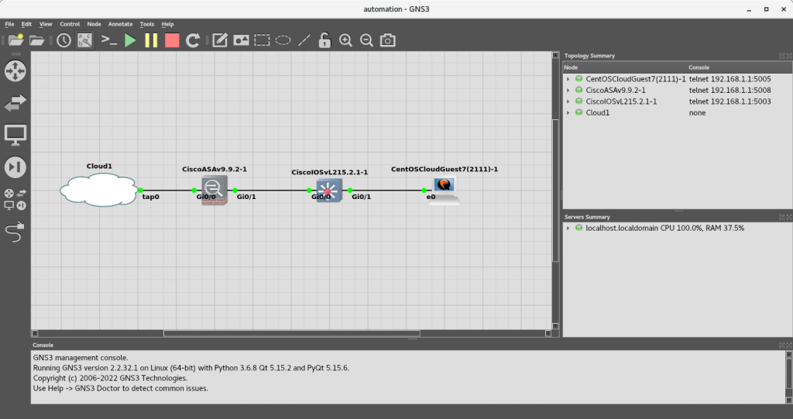

# Small Network Demo

This is a demonstration of how you can use GNS3 virtually to:

- Develop network device configurations and provision network devices 
- Add devices to a network and test connectivity
- Apply emerging technologies, such as network automation

- [Set up GNS3](#set-up-gns3 "Set up GNS3")
- [Set up the Web Server](#set-up-the-web-server "Set up the Web Server]")
- [Set up the Firewall](#set-up-the-firewall "Set up the Firewall")
- [The Demo](#the-demo "The Demo")
- [Put It All Together](#put-it-all-together "Put It All Together")

>**IMPORTANT NOTE** - You will need a Cisco Learning Store Account to perform this lab.

---

## Set up GNS3

Follow the instructions at https://github.com/garciart/network-automation, up to and including [Setting up the environment](https://github.com/garciart/network-automation#setting-up-the-environment "Setting up the environment"). However, do not add a device.

Download an image for each of the following operating systems from https://learningnetworkstore.cisco.com/myaccount to an easily accessible location, such as the Downloads directory or a shared drive:

- Cisco Virtual Internetwork Operating System multilayer_switch (IOSvL2)
- Cisco Adaptive Security Virtual Appliance (ASAv) firewall

>**NOTE** - If you are using a shared folder to store device images, follow these instructions to allow the default user and GNS3 to access the folder:
>
>Open a new Terminal. Add the default user account (gns3user) to the ```vboxsf``` group:
>
>```
>sudo usermod -aG vboxsf gns3user
>grep 'vboxsf' /etc/group
>```
>
>**Output:**:
>
>```
>vboxsf:x:981:gns3user
>```
>
>Reboot so VirtualBox can reconnect the shared folder correctly:
>
>```
>sudo reboot now
>```
>
>Once the VM has rebooted, you can access the shared folder at ```/media/sf_shared-vm```.

You will also need a CentOS image from https://cloud.centos.org/centos/7/images/ to use as an HTTP server. Open a new Terminal and download the server image:

```
cd /media/sf_shared-vm/
wget --no-clobber https://cloud.centos.org/centos/7/images/CentOS-7-x86_64-GenericCloud-2111.qcow2
```

>**NOTE** - Later on, you could import an unconfigured version of CentOS 7 (CentOS-7-x86_64-GenericCloud.qcow2):
>
>```
>wget --no-clobber https://cloud.centos.org/centos/7/images/CentOS-7-x86_64-GenericCloud.qcow2
>```
>
>However, this image does not have any users. To activate root and set a password, execute the following command once you have downloaded the image:
>
>```
>virt-customize -a CentOS-7-x86_64-GenericCloud.qcow2 --root-password password:<enter a password of your choice>
>```
>
>Now you can access the server and add users, as necessary.

To speed up adding devices to GNS3, download the preconfigured appliance templates for both Cisco images and the server:

```
cd /media/sf_shared-vm/
wget --no-clobber https://raw.githubusercontent.com/GNS3/gns3-registry/master/appliances/cisco-iosvl2.gns3a
wget -nc https://raw.githubusercontent.com/GNS3/gns3-registry/master/appliances/cisco-asav.gns3a
wget -nc https://raw.githubusercontent.com/GNS3/gns3-registry/master/appliances/centos-cloud.gns3a
```

Follow the instructions at https://docs.gns3.com/docs/using-gns3/beginners/import-gns3-appliance/ to add the devices to GNS3.

---

## Set up the Web Server

Follow the instructions for **Your First Exercise** at https://github.com/garciart/network-automation#your-first-exercise, both [Part 1](https://github.com/garciart/network-automation#part-1-create-the-network "Create the Network") and [Part 2](https://github.com/garciart/network-automation#part-2-dry-run-through-the-console-port "Dry Run through the Console Port"), but replace the router with the **CentOS Cloud Guest7 (2111)** appliance that you imported earlier. Connect the device to the cloud through Ethernet0 to tap0.

When the ```login``` prompt appears enter "centos" as the username and "centos" as the password:

**Output:**

```
CentOS Linux 7 (Core)
Kernel 3.10.0-1160.45.1.el7.x86_64 on an x86_64

centos login: centos
Password: 
[centos@centos ~]$
```

Create a user named "webmaster". Enter "centos" if prompted for a password:

```
sudo adduser webmaster
```

Set a password of your choice for the ```webmaster``` user:

```
sudo passwd webmaster
```

Finally, give the ```webmaster``` administrative privileges:

```
sudo usermod -aG wheel webmaster
sudo id webmaster
```

Log out as ```centos``` and log in as ```webmaster```. Enter the password for the ```webmaster``` if prompted for a password:

**Output:**

```
[centos@centos ~]$ logout

CentOS Linux 7 (Core)
Kernel 3.10.0-1160.45.1.el7.x86_64 on an x86_64

centos login: webmaster
Password: 
[webmaster@centos ~]$ 
```

Get the name of the Ethernet port:

```
ip address show | grep '[0-9]: e[mnt]'
```

In our case, the port's name is ```eth0```. Place the server on the same subnet as the host, and, if prompted, enter the webmaster's password:

```
sudo ifconfig eth0 192.168.1.111 netmask 255.255.255.0
```

Check the connection with the host:

```
ping -c 4 192.168.1.10
```

Now, open a new Terminal tab, and go to the host's shared folder in the Terminal. Create a directory named "httpd":

```
cd /media/sf_shared-vm/
mkdir httpd
cd /media/sf_shared-vm/httpd/
```

Download Apache's RPM file for HTTP services, along with its dependencies, into the directory, then combine the files into a ZIP file:

```
wget --no-clobber http://mirror.centos.org/centos/7/os/x86_64/Packages/httpd-2.4.6-95.el7.centos.x86_64.rpm
wget -nc http://mirror.centos.org/altarch/7/os/aarch64/Packages/mailcap-2.1.41-2.el7.noarch.rpm
wget -nc http://mirror.centos.org/centos/7/os/x86_64/Packages/centos-logos-70.0.6-3.el7.centos.noarch.rpm
wget -nc http://mirror.centos.org/centos/7/os/x86_64/Packages/httpd-tools-2.4.6-95.el7.centos.x86_64.rpm
wget -nc http://mirror.centos.org/centos/7/os/x86_64/Packages/apr-1.4.8-7.el7.x86_64.rpm
wget -nc http://mirror.centos.org/centos/7/os/x86_64/Packages/apr-util-1.5.2-6.el7.x86_64.rpm
cd ..
zip -r httpd.zip httpd/*
```

Transfer the file to the CentOS server:

```
chmod 666 /media/sf_shared-vm/httpd.zip
scp -o StrictHostKeyChecking=no -o UserKnownHostsFile=/dev/null /media/sf_shared-vm/httpd.zip webmaster@192.168.1.111:/home/webmaster/httpd.zip
```

If the host warns you that ```The authenticity of host '192.168.1.111 (192.168.1.111)' can't be established.```, and if it asks, ```Are you sure you want to continue connecting (yes/no)?```, enter "yes". Otherwise, if prompted, enter the webmaster's password. You should see output similar to the following:

```
Warning: Permanently added '192.168.1.111' (ECDSA) to the list of known hosts.
webmaster@192.168.1.111's password:
httpd.zip                                                                                                                                                                        100% 7258KB  46.8MB/s   00:00
```

The CentOS server probably does not have the **unzip** utility, either. Get the location of the utility on the host:

```
which unzip
```

**Output:**

```
/usr/bin/unzip
```

Transfer a copy of the **unzip** utility to the server. You will have to place it in the ```/home/webmaster``` directory, since the host does not have **sudo** privileges on the server If prompted, enter the webmaster's password:

```
scp -o StrictHostKeyChecking=no -o UserKnownHostsFile=/dev/null /usr/bin/unzip webmaster@192.168.1.111:/home/webmaster/unzip
```

Go back to the CentOS server's tab and unzip the file. If prompted, enter the webmaster's password:

```
cd /home/webmaster
sudo mv /home/webmaster/unzip /usr/bin/unzip
unzip /home/webmaster/httpd.zip
```

**Output:**

```
Archive:  httpd.zip
  inflating: httpd/apr-1.4.8-7.el7.x86_64.rpm
  inflating: httpd/apr-util-1.5.2-6.el7.x86_64.rpm
  inflating: httpd/centos-logos-70.0.6-3.el7.centos.noarch.rpm
  inflating: httpd/httpd-2.4.6-95.el7.centos.x86_64.rpm
  inflating: httpd/httpd-tools-2.4.6-95.el7.centos.x86_64.rpm
  inflating: httpd/mime.types
```

Go to the new ```httpd``` directory and install the RPMs. Ignore any warnings, and, if prompted, enter the webmaster's password:

```  
cd /home/webmaster/httpd/
sudo rpm --install --verbose --hash apr-1.4.8-7.el7.x86_64.rpm
sudo rpm -ivh apr-util-1.5.2-6.el7.x86_64.rpm
sudo rpm -ivh httpd-tools-2.4.6-95.el7.centos.x86_64.rpm
sudo rpm -ivh centos-logos-70.0.6-3.el7.centos.noarch.rpm
sudo rpm -ivh mailcap-2.1.41-2.el7.noarch.rpm
sudo rpm -ivh httpd-2.4.6-95.el7.centos.x86_64.rpm
```

Next, make the server's IP address permanent. Use the stream editor utility to append the following two lines to the configuration file of the server's Ethernet port. If prompted, enter the webmaster's password:

```

sudo sed --in-place --expression "\$aIPADDR=192.168.1.111" /etc/sysconfig/network-scripts/ifcfg-eth0
sudo sed -i -e "\$aPREFIX=24" /etc/sysconfig/network-scripts/ifcfg-eth0
sudo sed -i "s|BOOTPROTO=dhcp|BOOTPROTO=none|g" /etc/sysconfig/network-scripts/ifcfg-eth0
```

Check if you updated the file:

```
cat /etc/sysconfig/network-scripts/ifcfg-eth0
```

**Output:**

```
# Created by cloud-init on instance boot automatically, do not edit.
#
BOOTPROTO=dhcp
DEVICE=eth0
HWADDR=0c:c2:61:dd:00:00
ONBOOT=yes
STARTMODE=auto
TYPE=Ethernet
USERCTL=no
IPADDR=192.168.1.111
PREFIX=24
```

Enable and start the HTTP server. If prompted, enter the webmaster's password:

```
sudo systemctl enable httpd
sudo apachectl start
```

Create an "index.html" file:

```
cd /home/webmaster/httpd/
echo '<!DOCTYPE html>' > index.html
echo '<html>' >> index.html
echo '<head>' >> index.html
echo '<title>Welcome to my GNS3 Demo!</title>' >> index.html
echo '</head>' >> index.html
echo '<body>' >> index.html
echo '<h1>Welcome to my GNS3 Demo!</h1>' >> index.html
echo '<p>My name is Rob, and this is my GNS3 demo!</p>' >> index.html
echo '<p>Current Date and Time is <span id='date-time'></span>.</p>' >> index.html
echo '<script>' >> index.html
echo 'var dt = new Date();' >> index.html
echo 'document.getElementById('date-time').innerHTML=dt;' >> index.html
echo '</script>' >> index.html
echo '</body>' >> index.html
echo '</html>' >> index.html
```

Move the file to the ```/var/www/html``` directory and fix permissions. If prompted, enter the webmaster's password:

```
sudo mv /home/webmaster/httpd/index.html /var/www/html/index.html
chmod 755 /var/www/html/
chmod 644 /var/www/html/index.html
sudo restorecon -Rv /var/www/html
```

Reboot the server, so all the changes will be updated. If prompted, enter the webmaster's password:

```
sudo reboot now
```

Once the server has finished rebooting, switch back to the host, open a browser, and visit http://192.168.1.111. The website should appear!

When finished, shutdown the web server and disconnect it from the cloud.

---

## Set up the Firewall

Follow the instructions for **Your First Exercise** at https://github.com/garciart/network-automation#your-first-exercise, both [Part 1](https://github.com/garciart/network-automation#part-1-create-the-network "Create the Network") and [Part 2](https://github.com/garciart/network-automation#part-2-dry-run-through-the-console-port "Dry Run through the Console Port"), but replace the router with the **CCisco ASAv 9.9.2 appliance** appliance that you imported earlier. Connect the device to the cloud through GigabitEthernet0/0 to tap0.

Open a console. After the device finishes booting, the User EXEC Mode prompt should appear (```ciscoasa>```). Enter "enable" to get to Privileged EXEC Mode. If prompted for a password, press <kbd>Enter</kbd>, since the device has no password yet:

**Output:**

```
ciscoasa> enable
Password: 
ciscoasa# 
```

Enter Global Configuration Mode and disable routing:

>**NOTE** - If the message, ```Would you like to enable anonymous error reporting to help improve the product? [Y]es, [N]o, [A]sk later:```, enter "N" for now.

```
configure terminal
firewall transparent
end
```

Configure the ports for external and internal communications and enable Layer 3 communications through a Bridge Virtual Interface (BVI):

```
configure terminal
interface GigabitEthernet0/0
nameif outside
security-level 100
bridge-group 1
no shutdown
exit
interface GigabitEthernet0/1
nameif inside
security-level 100
bridge-group 1
no shutdown
exit
interface bvi 1
ip address 192.168.1.123 255.255.255.0
end
```

You will need the bridge, since the firewall does not allow packets to enter and exit through the same interface. In addition, packets can only flow from a port at a higher security level to a lower level, and ports on the same security level cannot communicate with each other. To test connectivity in this lab, allow traffic to flow between ports at the same security level: 

```
configure terminal
same-security-traffic permit inter-interface
end
```

Check connectivity between the firewall and the host:

```
ping 192.168.1.10
```

Save the current configuration:

```
copy running-config startup-config
```

Connect the firewall to the server through GigabitEthernet0/1, and start the server.

Open a console and log in to the server, using the webmaster account. Once you are logged in, ping both the firewall and the cloud:

```
ping -c 4 192.168.1.123
ping -c 4 192.168.1.10
```

Go back to the firewall console, and ping the server:

```
ping 192.168.1.111
```

Open a Terminal on the host, and ping both the firewall and the server:

```
ping -c 4 192.168.1.123
ping -c 4 192.168.1.111
```

Once you have finished checking connectivity, shutdown the firewall and the server, and disconnect both of them from the cloud.

---

## The Demo

Drag a **cisco-iosvl2** switch onto the **Workspace**. Rename it "c3750Z-4"; increase the memory to 1024; increase the vCPUs to 2; and reduce the network adapters to 4.

Open a new Terminal or a console:

>**NOTE** - To allow cut and pasting (to speed up demonstrations), set the GNS3 terminal to use the **GNOME** terminal instead of **xterm** (*Edit* -> *Preferences* -> *General* -> *Console applications* -> *Console settings*).

```
telnet 192.168.1.1 5001
```

Familiar startup messages should appear. Once they are complete, press <kbd>Enter</kbd> to continue, as instructed.

You should be in User EXEC Mode, which only allows you to access to basic commands. Enter the following command to enter Privileged EXEC Mode:

```enable```

Determine the default file system and check the status of the Ethernet ports by entering the following commands:

```
dir
show ip interface brief
```

You should see something like the following:

```
Switch#dir
Directory of flash0:/

    1  drw-           0  Jan 30 2013 00:00:00 +00:00  boot
  264  drw-           0  Oct 14 2013 00:00:00 +00:00  config
  266  -rw-         375  Jun 19 2018 00:00:00 +00:00  config.grub
  267  -rw-   118944152  Jun 19 2018 00:00:00 +00:00  vios_l2-adventerprisek9-m
  268  -rw-      524288   May 2 2022 15:15:24 +00:00  nvram

2142715904 bytes total (2018639872 bytes free)
Switch#sho ip int br
Interface              IP-Address      OK? Method Status                Protocol
GigabitEthernet0/0     unassigned      YES unset  up                    up
GigabitEthernet0/1     unassigned      YES unset  down                  down
GigabitEthernet0/2     unassigned      YES unset  down                  down
GigabitEthernet0/3     unassigned      YES unset  down                  down
```

The name of the default file system is ```flash0``` and none of the ports have an IPv4 address. Fix that by entering the following commands:

```
configure terminal
interface GigabitEthernet0/0
switchport mode access
switchport access vlan 1
no shutdown
exit
interface vlan 1
ip address 192.168.1.20 255.255.255.0
no shutdown
end
```

Check the status of the Ethernet ports again and verify that you are connected to the host:

```
show ip interface brief
ping 192.168.1.10
```

Next, enable SSH communications:

```
configure terminal
crypto key zeroize rsa
crypto key generate rsa general-keys label DEMO modulus 1024
end
```

Check that SSH is enabled by entering ```show ip ssh```:

```
Switch#show ip ssh
SSH Enabled - version 1.99
Authentication methods:publickey,keyboard-interactive,password
Authentication Publickey Algorithms:x509v3-ssh-rsa,ssh-rsa
Hostkey Algorithms:x509v3-ssh-rsa,ssh-rsa
Encryption Algorithms:aes128-ctr,aes192-ctr,aes256-ctr
MAC Algorithms:hmac-sha1,hmac-sha1-96
Authentication timeout: 120 secs; Authentication retries: 3
Minimum expected Diffie Hellman key size : 1024 bits
IOS Keys in SECSH format(ssh-rsa, base64 encoded): DEMO
ssh-rsa AAAAB3NzaC1yc2EAAAADAQABAAAAgQDLQ61TadewW6SdrPQ9mXjtNVdb5USKiUgCbkXijxTQ
1leWvyyEUanTIVkgf/8dy1MW0TfgnX0orjZxjh6VTWXWdzsivqgiLQiL7KX5WjSrjbdUNSiuHbI09wMb
jswLLygQdqrQE0F9d07hsUEqZE5F7BbK482HXhRjKMLDeNmLpQ==
```

Next, secure the switch:

```
configure terminal
username admin privilege 15 secret cisco
line vty 0 4
login local
exit
line console 0
password ciscon
login
exit
line aux 0
password cisaux
login
exit
enable secret cisen
service password-encryption
end
```

While you are here, enable the switch's web graphical user interface (GUI):

```
configure terminal
ip http server
ip http authentication local
end
```

Save all changes to the default configuration:

```
copy running-config startup-config
```

Enter "startup-config" when prompted for a filname.

Before leaving, take a look at the startup-config file:

```
show startup-config
```

You will see that the ports are secured and the passwords are all encrypted.

Exit Telnet by pressing <kbd>Ctrl</kbd> + <kbd>]</kbd>, and then entering "q". Once you are back at the Bash prompt, SSH into the switch:

 >**NOTE** - For this connection, use the ```StrictHostKeyChecking``` and ```UserKnownHostsFile``` options to prevent having to modify the ```known_hosts``` file:

```
ssh -o StrictHostKeyChecking=no -o UserKnownHostsFile=/dev/null admin@192.168.1.20
```

If asked if you want to continue connecting, enter "yes". When prompted for a password, enter "cisco".

If all went well, the switch's prompt should appear.

Now, download the secure configuration to your ```home``` directory:

```
copy startup-config scp:
```

When prompted, enter "192.168.1.10" as the address of the remote host; "gns3user" as the username; "new-start.cfg" as the destination filename; and "gns3user" as the password:

```
Switch#copy startup-config scp:
Address or name of remote host []? 192.168.1.10
Destination username [admin]? gns3user
Destination filename [switch-confg]? new-start.cfg
Writing new-start.cfg
Password:
! Sink: C0644 3600 new-start.cfg

3600 bytes copied in 13.010 secs (277 bytes/sec)
```

Exit SSH by pressing <kbd>Shift</kbd> + <kbd>~</kbd>, and then entering ".".

Switch to the GNS3 client, then stop the switch and delete it. Open the **Devices Toolbar**, and place a new switch onto the **Workspace**. Connect the new switch to the **Cloud** and start the switch.

Switch back to the Terminal. Before connecting to the new switch, enable the Trivial File Transfer Protocol (TFTP) server. You will use TFTP to upload the secure configuration to the switch later on:

```
sudo firewall-cmd --zone=public --add-port=69/udp
sudo firewall-cmd --zone=public --add-service=tftp
sudo mkdir --parents /var/lib/tftpboot
sudo chmod 777 /var/lib/tftpboot
cp ~/new-start.cfg /var/lib/tftpboot
sudo chmod 777 /var/lib/tftpboot/new-start.cfg
sudo systemctl start tftp
```

Now, connect to the new switch:

```
telnet 192.168.1.1 5001
```

Familiar startup messages should appear. Once they are complete, press <kbd>Enter</kbd> to continue, as instructed.

You should be in User EXEC Mode, which only allows you to access to basic commands. Enter the following command to enter Privileged EXEC Mode:

```enable```

To verify that this is a new switch, check the status of the Ethernet ports and look at the startup-config (nothing is secured):

```
show ip interface brief
show startup-config
```

Great! However, you will have to do some configuration to allow Layer 3 communications with the switch. The good news is that you will not have to completely repeat everything you did before; you only need to configure an Ethernet port and enable SSH:

```
configure terminal
interface GigabitEthernet0/0
switchport mode access
switchport access vlan 1
no shutdown
exit
interface vlan 1
ip address 192.168.1.20 255.255.255.0
no shutdown
exit
crypto key zeroize rsa
crypto key generate rsa general-keys label DEMO modulus 1024
end
```

Check the status of the Ethernet ports and SSH, and verify that you are connected to the host:

```
show ip interface brief
show ip ssh
ping 192.168.1.10
```

Next, upload the new configuration from the host:

```
copy tftp: flash0:
```

When prompted, enter "192.168.1.10" as the address of the remote host; "gns3user" as the username; and "new-start.cfg" as the destination filename:

```
Switch#copy tftp: flash0:
Address or name of remote host []? 192.168.1.10
Source filename []? new-start.cfg
Destination filename [new-start.cfg]? new-start.cfg
Accessing tftp://192.168.1.10/new-start.cfg...
Loading new-start.cfg from 192.168.1.10 (via Vlan1): !
[OK - 2914 bytes]

2914 bytes copied in 0.461 secs (6321 bytes/sec)
```

Verify that ```new-start.cfg``` was uploaded and set as the boot configuration file:

```
copy new-start.cfg startup-config
```

Verify the ```startup-config``` has been updated, and the ports are secured and the passwords are encrypted:

```
show startup-config
```

Copy the ```startup-config``` to the ```running-config```, by entering ```copy startup-config running-config```. When prompted, enter "running-config" as the destination filename:

```
Switch#copy start run
Destination filename [running-config]?
3600 bytes copied in 0.046 secs (78261 bytes/sec)
```

Exit Telnet by pressing <kbd>Ctrl</kbd> + <kbd>]</kbd>, and then entering "q". Once you are back at the Bash prompt, for security purposes, shut down the TFTP service:

```
sudo firewall-cmd --zone=public --remove-port=69/udp
sudo firewall-cmd --zone=public --remove-service=tftp
sudo systemctl stop tftp
```

Once that is complete, SSH into the switch:

```
ssh -o StrictHostKeyChecking=no -o UserKnownHostsFile=/dev/null admin@192.168.1.20
```

If you are asked if you want to continue connecting, enter "yes". When prompted for a password, enter "cisco".

If all went well, the switch's prompt should appear. Look around, and, when you are finished, enter "exit" to get back to the Bash prompt.

Go back to GNS3 and shut down and disconnect all the devices.

---

## Put It All Together

Connect the devices as shown below:

- Cloud ```tap0``` to ASA ```Gi0/0```
- ASA ```Gi0/1``` to Switch ```Gi0/0```
- Switch ```Gi0/1``` to Server ```Ethernet0```



Turn on all the devices. Allow a few minutes for the devices to finish booting up (you can open a device console and check).

Switch back to the host, open a browser, and visit http://192.168.1.111. The website should appear!
