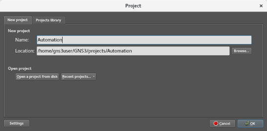
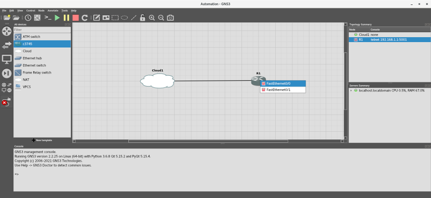
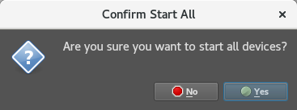

# Adventures in Network Automation

## Lab 001 - Telnet into a device and format the flash memory.

>**Note** - If you like, check out [https://docs.gns3.com/docs/using-gns3/beginners/the-gns3-gui](https://docs.gns3.com/docs/using-gns3/beginners/the-gns3-gui "The GNS3 GUI") to learn the different parts of the GNS3 Graphical User Interface (GUI).

Once you have finished setting up your lab environment, click on **File** ->  **New blank project**, or press  <kbd>Ctrl</kbd>+<kbd>N</kbd>, to create a new project. If GNS3 is not running, start GNS3 by inputting ```gns3_run``` in a Terminal (the **Project** window should appear).

A pop-up dialog will appear, asking you to create a new project. Enter ```lab001-telnet``` in the ***Name*** textbox and click the **OK** button.



From the GNS3 Toolbar, click **View** -> **Docks** -> **All templates**:


All the devices you can use in your lab will appear in a docked window next to the Devices Toolbar on the right.

>**NOTE** - In the **View** dropdown menu, there are several options that will make your life easier. I recommend both **Snap to grid**, which will keep your workspace orderly, and **Show/Hide interface labels**, which will allow you to see your connection points at a glance.

You may also use the "Browse all devices" to see all your available devices:


Select a **Cloud** and place it in the Workspace, then select a **c3745** and place it on the Workspace. Note that the router's hostname is **R1**:


Select the "Add a link" icon at the bottom of the Devices Toolbar:


Move the cross-hair over **Cloud1** and select the TAP interface name (e.g., **tap0**):


Connect the other end to the built-in **FastEthernet0/0** port in **R1**:



Notice that, while the devices are connected, nothing is being transmitted, because the router is not on:


Let us fix that. Click on the green **Play** icon in the GNS3 Toolbar above the Workspace. When asked, "Are you sure you want to start all devices?", click **Yes**:



You will see that all the nodes are now green, both in the Workspace and the Topology Summary in the top left-hand corner:


By the way, note the console information for R1 in the **Topology Summary** in the top left-hand corner. It tells us that, even though the device does not have an IP address yet, you can connect to R1 using Telnet through the Console port on the back of the 3745 using port 5001.

However, your port number may be different. If the Console port number is difficult to see, you can get the information by expanding the dock or right-clicking on the R1 node and selecting **Show node information**:


The pop-up dialog has a lot of good information, including which port number the Console port is using:


Open a new Terminal and Telnet into the device by inputting the following command:

```
telnet 192.168.1.1 5001
```

You will see boot up messages appear on the screen, similar to the following:

```
Trying 192.168.1.1...
Connected to 192.168.1.1.
Escape character is '^]'.
Connected to Dynamips VM "R1" (ID 1, type c3745) - Console port
Press ENTER to get the prompt.
...
Press RETURN to get started!
...
*Mar  1 00:00:05.603: %LINEPROTO-5-UPDOWN: Line protocol on Interface FastEthernet0/0, changed state to down
*Mar  1 00:00:05.699: %LINEPROTO-5-UPDOWN: Line protocol on Interface FastEthernet0/1, changed state to down
```

Once the messages have stopped appearing, press <kbd>Enter</kbd> to access a prompt. In our case, the Privileged EXEC mode prompt (```R1#```) will appear:

```
R1#
```

You are now connected to the router through the Console port. Before we continue, let us take care of some housekeeping.

When we first configured the router, we gave it a default IOS image (c3745-adventerprisek9-mz.124-25d.bin). However, when the router first starts, it looks for an IOS image in flash memory. This is because the 3745 can store multiple IOS's in flash memory; you tell the router which one you want to use, by inputting ```boot system flash:<the IOS filename>.bin``` at a configuration prompt and saving it in the start-up configuration file. If the router does not find an IOS there, it will look in its Read-Only Memory (ROM) for a default IOS.

Our router will do this because we have not formatted our flash memory, preventing us from uploading another IOS. As a matter of fact, you may see the following error:

```
PCMCIA disk 0 is formatted from a different router or PC. A format in this router is required before an image can be booted from this device
```

In this lab, we will not need another IOS, but we do want to use our flash memory, so let us fix our memory issue, by inputting the following command:

```
format flash:
```

You will be asked to confirm the format operation twice. Press <kbd>Enter</kbd> both times:

```
Format operation may take a while. Continue? [confirm]
Format operation will destroy all data in "flash:".  Continue? [confirm]
```

You should see output similar to the following:

```
Format: Drive communication & 1st Sector Write OK...
Writing Monlib sectors.
.........................................................................................................................
Monlib write complete 
..
Format: All system sectors written. OK...

Format: Total sectors in formatted partition: 130911
Format: Total bytes in formatted partition: 67026432
Format: Operation completed successfully.

Format of flash complete

R1#
```

Input ```show flash``` to see what is in the drive:

```
No files on device
66875392 bytes available (0 bytes used)

R1#
```

Now, press <kbd>Ctrl</kbd>+<kbd>]</kbd> to leave R1 and input "q" to exit Telnet. Go back to the GNS3 GUI, click the red **Stop** icon in the GNS3 Toolbar above the Workspace. When asked, "Are you sure you want to stop all devices?", click Yes::

>Do not click on **Reload**! **Reload** will load the default settings, erasing any changes you have made. You will learn how to save configurations later.


After a few seconds, click on the green **Play** icon in the GNS3 Toolbar above the Workspace. When asked, "Are you sure you want to start all devices?", click **Yes**:


All the nodes should turn green.

## The Code:

To recap, we:

1. Accessed the device through Telnet.
2. Entered Privileged EXEC Mode.
3. Formatted the device's flash memory.
4. Closed the connection.

Like I stated earlier, this is easy to do for one device, but not for one hundred. Let us put these steps into a simple python script.

This is a bare-bones script that automates everything we did earlier. The heart of the script is the ```child```. Once spawned, we will use it to send commands to the device, expecting a certain result:

```
#!/usr/bin/python
"""Lab 001: Telnet into a device and format the flash memory.
To run this lab:

* Start GNS3 by executing "gn3_run" in a Terminal window.
* Add a Cloud and a C3745 router
* Connect the cloud's tap interface to the router's FastEthernet0/0 interface
* Start all devices.
* Run this script (i.e., "python lab001-telnet.py")
"""
from __future__ import print_function

import time

import pexpect

child = None
print("Connecting to the device and formatting the flash memory...")

# Connect to the device and allow time for any boot messages to clear
child = pexpect.spawn("telnet 192.168.1.1 5001")
time.sleep(5)
child.sendline("\r")

# Check for a prompt, either R1> (User EXEC mode) or R1# (Privileged EXEC Mode)
# and enable Privileged EXEC Mode if in User EXEC mode.
index = child.expect_exact(["R1>", "R1#", ])
if index == 0:
    child.sendline("enable\r")
    child.expect_exact("R1#")

# Format the flash memory. Look for the final characters of the following strings:
# "Format operation may take a while. Continue? [confirm]"
# "Format operation will destroy all data in "flash:".  Continue? [confirm]"
# "66875392 bytes available (0 bytes used)"
#
child.sendline("format flash:\r")
child.expect_exact("Continue? [confirm]")
child.sendline("\r")
child.expect_exact("Continue? [confirm]")
child.sendline("\r")
child.expect_exact("Format of flash complete", timeout=120)
child.sendline("show flash\r")
child.expect_exact("(0 bytes used)")

# Close Telnet and disconnect from device
child.sendcontrol("]")
child.sendline('q\r')

print("Successfully connected to the device and formatted the flash memory.")
```

Run the script, and you will get the following output:

```
$ python lab001-telnet.py

Hello, friend.
Connecting to the device and formatting the flash memory...
Successfully connected to the device and formatted the flash memory.
Script complete. Have a nice day.
```

By the way, if you are still are connected to the device through Telnet in a Terminal window, you will see your program run:

```
R1#format flash:
Format operation may take a while. Continue? [confirm]
Format operation will destroy all data in "flash:".  Continue? [confirm]
Format: Drive communication & 1st Sector Write OK...
Writing Monlib sectors.
.........................................................................................................................
Monlib write complete 
..
Format: All system sectors written. OK...

Format: Total sectors in formatted partition: 130911
Format: Total bytes in formatted partition: 67026432
Format: Operation completed successfully.

Format of flash complete
R1#show flash
No files on device

66875392 bytes available (0 bytes used)

R1#
```

I have also included a script with error detection in the **labs** folder, named [lab001-telnet.py](labs/lab001-telnet.py "Telnet lab"). If you want to experiment with debugging, stop the devices and run [lab001-telnet.py](labs/lab001-telnet.py "Telnet lab"). The script will fail, and provide you with detailed information on why.

**Congratulations!** You have automated a common networking task using Python. You can explore the other labs in the **labs** folder, or you can exit GNS3. Do not forget to return to the Terminal window when you exit GNS3 to finish execution of the script; enter your password if prompted:

```
Resetting the network...
[sudo] password for gns3user: 

Network interface configuration:
3: enp0s8: <BROADCAST,MULTICAST> mtu 1500 qdisc pfifo_fast state DOWN group default qlen 1000
    link/ether 08:00:27:c7:b0:0f brd ff:ff:ff:ff:ff:ff
    inet 192.168.1.10/24 scope global enp0s8
       valid_lft forever preferred_lft forever

Script complete. Have a nice day.
```

Good luck!
