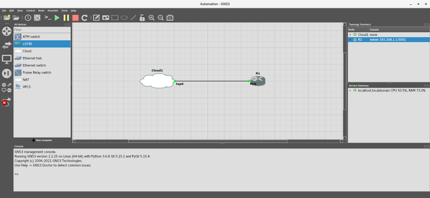
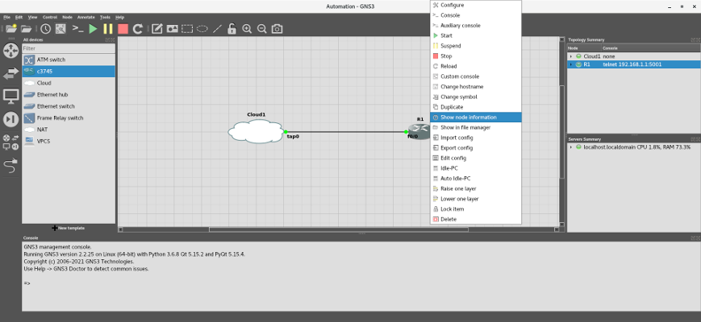

# Welcome to the Labs!


Before starting the labs, let's run the commands we will use in the labs in a router console session. This will give you an idea of the output and results expected from each lab.

First, ensure you have installed GNS3 per the instructions in the **"Adventures in Automation"** tutorial (this repo's main README.md file) and start it up. As we stated at the end, we recommend you enter ```gns3_run``` from a Terminal to start GNS3.

>**NOTE** - By the way, we will continue to use the Cisco 3745 Multi-Service Access Router for the labs, so no further configuration is needed. All you will have to do from the GNS3 GUI is start the device; occasionally get some info or reload the device; and stop the device before exiting. 

Second, change your firewall settings by opening a Linux Terminal window and entering the following commands. If prompted, enter your sudo password:

```
sudo firewall-cmd --zone=public --add-port=23/tcp
sudo firewall-cmd --zone=public --add-port=69/udp
sudo firewall-cmd --zone=public --add-service=tftp
```

The first command allows Telnet client communications through port 23, while the next two commands allow Trivial File Transfer Protocol (TFTP) client and server communications through port 69. Both Telnet and TFTP are not secure, but we will use them in the labs to demonstrate simple host-to-device communications and file transfers, before implementing more secure protocols.

>**NOTE** - If you run into any errors, make sure you installed GNS3 per the instructions in the "Adventures in Automation" tutorial.
>- Do not reload the firewall daemon. For security purposes, these changes are temporary and the ports will close if the system crashes or reboots.
>- Do not install a Telnet service. You will only need the Telnet client, which you installed during the GNS3 setup. 

Next, create the TFTP default directory (if it does not exist) and give it the necessary permissions to accept and send files:

```
sudo mkdir --parents --verbose /var/lib/tftpboot 
sudo chmod 777 --verbose /var/lib/tftpboot
```

For many reasons, TFTP is very limited. TFTP can only copy to an ***existing*** file; it cannot ***create*** a new copy! Therefore, create a shell file for TFTP to copy data into, and give the shell the necessary permissions to accept the data:

```
sudo touch /var/lib/tftpboot/startup-config.bak
sudo chmod 777 --verbose /var/lib/tftpboot/startup-config.bak
```

Finally, start the TFTP service:

```
sudo systemctl start tftp
```

Now that you have set up the host system, you can run the commands in a router console session. First, get the gateway IP address and console port's number from the **Topology Summary** in the top left-hand corner.:



If the console port number is difficult to see, you can get the information by expanding the dock or right-clicking on the R1 node and selecting **Show node information**:




Connect to the device using Telnet. In our case, the console port number is ```5001```. Remember, do not add a colon after the IP address; just use a space:

```
telnet 192.168.1.1 5001
```

If everything was configured correctly, you will see messages from the boot sequence of the device. For us, the most important part of the output is this line:

```
Press RETURN to get started!
```

If the device was reloaded correctly, you should see this message and no prompt before or after it (e.g., ```R1>```, ```R1#```, etc.) until you press <kbd>Enter</kbd>. If you see a prompt, that means that the device was not properly reloaded, and you may be using someone else's virtual teletype (VTY) session. This is dangerous for many reasons (e.g., race condition, eavesdropping, etc.), so press <kbd>Ctrl</kbd>+<kbd>]</kbd> 

Press <kbd>Enter</kbd> now. If you see the following text...

```
User Access Verification

Password: 
```

...it means that the device:

1. Has not been properly reloaded -
2. Has already been configured

In both cases, 
