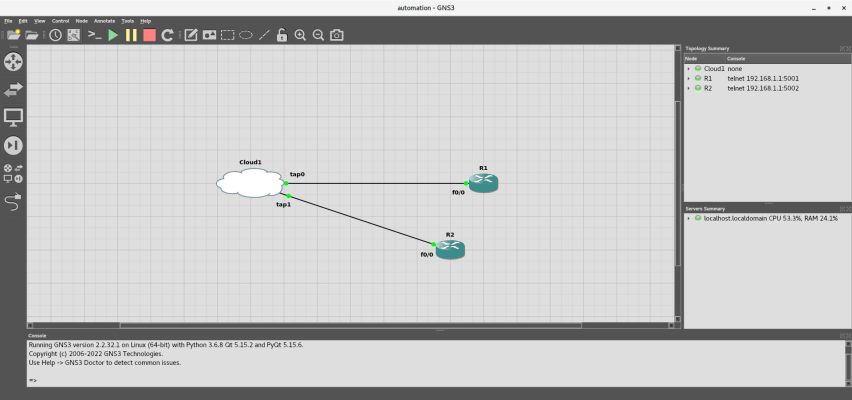

# Exercises

The exercises on this page will show you how to automate simple network tasks using Python. Each exercise will demonstrate the manual way of performing a task, followed by a Python script that automates the work.

First, ensure you have installed and started GNS3 per the instructions on the landing page of this **[repo](https://github.com/garciart/network-automation#adventures-in-network-automation "Adventures in Network Automation")**, up to and including **[Your First Lab - Part 1: Create the Network](https://github.com/garciart/network-automation#part-1-create-the-network "Your First Lab - Part 1: Create the Network")**.

>**NOTE** - To speed thing up, we recommend you follow our suggestion in the post-script of **[Adventures in Automation](https://github.com/garciart/network-automation#post-script "Post Script")**, and start GNS3 by using the ```gns3_run``` Bash script.

However, add another **Cisco 3745** router to the Workspace, and make sure it is named "R2". Connect the ```tap1``` interface in **Cloud1** to the ```F0/0``` interface in **R2**. Start all the devices, and you should end up with a topology that looks like the following:



>**NOTE** - If your port numbers in the **Topology Summary** (on the right) are not ```5001``` and ```5002```, that is OK. For the exercises, replace ```5001``` with the port number that the GNS3 server assigned to **R1** (e.g., ```192.168.1.1 5XXX```, etc) and replace ```5002``` with the port number that the GNS3 server assigned to **R2**.

You will run commands directly in the console on **R1**, and you will run Python scripts on **R2**. This will prevent errors due to executing commands twice on the same device.

## Exercises:

>**NOTE** - In the code snippets, a semicolon (```;```) or pound sign (```#```) after a command or a line is a comment indicator, in which I may explain what is going on. They are optional, and you do not have to add the indicator or the comments.

>**NOTE** - While I included error-handling in the Cisco IOS class and static Utility module, for the sake of brevity, I did not do so for these exercises. I expect that, if you followed the instructions and created your topology correctly, all the commands will work, if executed sequentially.

1. [Connect to the device from the host via Telnet](#connect-to-the-device-from-the-host-via-telnet "Connect to the device from the host via Telnet")
2. [Access the device's Privileged EXEC mode](#access-the-devices-privileged-exec-mode "Access the device's Privileged EXEC mode")
3. [Set up the device's logging process](#set-up-the-devices-logging-process "Set up the device's logging process")
4. [Change the device's hostname](#change-the-devices-hostname "Change the device's hostname")
5. [Save the device's running configuration as the startup configuration](#save-the-devices-running-configuration-as-the-startup-configuration "Save the device's running configuration as the startup configuration")
6. [Get the name of the device's default file system](#get-the-name-of-the-devices-default-file-system "Get the name of the device's default file system")
7. [Get the name of the device](#get-the-name-of-the-device "Get the name of the device")
8. [Get the serial number of the device](#get-the-serial-number-of-the-device "Get the serial number of the device")
9. [Get the operating system's name and version of the device](#get-the-operating-systems-name-and-version-of-the-device "Get the operating system's name and version of the device")
10. [Format a filesystem on the device](#format-a-filesystem-on-the-device "Format a filesystem on the device")
11. [Set the switch's priority](#set-the-switchs-priority "Set the switch's priority")
12. [Assign the switch an IPv4 address](#assign-the-switch-an-ipv4-address "Assign the switch an IPv4 address")
13. [Assign the router an IPv4 address](#assign-the-router-an-ipv4-address "Assign the router an IPv4 address")
14. [Test connectivity from the device to the host](#test-connectivity-from-the-device-to-the-host "Test connectivity from the device to the host")
15. [Test connectivity from the host to the device](#test-connectivity-from-the-host-to-the-device "Test connectivity from the host to the device")
16. [Secure the device's virtual teletype (VTY) lines](#secure-the-devices-virtual-teletype-vty-lines "Secure the device's virtual teletype (VTY) lines")
17. [Secure the device's Console port](#secure-the-devices-console-port "Secure the device's Console port")
18. [Secure the device's Auxiliary port](#secure-the-devices-auxiliary-port "Secure the device's Auxiliary port")
19. [Secure the device's Privileged EXEC Mode](#secure-the-devices-privileged-exec-mode "Secure the device's Privileged EXEC Mode")
20. [Set the device's clock manually](#set-the-devices-clock-manually "Set the device's clock manually")
21. [Enable the NTP server on the host](#enable-the-ntp-server-on-the-host "Enable the NTP server on the host")
22. [Update the device's clock using the host's NTP server](#update-the-devices-clock-using-the-hosts-ntp-server "Update the device's clock using the host's NTP server")
23. [Enable SSH on the device](#enable-ssh-on-the-device "Enable SSH on the device")
24. [Connect to the device from the host via Secure Shell (SSH)](#connect-to-the-device-from-the-host-via-secure-shell-ssh "Connect to the device from the host via Secure Shell (SSH)")
25. [Enable the TFTP server on the host](#enable-the-tftp-server-on-the-host "Enable the TFTP server on the host")
26. [Download the device's startup configuration to the host via TFTP](#download-the-devices-startup-configuration-to-the-host-via-tftp "Download the device's startup configuration to the host via TFTP")
27. [Determine and display a file's hash value](#determine-and-display-a-files-hash-value "Determine and display a file's hash value")
28. [Upload a non-existing file from the host to the device via TFTP](#upload-a-non-existing-file-from-the-host-to-the-device-via-tftp "Upload a non-existing file from the host to the device via TFTP")
29. [Download a non-existing file from the host to the device via TFTP](#download-a-non-existing-file-from-the-host-to-the-device-via-tftp "Download a non-existing file from the host to the device via TFTP")
30. [Upload an existing file from the host to the device via TFTP](#upload-an-existing-file-from-the-host-to-the-device-via-tftp "Upload an existing file from the host to the device via TFTP")
31. [Download an existing file from the host to the device via TFTP](#download-an-existing-file-from-the-host-to-the-device-via-tftp "Download an existing file from the host to the device via TFTP")
32. [Enable the FTP server on the host](#enable-the-ftp-server-on-the-host "Enable the FTP server on the host")
33. [Download the device's startup configuration to the host via FTP](#download-the-devices-startup-configuration-to-the-host-via-ftp "Download the device's startup configuration to the host via FTP")
34. [Upload a non-existing file from the host to the device via FTP](#upload-a-non-existing-file-from-the-host-to-the-device-via-ftp "Upload a non-existing file from the host to the device via FTP")
35. [Download a non-existing file from the host to the device via FTP](#download-a-non-existing-file-from-the-host-to-the-device-via-ftp "Download a non-existing file from the host to the device via FTP")
36. [Upload an existing file from the host to the device via FTP](#upload-an-existing-file-from-the-host-to-the-device-via-ftp "Upload an existing file from the host to the device via FTP")
37. [Download an existing file from the host to the device via FTP](#download-an-existing-file-from-the-host-to-the-device-via-ftp "Download an existing file from the host to the device via FTP")
38. [Enable the SCP server on the host](#enable-the-scp-server-on-the-host "Enable the SCP server on the host")
39. [Download the device's startup configuration to the host via SCP](#download-the-devices-startup-configuration-to-the-host-via-scp "Download the device's startup configuration to the host via SCP")
40. [Upload a non-existing file from the host to the device via SCP](#upload-a-non-existing-file-from-the-host-to-the-device-via-scp "Upload a non-existing file from the host to the device via SCP")
41. [Download a non-existing file from the host to the device via SCP](#download-a-non-existing-file-from-the-host-to-the-device-via-scp "Download a non-existing file from the host to the device via SCP")
42. [Upload an existing file from the host to the device via SCP](#upload-an-existing-file-from-the-host-to-the-device-via-scp "Upload an existing file from the host to the device via SCP")
43. [Download an existing file from the host to the device via SCP](#download-an-existing-file-from-the-host-to-the-device-via-scp "Download an existing file from the host to the device via SCP")
44. [Reload the device](#reload-the-device "Reload the device")
45. [Disable the TFTP service on the host](#disable-the-tftp-service-on-the-host "Disable the TFTP service on the host")
46. [Disable the FTP service on the host](#disable-the-ftp-service-on-the-host "Disable the FTP service on the host")
47. [Disable the NTP service on the host](#disable-the-ntp-service-on-the-host "Disable the NTP service on the host")
48. [Disable the SCP service on the host (optional)](#disable-the-scp-service-on-the-host-optional "Disable the SCP service on the host (optional)")

---

## Connect to the device from the host via Telnet

As I stated in **[Adventures in Automation](https://github.com/garciart/network-automation "Adventures in Automation")**, GNS3 uses [*Reverse Telnet*](https://en.wikipedia.org/wiki/Reverse_telnet "Reverse Telnet"). The GNS3 server assigns a port number to each virtual device in the **Workspace**, and you can access a device through the server's IPv4 address and its Console port number. Connecting to a device using Reverse Telnet is similar to connecting to a device through its Console port (or Auxiliary port, if enabled), using a serial cable, and a terminal emulator like PuTTY or Minicom. However, you will not be able to open a Secure Shell (SSH) connection using this method.

Open a Terminal and connect to the device:

```
telnet 192.168.1.1 5001
```

>**NOTE** - If you see an error message that states, ```Connection refused```, make sure you started all the devices in the GNS3 client.

After a few minutes, the router will request that you ```Press RETURN to get started```. Press <kbd>Enter</kbd>, and one of the following prompts should appear:

- ```R1>``` - You are in User EXEC Mode. In this mode, you can only perform basic tasks, like pinging or "show"-ing basic information.
- ```R1#``` - You are in Privileged EXEC Mode. In this mode, you can perform advanced tasks, like debugging, and you can as access the device's global configuration settings.
- ```R1(config)#``` - You are in Global Configuration Mode. In this mode, you can view and change settings that affect all interfaces, ports, and protocols of the device, and you can access their configuration settings.
- ```R1(config-if)``` - You are in Interface Configuration Mode. In this mode, you can manage network interface settings, such as IPv4 addresses.
- ```R1(config-line)#``` - You are in Line Command Mode. In this mode, you can manage port settings, such as a password.
- ```R1(config-router)#``` - You are in Router Command Mode. In this mode, you can manage routing protocols, such as Routing Information Protocol (RIP), Open Shortest Path First (OSPF), etc.

In these exercises, the base mode for interacting with the router is **Privileged EXEC Mode** (```R1#```). If you are not in Privileged EXEC Mode, that is OK; I'll show you how to get to Privileged EXEC Mode from any mode after this exercise.

Right now, open another Terminal (or another tab in the current Terminal), and access the Python interpreter:

```
python
```

At the ```>>>``` prompt, enter the following code to create a Telnet child process:

>**NOTE** - Do not run these scripts on **R1**! Make sure you use the port number for **R2** instead, or you will run into problems later on. 

```
import pexpect
child = pexpect.spawn('telnet 192.168.1.1 5002')
```

Wow, nothing happened; how anti-climactic. Do not worry, you will start interacting with the child process in the next exercise.

-----

## Access the device's Privileged EXEC mode

As I said, the base mode for interacting with the router is **Privileged EXEC Mode**. Go back to your Telnet Terminal and determine which mode you are in:

- If the prompt is ```R1>```, enter ```enable``` to get to Privileged EXEC Mode.
- If the prompt is not ```R1>``` or ```R1#```, enter ```end``` to get to Privileged EXEC Mode.
- If the prompt is ```R1#```, you are good to go!

Go back to your Python Terminal and enter the following commands:

>**NOTE** - Press <kbd>Enter</kbd> if you come across a blank line in the code. This will get you out of secondary paths of execution (indicated by a ```...``` prompt in the interpreter), such as loop or if-else mode.

```
device_prompts = ['R2>', 'R2#', 'R2(config)#', 'R2(config-if)#', 'R2(config-line)#', 'R2(config-switch)#', 'R2(config-router)#', ]
child.sendline('\r')
index = child.expect_exact(device_prompts)
# Privileged EXEC Mode is R2# at index 1, aka device_prompts[1]
if index <= 1:
    child.sendline('enable\r')  # OK for R2> and R2# (no effect if already in Privileged EXEC Mode)
else:
    child.sendline('end\r')  # After this line, press Enter again to exit if-else mode
    
child.expect_exact(device_prompts[1])
```

A ```0``` should appear after you enter the last line, which indicates that the child process found the Privileged EXEC Mode prompt.

>**NOTE - End-of-line (EOL) issues:** Pexpect's ```sendline()``` sends a line feed (```\n```) after the text. However, depending on:
>- The physical port used to connect to the device (e.g., VTY, Console, etc.)
>- The protocol (e.g., Telnet, SSH, etc.)
>- The network port (e.g., 23, 2000, 4000, etc.)
>- The terminal emulator (e.g., PuTTY, Minicom, etc.)
>- The emulation (e.g., VT100, VT102, ANSI, etc.)
>
>The device may require a carriage return (```\r```) before the line feed to create a CRLF combination (i.e., ```child.sendline('text\r')```, based on the connection. For example, when using Telnet with GNS3 and the Cisco 3745 router, you must append a carriage return to the text in each ```sendline()```.

-----

## Set up the device's logging process

Go back to your Telnet Terminal, then enter and exit Global Configuration Mode:

```
configure terminal
end
```

Once you enter ```end```, a message, similar to the following, may appear: 

```
*Mar  1 00:00:19.347: %SYS-5-CONFIG_I: Configured from console by console
```

By default, Cisco devices display system messages on the console. However, sometimes these messages cause a new prompt. When configuring a device using Python, this may cause the Pexpect cursor to stop at the wrong prompt, and look for a search string in the wrong place.

There are several ways to solve this problem:

1. You can disable console logging by entering ```no logging console```. However, doing this will hide important messages, such as error messages about software or hardware malfunctions.
2. You can change the console logging level from  **7 (debugging)** to **4 (warnings)**. Doing this will not hide error messages, but debugging messages, informational messages, and notifications will "disappear", since the device does not store them.
3. You can store messages in a buffer instead.

We will go with choices 2 and 3 for now. Once the device is configured, you can save the messages to a file or forward them to a syslog server.

Go back to your Telnet Terminal and set up the logging process:

```
configure terminal
logging console 4
logging buffered 16384
end
```

Once you enter ```end```, no message should appear. But if you look at the log, you will see that the message was stored:

```
show log
```

**Output:**

```
Syslog logging: enabled (12 messages dropped, 1 messages rate-limited,
                0 flushes, 0 overruns, xml disabled, filtering disabled)
    Console logging: level warnings, 12 messages logged, xml disabled,
                     filtering disabled
    Monitor logging: level debugging, 0 messages logged, xml disabled,
                     filtering disabled
    Buffer logging: level debugging, 1 messages logged, xml disabled,
                    filtering disabled
    Logging Exception size (4096 bytes)
    Count and timestamp logging messages: disabled

No active filter modules.

    Trap logging: level informational, 16 message lines logged
          
Log Buffer (16384 bytes):

*Mar  1 00:00:48.355: %SYS-5-CONFIG_I: Configured from console by console
```

-----

## Change the device's hostname

Sometimes, the hostname of the device is too generic (e.g., ```Switch```, ```Router```, etc.). If your network has multiple switches or routers, you can lose track of which device you are working on, and you may accidentally enter a command on the wrong device. Making each device's hostname unique can prevent this.

Go back to your Telnet Terminal and change the hostname to ```Router1```:

```
configure terminal ; Enter Global Configuration Mode
hostname Router1
end ; Exit Global Configuration Mode
```

**Output:**

```
R1#configure terminal 
Enter configuration commands, one per line.  End with CNTL/Z.
R1(config)#hostname Router1
Router1(config)#end
Router1#
```

>**NOTE** - You may see a "Configured from console by console" message appear. That is OK; it is a console logging message. You could turn this off by entering ```no logging console``` in Global Configuration mode, but, for now, we appreciate the feedback.

However, we like ```R1```, so change it back:

```
configure terminal ; or conf t
hostname R1
end
```

You should start and end in Privileged EXEC Mode after each change.

Go back to your Python Terminal and enter the following commands:

```
child.sendline('configure terminal\r')
child.expect_exact('R2(config)#')
child.sendline('hostname Router2\r')
child.expect_exact('Router2(config)#')
child.sendline('end\r')
child.expect_exact('Router2#')
child.sendline('configure terminal\r')
child.expect_exact('Router2(config)#')
child.sendline('hostname R2\r')
child.expect_exact('R2(config)#')
child.sendline('end\r')
child.expect_exact('R2#')
```

-----

## Save the device's running configuration as the startup configuration.

When we make changes to the device, such as changing the hostname, we are making changes to the ***running configuration***; everything will return to its default values after the device reboots. To make the changes permanent, you must copy the running configuration to the device's ***startup configuration***.

Even though we rolled-back our changes, go back to your Telnet Terminal and make the current configuration the default configuration:

```
copy running-config startup-config ; or copy run start
```

The device will prompt you for a ```Destination filename```, with ```startup-config``` as the default. You can re-enter "startup-config", or you can just press <kbd>Enter</kbd> to accept the default value.

**Output:**

```
R1#copy running-config startup-config
Destination filename [startup-config]? 
Building configuration...
[OK]
R1#
```

Go back to your Python Terminal and enter the following commands:

```
child.sendline('copy running-config startup-config\r')
index = child.expect_exact(['Destination filename', 'R2#', ])
if index == 0:
    child.sendline('startup-config\r')
    child.expect_exact('[OK]')
    child.expect_exact('R2#')  # After this line, press Enter again to exit if-else mode

```

-----

## Get the name of the device's default file system. 

Cisco devices have default file systems, where files are read and copied to and from. However, depending on the device, the name of the default file system may be ```flash```, ```flash0```, ```bootflash```, ```slot0```, etc. Knowing the default file system's name is important; you do not want to copy files to the wrong directory!

Go back to your Telnet Terminal and get a list of the device's file systems:

```
show file systems
```

**Output:**

```
File Systems:

     Size(b)     Free(b)      Type  Flags  Prefixes
      155640      153658     nvram     rw   nvram:
*  134182912    67104768      disk     rw   flash:
```

The asterisk (```*```) indicates the current file system, while the ```Prefixes``` provide the names of the file systems.

Verify the name of the default file system and look at its contents:

```
R1#dir
```

**Output:**

```
R1#dir
Directory of flash:/

No files in directory

134182912 bytes total (67104768 bytes free)
R1#
```

The device's default file system is ```flash```. 

>**NOTE** - If the message, ```PCMCIA disk 0 is formatted from a different router or PC. A format in this router is required before an image can be booted from this device```, appears, this means that the file system is not formatted. That's OK; we will learn how to format a file system after this exercise.

Go back to your Python Terminal and enter the following commands:

```
child.sendline('show file systems\r')
child.expect_exact('R2#')
print(child.before)
child.sendline('dir\r')
child.expect_exact('dir')
index = child.expect_exact(['More', 'R2#', ])
dir_list = str(child.before)
if index == 0:
    # No need to get the whole directory listing, so break out
    child.sendcontrol('c')
    child.expect_exact('R2#')  # After this line, press Enter again to exit if-else mode

default_file_system = dir_list.split('Directory of ')[1].split(':')[0].strip()
if not default_file_system.startswith(('bootflash', 'flash', 'slot', 'disk',)):
    raise RuntimeError('Cannot get the device\'s working drive.')  # After this line, press Enter again to exit if-else mode

# If the drive is not formatted, a warning will appear, followed by another prompt.
# Wait for it to pass, and get to the correct prompt
child.expect_exact(['before an image can be booted from this device', pexpect.TIMEOUT, ], timeout=5)
child.expect_exact('R2#')
```

-----

## Get the name of the device. 

Lorem ipsum dolor sit amet, consectetur adipiscing elit, sed do eiusmod tempor incididunt ut labore et dolore magna aliqua. Ut enim ad minim veniam, quis nostrud exercitation ullamco laboris nisi ut aliquip ex ea commodo consequat. Duis aute irure dolor in reprehenderit in voluptate velit esse cillum dolore eu fugiat nulla pariatur. Excepteur sint occaecat cupidatat non proident, sunt in culpa qui officia deserunt mollit anim id est laborum.

-----

## Get the serial number of the device. 

Lorem ipsum dolor sit amet, consectetur adipiscing elit, sed do eiusmod tempor incididunt ut labore et dolore magna aliqua. Ut enim ad minim veniam, quis nostrud exercitation ullamco laboris nisi ut aliquip ex ea commodo consequat. Duis aute irure dolor in reprehenderit in voluptate velit esse cillum dolore eu fugiat nulla pariatur. Excepteur sint occaecat cupidatat non proident, sunt in culpa qui officia deserunt mollit anim id est laborum.

-----

## Get the operating system's name and version of the device. 

Lorem ipsum dolor sit amet, consectetur adipiscing elit, sed do eiusmod tempor incididunt ut labore et dolore magna aliqua. Ut enim ad minim veniam, quis nostrud exercitation ullamco laboris nisi ut aliquip ex ea commodo consequat. Duis aute irure dolor in reprehenderit in voluptate velit esse cillum dolore eu fugiat nulla pariatur. Excepteur sint occaecat cupidatat non proident, sunt in culpa qui officia deserunt mollit anim id est laborum.

-----

## Format a filesystem on the device. 

Lorem ipsum dolor sit amet, consectetur adipiscing elit, sed do eiusmod tempor incididunt ut labore et dolore magna aliqua. Ut enim ad minim veniam, quis nostrud exercitation ullamco laboris nisi ut aliquip ex ea commodo consequat. Duis aute irure dolor in reprehenderit in voluptate velit esse cillum dolore eu fugiat nulla pariatur. Excepteur sint occaecat cupidatat non proident, sunt in culpa qui officia deserunt mollit anim id est laborum.

-----

## Set the switch's priority. 

Lorem ipsum dolor sit amet, consectetur adipiscing elit, sed do eiusmod tempor incididunt ut labore et dolore magna aliqua. Ut enim ad minim veniam, quis nostrud exercitation ullamco laboris nisi ut aliquip ex ea commodo consequat. Duis aute irure dolor in reprehenderit in voluptate velit esse cillum dolore eu fugiat nulla pariatur. Excepteur sint occaecat cupidatat non proident, sunt in culpa qui officia deserunt mollit anim id est laborum.

-----

## Assign the switch an IPv4 address. 

Lorem ipsum dolor sit amet, consectetur adipiscing elit, sed do eiusmod tempor incididunt ut labore et dolore magna aliqua. Ut enim ad minim veniam, quis nostrud exercitation ullamco laboris nisi ut aliquip ex ea commodo consequat. Duis aute irure dolor in reprehenderit in voluptate velit esse cillum dolore eu fugiat nulla pariatur. Excepteur sint occaecat cupidatat non proident, sunt in culpa qui officia deserunt mollit anim id est laborum.

-----

## Assign the router an IPv4 address. 

Lorem ipsum dolor sit amet, consectetur adipiscing elit, sed do eiusmod tempor incididunt ut labore et dolore magna aliqua. Ut enim ad minim veniam, quis nostrud exercitation ullamco laboris nisi ut aliquip ex ea commodo consequat. Duis aute irure dolor in reprehenderit in voluptate velit esse cillum dolore eu fugiat nulla pariatur. Excepteur sint occaecat cupidatat non proident, sunt in culpa qui officia deserunt mollit anim id est laborum.

-----

## Test connectivity from the device to the host. 

Lorem ipsum dolor sit amet, consectetur adipiscing elit, sed do eiusmod tempor incididunt ut labore et dolore magna aliqua. Ut enim ad minim veniam, quis nostrud exercitation ullamco laboris nisi ut aliquip ex ea commodo consequat. Duis aute irure dolor in reprehenderit in voluptate velit esse cillum dolore eu fugiat nulla pariatur. Excepteur sint occaecat cupidatat non proident, sunt in culpa qui officia deserunt mollit anim id est laborum.

-----

## Test connectivity from the host to the device. 

Lorem ipsum dolor sit amet, consectetur adipiscing elit, sed do eiusmod tempor incididunt ut labore et dolore magna aliqua. Ut enim ad minim veniam, quis nostrud exercitation ullamco laboris nisi ut aliquip ex ea commodo consequat. Duis aute irure dolor in reprehenderit in voluptate velit esse cillum dolore eu fugiat nulla pariatur. Excepteur sint occaecat cupidatat non proident, sunt in culpa qui officia deserunt mollit anim id est laborum.

-----

## Secure the device's virtual teletype (VTY) lines. 

Lorem ipsum dolor sit amet, consectetur adipiscing elit, sed do eiusmod tempor incididunt ut labore et dolore magna aliqua. Ut enim ad minim veniam, quis nostrud exercitation ullamco laboris nisi ut aliquip ex ea commodo consequat. Duis aute irure dolor in reprehenderit in voluptate velit esse cillum dolore eu fugiat nulla pariatur. Excepteur sint occaecat cupidatat non proident, sunt in culpa qui officia deserunt mollit anim id est laborum.

-----

## Secure the device's Console port. 

Lorem ipsum dolor sit amet, consectetur adipiscing elit, sed do eiusmod tempor incididunt ut labore et dolore magna aliqua. Ut enim ad minim veniam, quis nostrud exercitation ullamco laboris nisi ut aliquip ex ea commodo consequat. Duis aute irure dolor in reprehenderit in voluptate velit esse cillum dolore eu fugiat nulla pariatur. Excepteur sint occaecat cupidatat non proident, sunt in culpa qui officia deserunt mollit anim id est laborum.

-----

## Secure the device's Auxiliary port. 

Lorem ipsum dolor sit amet, consectetur adipiscing elit, sed do eiusmod tempor incididunt ut labore et dolore magna aliqua. Ut enim ad minim veniam, quis nostrud exercitation ullamco laboris nisi ut aliquip ex ea commodo consequat. Duis aute irure dolor in reprehenderit in voluptate velit esse cillum dolore eu fugiat nulla pariatur. Excepteur sint occaecat cupidatat non proident, sunt in culpa qui officia deserunt mollit anim id est laborum.

-----

## Secure the device's Privileged EXEC Mode. 

Lorem ipsum dolor sit amet, consectetur adipiscing elit, sed do eiusmod tempor incididunt ut labore et dolore magna aliqua. Ut enim ad minim veniam, quis nostrud exercitation ullamco laboris nisi ut aliquip ex ea commodo consequat. Duis aute irure dolor in reprehenderit in voluptate velit esse cillum dolore eu fugiat nulla pariatur. Excepteur sint occaecat cupidatat non proident, sunt in culpa qui officia deserunt mollit anim id est laborum.

-----

## Set the device's clock manually. 

Lorem ipsum dolor sit amet, consectetur adipiscing elit, sed do eiusmod tempor incididunt ut labore et dolore magna aliqua. Ut enim ad minim veniam, quis nostrud exercitation ullamco laboris nisi ut aliquip ex ea commodo consequat. Duis aute irure dolor in reprehenderit in voluptate velit esse cillum dolore eu fugiat nulla pariatur. Excepteur sint occaecat cupidatat non proident, sunt in culpa qui officia deserunt mollit anim id est laborum.

-----

## Enable the NTP server on the host. 

Lorem ipsum dolor sit amet, consectetur adipiscing elit, sed do eiusmod tempor incididunt ut labore et dolore magna aliqua. Ut enim ad minim veniam, quis nostrud exercitation ullamco laboris nisi ut aliquip ex ea commodo consequat. Duis aute irure dolor in reprehenderit in voluptate velit esse cillum dolore eu fugiat nulla pariatur. Excepteur sint occaecat cupidatat non proident, sunt in culpa qui officia deserunt mollit anim id est laborum.

-----

## Update the device's clock using the host's NTP server. 

Lorem ipsum dolor sit amet, consectetur adipiscing elit, sed do eiusmod tempor incididunt ut labore et dolore magna aliqua. Ut enim ad minim veniam, quis nostrud exercitation ullamco laboris nisi ut aliquip ex ea commodo consequat. Duis aute irure dolor in reprehenderit in voluptate velit esse cillum dolore eu fugiat nulla pariatur. Excepteur sint occaecat cupidatat non proident, sunt in culpa qui officia deserunt mollit anim id est laborum.

-----

## Enable SSH on the device. 

Lorem ipsum dolor sit amet, consectetur adipiscing elit, sed do eiusmod tempor incididunt ut labore et dolore magna aliqua. Ut enim ad minim veniam, quis nostrud exercitation ullamco laboris nisi ut aliquip ex ea commodo consequat. Duis aute irure dolor in reprehenderit in voluptate velit esse cillum dolore eu fugiat nulla pariatur. Excepteur sint occaecat cupidatat non proident, sunt in culpa qui officia deserunt mollit anim id est laborum.

-----

## Connect to the device from the host via Secure Shell (SSH). 

Lorem ipsum dolor sit amet, consectetur adipiscing elit, sed do eiusmod tempor incididunt ut labore et dolore magna aliqua. Ut enim ad minim veniam, quis nostrud exercitation ullamco laboris nisi ut aliquip ex ea commodo consequat. Duis aute irure dolor in reprehenderit in voluptate velit esse cillum dolore eu fugiat nulla pariatur. Excepteur sint occaecat cupidatat non proident, sunt in culpa qui officia deserunt mollit anim id est laborum.

-----

## Enable the TFTP server on the host. 

Lorem ipsum dolor sit amet, consectetur adipiscing elit, sed do eiusmod tempor incididunt ut labore et dolore magna aliqua. Ut enim ad minim veniam, quis nostrud exercitation ullamco laboris nisi ut aliquip ex ea commodo consequat. Duis aute irure dolor in reprehenderit in voluptate velit esse cillum dolore eu fugiat nulla pariatur. Excepteur sint occaecat cupidatat non proident, sunt in culpa qui officia deserunt mollit anim id est laborum.

-----

## Download the device's startup configuration to the host via TFTP. 

Lorem ipsum dolor sit amet, consectetur adipiscing elit, sed do eiusmod tempor incididunt ut labore et dolore magna aliqua. Ut enim ad minim veniam, quis nostrud exercitation ullamco laboris nisi ut aliquip ex ea commodo consequat. Duis aute irure dolor in reprehenderit in voluptate velit esse cillum dolore eu fugiat nulla pariatur. Excepteur sint occaecat cupidatat non proident, sunt in culpa qui officia deserunt mollit anim id est laborum.

-----

## Determine and display a file's hash value. 

Lorem ipsum dolor sit amet, consectetur adipiscing elit, sed do eiusmod tempor incididunt ut labore et dolore magna aliqua. Ut enim ad minim veniam, quis nostrud exercitation ullamco laboris nisi ut aliquip ex ea commodo consequat. Duis aute irure dolor in reprehenderit in voluptate velit esse cillum dolore eu fugiat nulla pariatur. Excepteur sint occaecat cupidatat non proident, sunt in culpa qui officia deserunt mollit anim id est laborum.

-----

## Upload a non-existing file from the host to the device via TFTP. 

Lorem ipsum dolor sit amet, consectetur adipiscing elit, sed do eiusmod tempor incididunt ut labore et dolore magna aliqua. Ut enim ad minim veniam, quis nostrud exercitation ullamco laboris nisi ut aliquip ex ea commodo consequat. Duis aute irure dolor in reprehenderit in voluptate velit esse cillum dolore eu fugiat nulla pariatur. Excepteur sint occaecat cupidatat non proident, sunt in culpa qui officia deserunt mollit anim id est laborum.

-----

## Download a non-existing file from the host to the device via TFTP. 

Lorem ipsum dolor sit amet, consectetur adipiscing elit, sed do eiusmod tempor incididunt ut labore et dolore magna aliqua. Ut enim ad minim veniam, quis nostrud exercitation ullamco laboris nisi ut aliquip ex ea commodo consequat. Duis aute irure dolor in reprehenderit in voluptate velit esse cillum dolore eu fugiat nulla pariatur. Excepteur sint occaecat cupidatat non proident, sunt in culpa qui officia deserunt mollit anim id est laborum.

-----

## Upload an existing file from the host to the device via TFTP. 

Lorem ipsum dolor sit amet, consectetur adipiscing elit, sed do eiusmod tempor incididunt ut labore et dolore magna aliqua. Ut enim ad minim veniam, quis nostrud exercitation ullamco laboris nisi ut aliquip ex ea commodo consequat. Duis aute irure dolor in reprehenderit in voluptate velit esse cillum dolore eu fugiat nulla pariatur. Excepteur sint occaecat cupidatat non proident, sunt in culpa qui officia deserunt mollit anim id est laborum.

-----

## Download an existing file from the host to the device via TFTP. 

Lorem ipsum dolor sit amet, consectetur adipiscing elit, sed do eiusmod tempor incididunt ut labore et dolore magna aliqua. Ut enim ad minim veniam, quis nostrud exercitation ullamco laboris nisi ut aliquip ex ea commodo consequat. Duis aute irure dolor in reprehenderit in voluptate velit esse cillum dolore eu fugiat nulla pariatur. Excepteur sint occaecat cupidatat non proident, sunt in culpa qui officia deserunt mollit anim id est laborum.

-----

## Enable the FTP server on the host. 

Lorem ipsum dolor sit amet, consectetur adipiscing elit, sed do eiusmod tempor incididunt ut labore et dolore magna aliqua. Ut enim ad minim veniam, quis nostrud exercitation ullamco laboris nisi ut aliquip ex ea commodo consequat. Duis aute irure dolor in reprehenderit in voluptate velit esse cillum dolore eu fugiat nulla pariatur. Excepteur sint occaecat cupidatat non proident, sunt in culpa qui officia deserunt mollit anim id est laborum.

-----

## Download the device's startup configuration to the host via FTP. 

Lorem ipsum dolor sit amet, consectetur adipiscing elit, sed do eiusmod tempor incididunt ut labore et dolore magna aliqua. Ut enim ad minim veniam, quis nostrud exercitation ullamco laboris nisi ut aliquip ex ea commodo consequat. Duis aute irure dolor in reprehenderit in voluptate velit esse cillum dolore eu fugiat nulla pariatur. Excepteur sint occaecat cupidatat non proident, sunt in culpa qui officia deserunt mollit anim id est laborum.

-----

## Upload a non-existing file from the host to the device via FTP. 

Lorem ipsum dolor sit amet, consectetur adipiscing elit, sed do eiusmod tempor incididunt ut labore et dolore magna aliqua. Ut enim ad minim veniam, quis nostrud exercitation ullamco laboris nisi ut aliquip ex ea commodo consequat. Duis aute irure dolor in reprehenderit in voluptate velit esse cillum dolore eu fugiat nulla pariatur. Excepteur sint occaecat cupidatat non proident, sunt in culpa qui officia deserunt mollit anim id est laborum.

-----

## Download a non-existing file from the host to the device via FTP. 

Lorem ipsum dolor sit amet, consectetur adipiscing elit, sed do eiusmod tempor incididunt ut labore et dolore magna aliqua. Ut enim ad minim veniam, quis nostrud exercitation ullamco laboris nisi ut aliquip ex ea commodo consequat. Duis aute irure dolor in reprehenderit in voluptate velit esse cillum dolore eu fugiat nulla pariatur. Excepteur sint occaecat cupidatat non proident, sunt in culpa qui officia deserunt mollit anim id est laborum.

-----

## Upload an existing file from the host to the device via FTP. 

Lorem ipsum dolor sit amet, consectetur adipiscing elit, sed do eiusmod tempor incididunt ut labore et dolore magna aliqua. Ut enim ad minim veniam, quis nostrud exercitation ullamco laboris nisi ut aliquip ex ea commodo consequat. Duis aute irure dolor in reprehenderit in voluptate velit esse cillum dolore eu fugiat nulla pariatur. Excepteur sint occaecat cupidatat non proident, sunt in culpa qui officia deserunt mollit anim id est laborum.

-----

## Download an existing file from the host to the device via FTP. 

Lorem ipsum dolor sit amet, consectetur adipiscing elit, sed do eiusmod tempor incididunt ut labore et dolore magna aliqua. Ut enim ad minim veniam, quis nostrud exercitation ullamco laboris nisi ut aliquip ex ea commodo consequat. Duis aute irure dolor in reprehenderit in voluptate velit esse cillum dolore eu fugiat nulla pariatur. Excepteur sint occaecat cupidatat non proident, sunt in culpa qui officia deserunt mollit anim id est laborum.

-----

## Enable the SCP server on the host. 

Lorem ipsum dolor sit amet, consectetur adipiscing elit, sed do eiusmod tempor incididunt ut labore et dolore magna aliqua. Ut enim ad minim veniam, quis nostrud exercitation ullamco laboris nisi ut aliquip ex ea commodo consequat. Duis aute irure dolor in reprehenderit in voluptate velit esse cillum dolore eu fugiat nulla pariatur. Excepteur sint occaecat cupidatat non proident, sunt in culpa qui officia deserunt mollit anim id est laborum.

-----

## Download the device's startup configuration to the host via SCP. 

Lorem ipsum dolor sit amet, consectetur adipiscing elit, sed do eiusmod tempor incididunt ut labore et dolore magna aliqua. Ut enim ad minim veniam, quis nostrud exercitation ullamco laboris nisi ut aliquip ex ea commodo consequat. Duis aute irure dolor in reprehenderit in voluptate velit esse cillum dolore eu fugiat nulla pariatur. Excepteur sint occaecat cupidatat non proident, sunt in culpa qui officia deserunt mollit anim id est laborum.

-----

## Upload a non-existing file from the host to the device via SCP. 

Lorem ipsum dolor sit amet, consectetur adipiscing elit, sed do eiusmod tempor incididunt ut labore et dolore magna aliqua. Ut enim ad minim veniam, quis nostrud exercitation ullamco laboris nisi ut aliquip ex ea commodo consequat. Duis aute irure dolor in reprehenderit in voluptate velit esse cillum dolore eu fugiat nulla pariatur. Excepteur sint occaecat cupidatat non proident, sunt in culpa qui officia deserunt mollit anim id est laborum.

-----

## Download a non-existing file from the host to the device via SCP. 

Lorem ipsum dolor sit amet, consectetur adipiscing elit, sed do eiusmod tempor incididunt ut labore et dolore magna aliqua. Ut enim ad minim veniam, quis nostrud exercitation ullamco laboris nisi ut aliquip ex ea commodo consequat. Duis aute irure dolor in reprehenderit in voluptate velit esse cillum dolore eu fugiat nulla pariatur. Excepteur sint occaecat cupidatat non proident, sunt in culpa qui officia deserunt mollit anim id est laborum.

-----

## Upload an existing file from the host to the device via SCP. 

Lorem ipsum dolor sit amet, consectetur adipiscing elit, sed do eiusmod tempor incididunt ut labore et dolore magna aliqua. Ut enim ad minim veniam, quis nostrud exercitation ullamco laboris nisi ut aliquip ex ea commodo consequat. Duis aute irure dolor in reprehenderit in voluptate velit esse cillum dolore eu fugiat nulla pariatur. Excepteur sint occaecat cupidatat non proident, sunt in culpa qui officia deserunt mollit anim id est laborum.

-----

## Download an existing file from the host to the device via SCP. 

Lorem ipsum dolor sit amet, consectetur adipiscing elit, sed do eiusmod tempor incididunt ut labore et dolore magna aliqua. Ut enim ad minim veniam, quis nostrud exercitation ullamco laboris nisi ut aliquip ex ea commodo consequat. Duis aute irure dolor in reprehenderit in voluptate velit esse cillum dolore eu fugiat nulla pariatur. Excepteur sint occaecat cupidatat non proident, sunt in culpa qui officia deserunt mollit anim id est laborum.

-----

## Reload the device. 

Lorem ipsum dolor sit amet, consectetur adipiscing elit, sed do eiusmod tempor incididunt ut labore et dolore magna aliqua. Ut enim ad minim veniam, quis nostrud exercitation ullamco laboris nisi ut aliquip ex ea commodo consequat. Duis aute irure dolor in reprehenderit in voluptate velit esse cillum dolore eu fugiat nulla pariatur. Excepteur sint occaecat cupidatat non proident, sunt in culpa qui officia deserunt mollit anim id est laborum.

-----

## Disable the TFTP service on the host. 

Lorem ipsum dolor sit amet, consectetur adipiscing elit, sed do eiusmod tempor incididunt ut labore et dolore magna aliqua. Ut enim ad minim veniam, quis nostrud exercitation ullamco laboris nisi ut aliquip ex ea commodo consequat. Duis aute irure dolor in reprehenderit in voluptate velit esse cillum dolore eu fugiat nulla pariatur. Excepteur sint occaecat cupidatat non proident, sunt in culpa qui officia deserunt mollit anim id est laborum.

-----

## Disable the FTP service on the host. 

Lorem ipsum dolor sit amet, consectetur adipiscing elit, sed do eiusmod tempor incididunt ut labore et dolore magna aliqua. Ut enim ad minim veniam, quis nostrud exercitation ullamco laboris nisi ut aliquip ex ea commodo consequat. Duis aute irure dolor in reprehenderit in voluptate velit esse cillum dolore eu fugiat nulla pariatur. Excepteur sint occaecat cupidatat non proident, sunt in culpa qui officia deserunt mollit anim id est laborum.

-----

## Disable the NTP service on the host. 

Lorem ipsum dolor sit amet, consectetur adipiscing elit, sed do eiusmod tempor incididunt ut labore et dolore magna aliqua. Ut enim ad minim veniam, quis nostrud exercitation ullamco laboris nisi ut aliquip ex ea commodo consequat. Duis aute irure dolor in reprehenderit in voluptate velit esse cillum dolore eu fugiat nulla pariatur. Excepteur sint occaecat cupidatat non proident, sunt in culpa qui officia deserunt mollit anim id est laborum.

-----

## Disable the SCP service on the host (optional). 

Lorem ipsum dolor sit amet, consectetur adipiscing elit, sed do eiusmod tempor incididunt ut labore et dolore magna aliqua. Ut enim ad minim veniam, quis nostrud exercitation ullamco laboris nisi ut aliquip ex ea commodo consequat. Duis aute irure dolor in reprehenderit in voluptate velit esse cillum dolore eu fugiat nulla pariatur. Excepteur sint occaecat cupidatat non proident, sunt in culpa qui officia deserunt mollit anim id est laborum.

-----

## Congratulations!

Nicely done! You should now have a good idea on how to perform common networking tasks through the Cisco command-line interface (CLI), and how to automate the commands in Python using Pexpect.