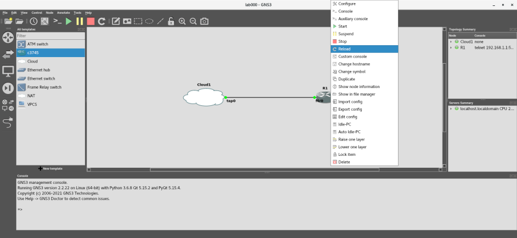

# Adventures in Network Automation

## Lab 001 - Configure a device for Ethernet (Layer 3) connections.

In the real world, you interact with the router using Ethernet, not the Console port. However, you will not be able to connect to the router through Ethernet until you give it an IP address.

Start GNS3 by opening a terminal and inputting ```gns3_run```.

>**Note** - If you like, check out [https://docs.gns3.com/docs/using-gns3/beginners/the-gns3-gui](https://docs.gns3.com/docs/using-gns3/beginners/the-gns3-gui "The GNS3 GUI") to learn the different parts of the GNS3 Graphical User Interface (GUI).

Click on **File** ->  **New blank project**, or press  <kbd>Ctrl</kbd>+<kbd>N</kbd>, to create a new project. If GNS3 is not running, make sure that you have set up your network bridge, and start GNS3 by inputting ```gns3``` in a Terminal (the **Project** window should appear).

A pop-up dialog will appear, asking you to create a new project. Enter ```lab001``` in the ***Name*** textbox and click the **OK** button.


Complete the steps in Lab000 (Telnet), and Telnet back into the device by opening a Terminal and inputting the following command. Using the instructions in Lab000, make sure your use the right console port:

```
telnet 192.168.1.1 5001
```

Check the status of the router's internet protocol interfaces:

```
R1#show ip interface brief
Interface                  IP-Address      OK? Method Status                Protocol
FastEthernet0/0            unassigned      YES unset  administratively down down    
FastEthernet0/1            unassigned      YES unset  administratively down down 
```

Let us get a little more information about the port we will use for our Ethernet connection, FastEthernet0/0:

```
R1#show ip interface FastEthernet0/0
FastEthernet0/0 is administratively down, line protocol is down
  Internet protocol processing disabled
```

Okay, FastEthernet0/0 is down and not configured. We will give it an IP address of 192.168.1.20 and bring the port up:

```
R1#enable ; Enter User EXEC mode
R1#configure terminal ; Enter Privileged EXEC mode
```

When you see the message ```Enter configuration commands, one per line.  End with CNTL/Z.```, interface with the Ethernet port. Assign it an IP address and bring it up, using the following commands:

```
R1(config)#interface FastEthernet0/0
R1(config-if)#ip address 192.168.1.20 255.255.255.0
R1(config-if)#no shutdown ; Bring FastEthernet0/0 up
R1(config-if)#
```

Wait a few seconds; you will see messages like the following appear:

```
*Mar  1 00:16:01.151: %LINK-3-UPDOWN: Interface FastEthernet0/0, changed state to up
*Mar  1 00:16:02.151: %LINEPROTO-5-UPDOWN: Line protocol on Interface FastEthernet0/0, changed state to up
```

Exit the interface configuration mode, using the following commands:

```
R1(config-if)#exit
R1(config-line)#end
R1#
```

Next, save the changes to the running configuration, then replace the startup configuration file with the running configuration; this will make the changes permanent: 

```
R1#write memory ; Save the configuration
Building configuration...
[OK]
R1#copy running-config startup-config ; Set the configuration as default
```

You will be prompted for the destination filename. Accept the default name by pressing <kbd>Enter</kbd>:

```
Destination filename [startup-config]?
Building configuration...
[OK]
R1#
```

Press <kbd>Ctrl</kbd>+<kbd>]</kbd> to leave R1 and input "q" to exit Telnet. Go back to the GNS3 GUI, but this time, right click on R1, and click on Reload:



Normally, when you reload a device, it will load the default settings, erasing any changes you made. However, since you transferred the running configuration to the startup configuration in the NVRAM, the router will now remember your settings.

Ping the device from the Terminal:

```
$ ping -c 4 192.168.1.20
PING 192.168.1.20 (192.168.1.20) 56(84) bytes of data.
64 bytes from 192.168.1.20: icmp_seq=1 ttl=255 time=16.6 ms
64 bytes from 192.168.1.20: icmp_seq=2 ttl=255 time=10.9 ms
64 bytes from 192.168.1.20: icmp_seq=3 ttl=255 time=10.9 ms
64 bytes from 192.168.1.20: icmp_seq=4 ttl=255 time=2.02 ms

--- 192.168.1.20 ping statistics ---
4 packets transmitted, 4 received, 0% packet loss, time 3003ms
rtt min/avg/max/mdev = 2.028/10.153/16.660/5.237 ms
```

However, you will not be able to connect through an Ethernet port until you set up some security; otherwise, you will receive a ```Password required, but none set``` error.

## The Code:

To recap, we:

1. Accessed the device through Telnet.
2. Entered Privileged EXEC Mode
3. ...
4. Closed the connection.

Like I stated earlier, this is easy to do for one device, but not for one hundred. Let us put these steps into a simple python script.

This is a bare-bones script that automates everything we did earlier. Once again, the heart of the script is the ```child```, which, once spawned, will send commands to the device, expecting a certain result. However, there is a second command, ```subprocess```, which will allow you to use Linux commands from inside the script:

```
#!/usr/bin/python
"""Lab 001: Configure a device for Ethernet (Layer 3) connections.
To run this lab:

* Start GNS3 by executing "gn3_run" in a Terminal window.
* Select lab001 from the Projects library.
* Start all devices.
* Run this script (i.e., "Python lab001-ping.py")
"""
from __future__ import print_function

import shlex
import subprocess
import sys
import time

import pexpect

print("Connecting to the device and configuring for Layer 3 connectivity...")

# Connect to the device and allow time for any boot messages to clear
child = pexpect.spawn("telnet 192.168.1.1 5001")
time.sleep(10)
child.sendline("\r")

# Check for a prompt, either R1> (User EXEC mode) or R1# (Privileged EXEC Mode)
# and enable Privileged EXEC Mode if in User EXEC mode.
index = child.expect_exact(["R1>", "R1#", ])
if index == 0:
    child.sendline("enable\r")
    child.expect_exact("R1#")
# Enter Privileged EXEC mode
child.sendline("configure terminal\r")
child.expect_exact("R1(config)#")
# Access Ethernet port
child.sendline("interface FastEthernet0/0\r")
child.expect_exact("R1(config-if)#")
# Assign an IPv4 address and subnet mask
child.sendline("ip address 192.168.1.20 255.255.255.0\r")
child.expect_exact("R1(config-if)#")
# Bring FastEthernet0/0 up
child.sendline("no shutdown\r")
time.sleep(5)
child.expect_exact("R1(config-if)#")
child.sendline("exit\r")
child.expect_exact("R1(config)#")
# Set cisco as the User EXEC mode password
child.sendline("enable secret cisco\r")
child.expect_exact("R1(config)#")
# Require IP addresses instead of URLs to reduce typos
child.sendline("no ip domain-lookup\r")
child.expect_exact("R1(config)#")
# Enter line configuration mode and specify the type of line
child.sendline("line console 0\r")
child.expect_exact("R1(config-line)#")
# Set cisco as the console terminal line password
child.sendline("password cisco\r")
child.expect_exact("R1(config-line)#")
# Require console terminal login
child.sendline("login\r")
child.expect_exact("R1(config-line)#")
# Allow up to five connections for virtual teletype (vty) remote console access (Telnet, SSH, etc.)
child.sendline("line vty 0 4\r")
child.expect_exact("R1(config-line)#")
# Set cisco as the remote console access password
child.sendline("password cisco\r")
child.expect_exact("R1(config-line)#")
# Require Telnet and SSH login
child.sendline("login\r")
child.expect_exact("R1(config-line)#")
child.sendline("end\r")
child.expect_exact("R1#")
# Save the configuration
child.sendline("write memory\r")
"""
Building configuration...
[OK]
R1#
"""
child.expect_exact("[OK]", timeout=120)
# Set the configuration as default
child.sendline("copy running-config startup-config\r")
child.expect_exact("Destination filename [startup-config]?")
child.sendline("\r")
"""
Building configuration...
[OK]
R1#
"""
child.expect_exact("[OK]", timeout=120)
print("Configuration successful.")

print("Checking connectivity...")
# Ping the host from the device
child.sendline('ping 192.168.1.10\r')
# Check for the fail condition first, since the child will always return a prompt
index = child.expect(['Success rate is 0 percent', "R1#", ], timeout=60)
if index == 0:
    raise RuntimeError('Unable to ping the host from the device.')
else:
    # Ping the device from the host
    cmd = 'ping -c 4 192.168.1.20'
    # No need to read the output. Ping returns a non-zero value if no packets are received,
    # which will cause a check_output exception
    subprocess.check_output(shlex.split(cmd))
# Close Telnet and disconnect from device
child.sendcontrol("]")
child.sendline('q\r')
print("Connectivity to and from the device is good.")

print("Checking security...")
child = pexpect.spawn("telnet 192.168.1.20")
child.sendline("cisco\r")
child.expect_exact("R1>")
print("Security is good.")

# Close Telnet and disconnect from device
child.sendcontrol("]")
child.sendline('q\r')
print("Successfully configured the device and checked connectivity.")
```

Run the script, and you will get the following output:

```
$ python lab001-ping.py

Hello, friend.

Script complete. Have a nice day.
```

**Congratulations!** You have configured a device to support Ethernet connections using Python!