# Lab 00 - Demo

This demo/tutorial explains how to create a lab in GNS3 and how to use Python automation scripting to configure a router.

>**Note** - If you are unfamiliar with GNS3, visit [https://docs.gns3.com/docs/using-gns3/beginners/the-gns3-gui/](https://docs.gns3.com/docs/using-gns3/beginners/the-gns3-gui/ "The GNS3 GUI") for a great introduction to the GNS3 Graphical User Interface (GUI).

1. Start GNS3 by opening a terminal and running the "./gns3_run.sh" bash script.

         [gns3user@localhost ~]$ ./gns3_run.sh
         Setting up GNS3...
         Original interface name is enp0s3
         enp0s3 original IP address is 10.0.2.15
         enp0s3 original netmask is 255.255.255.0
         enp0s3 original broadcast address is 10.0.2.255
         [sudo] password for gns3user: 

3. When the **Project** window appears, select the **New Project** tab. Enter "Lab00" in the **Name** textbox and click **OK**. If the **Project** window does not appear, select **File -> New blank project** from the top menu or press **[CTRL]+[N]** .
   
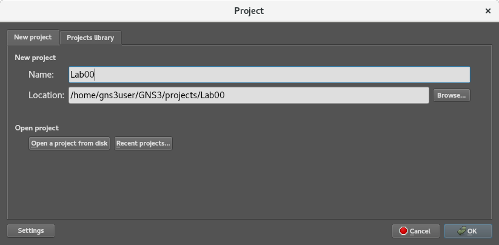

3. In the **Devices Toolbar** (on the left), click on **New template**, or select **File -> New template** from the top menu:


4. Select **Manually create a new template**:

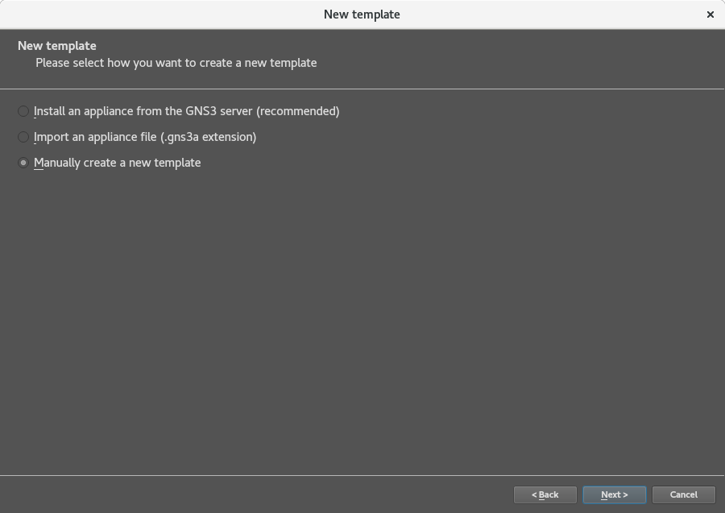

5. On the left, expand the **Dynamips** node and select **IOS routers**. When the **IOS router templates** window appears, select **New** to add a template:  

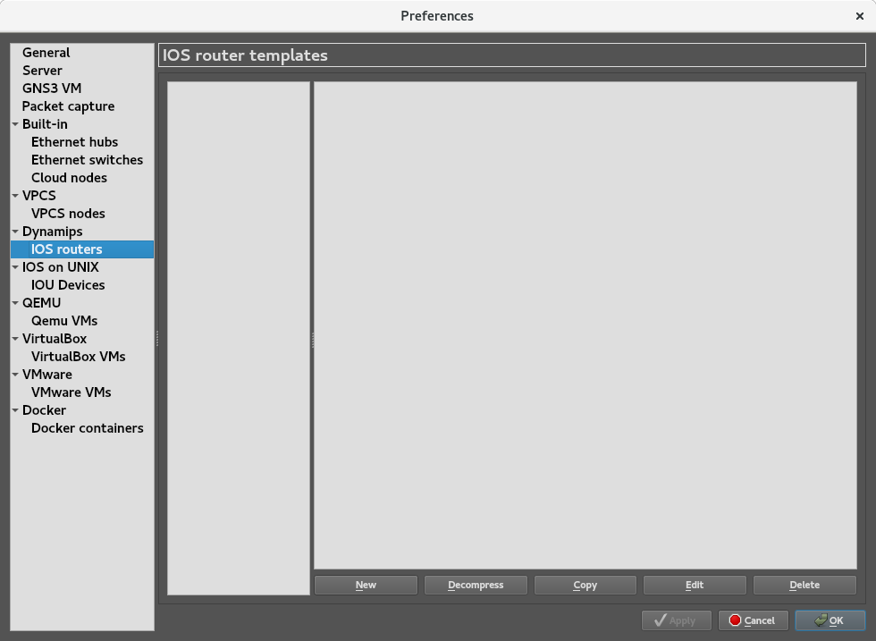

6. Choose **New Image** and click **Browse**:


7. During setup, you should have downloaded a Cisco Internetwork Operating System (IOS) for both the Cisco 3745 Multiservice Access Router and the Cisco 7206VXR Router. Select "c7000-a3jk9s-mz.124-25d.bin" to use IOS 12.4(25) Mainline with the Cisco 7206VXR, then click **Open** at the top:

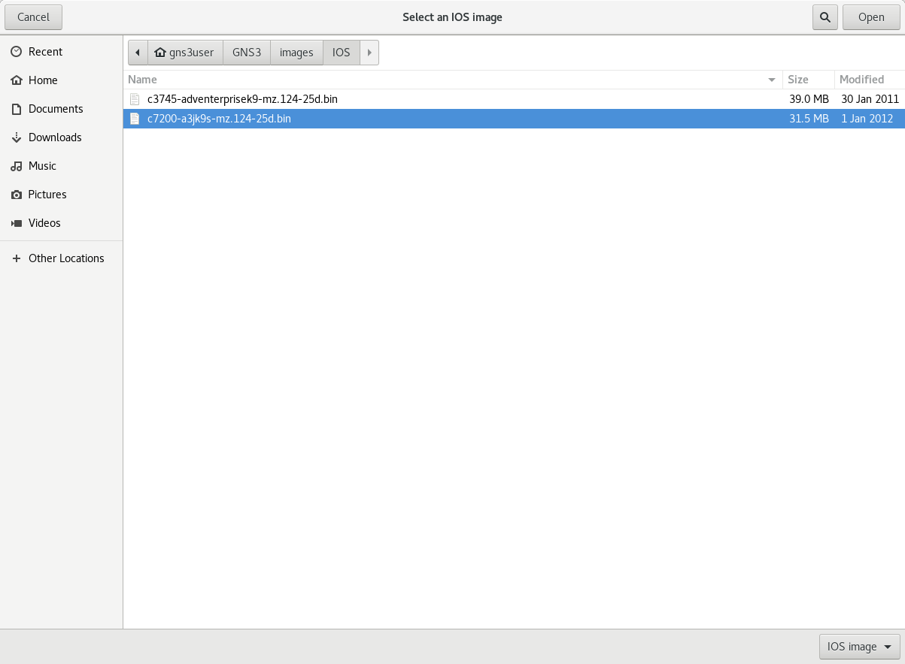

>**Note** - If you do not have these files, you can download the Cisco 3745 IOS manually from [http://tfr.org/cisco-ios/37xx/3745/c3745-adventerprisek9-mz.124-25d.bin](http://tfr.org/cisco-ios/37xx/3745/c3745-adventerprisek9-mz.124-25d.bin) and the Cisco 7206 IOS manually from [http://tfr.org/cisco-ios/7200/c7200-a3jk9s-mz.124-25d.bin](http://tfr.org/cisco-ios/7200/c7200-a3jk9s-mz.124-25d.bin).

8. When asked to decompress the binary file into an IOS image, click **Yes**:


9. When you return to the IOS image selection window, you will see that the binary file has been converted to an image; additional files should appear in the GNS3/images/IOS directory as well. Click **Next**:

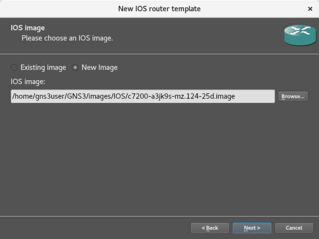

10. You can name the device whatever you like (e.g., "Cisco 7206", "My Router", etc.), but for now, accept the default values by clicking **Next**:


11. The minimum RAM for IOS 12.4(25) Mainline is 256 MiB, so accept the default value by clicking **Next**:


12. This device, with one slot for an Input/Output (I/O) controller and six slots for port adapters, may be configured in many different ways, but since we will only be using one port for this demo (FastEthernet0/0), accept the default values by clicking **Next**:

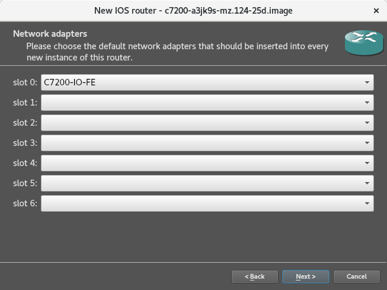

>**Note** - For quick reference, here is a table of the configurations available for this device. For more information on additional configurations, visit [Cisco 7200 Series Port Adapter Installation Requirements](https://www.cisco.com/c/en/us/td/docs/routers/7200/configuration/7200_port_adapter_config_guidelines/config/3875In.html#wp1054974 "Cisco 7200 Series Port Adapter Installation Requirements").

|Input/Output (I/O) Controller|Slot|Description|
|-----------------------------|----|-----------|
|C7200-IO-FE|0|1-port Fast Ethernet I/O controller (2 connectors: RJ-45 and MII)|
|C7200-IO-2FE|0|2-port Fast Ethernet I/O controller|
|C7200-IO-GE-E|0|1-port Gigabit Ethernet plus Ethernet I/O controller|

---

|Port Adapter ID|Slot|Port Adapter Group|Port Adapter Type|
|---------------|----|------------------|-----------------|
|PA-A1|1-6|Asynchronous Transfer Mode (ATM)|1-port multimode fiber|
|PA-FE-TX|1-6|Ethernet|1-port Fast Ethernet 100BASETX|
|PA-2FE-TX|1-6|Ethernet|2-port Fast Ethernet (TX)|
|PA-GE|1-6|Ethernet|1-port full-duplex Gigabit Ethernet|
|PA-4T+|1-6|Serial|4-port synchronous serial, enhanced|
|PA-8T|1-6|Serial|8-port synchronous serial|
|PA-4E|1-6|Ethernet|4-port Ethernet 10BASET|
|PA-8E|1-6|Ethernet|8-port Ethernet 10BASET|
|PA-POS-OC3|1-6|SONET|1-port SFP module-based OC-3c/STM-1 fiber|

13. In order to prevent the Dynamips emulator from monopolizing resources and locking the system, you will need to set an Idle-PC value. Click on **Idle-PC finder** to find a value:

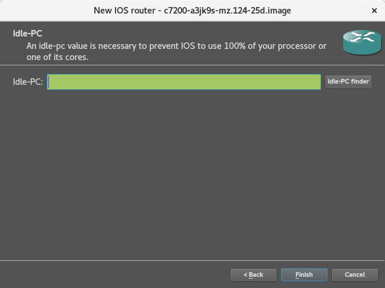

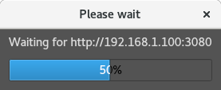

>**Note** - Chris Welsh provides an excellent explanation of the Idle-PC value in his blog at [https://rednectar.net/2013/02/24/dynamipsgns3-idle-pc-explained-finally/](https://rednectar.net/2013/02/24/dynamipsgns3-idle-pc-explained-finally/ "Dynamips/GNS3 Idle-PC explained. Finally!").

14. When a value has been found, click **OK** to return to the Idle-PC window. Ensure the **Idle-PC** textbox contains the value, and then click **Finish**:


15. GNS3 will return you to the template window. Click **OK** to return to the **Workspace**.

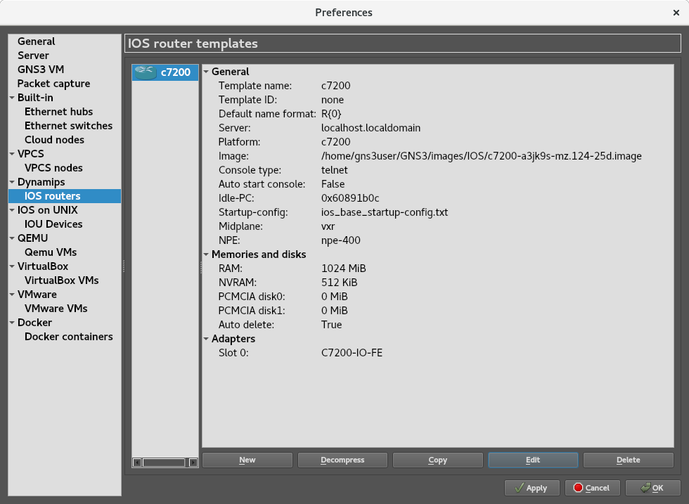

16. In the **Devices Toolbar** (on the left), click on the **Browse all devices** icon and select **Cloud**:
   
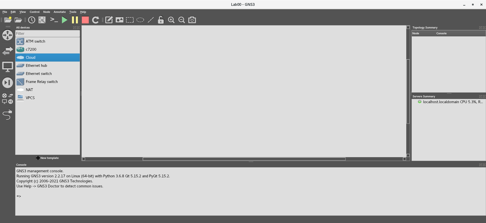

17. Drag a cloud device into the **Workspace**. This is your host machine:


18. Select and drag a Cisco 7206VXR (i.e., *c7200*) into the **Workspace**:


19. In the **Devices Toolbar** (on the left), click on the **Add a link** icon. Click on **Cloud1** and connect one end of the link to **tap0**:


20. Click on **R1** and connect the other end of the link to **FastEthernet0/0**:

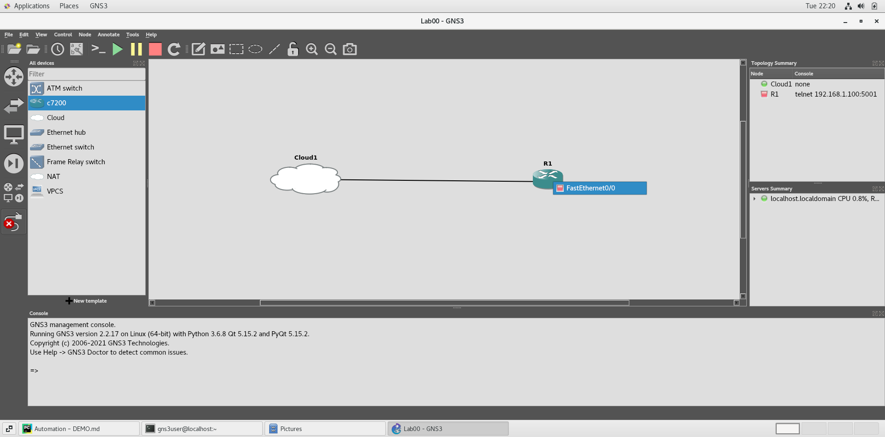

>**Note** - To quickly identify nodes in the **Workspace**, click on the **Show/Hide interface labels** icon in the top **Toolbar**, or select **View -> Show/Hide interface labels** from the top menu.

21. Right click on **R1** and **Start** the device (You can also start all the devices using the green **Start/Resume all nodes** icon in the top **Toolbar**):

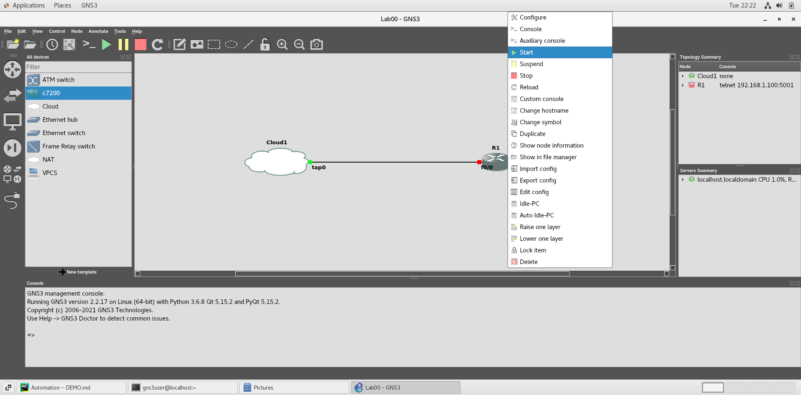

22. Right click on **R1** again to open a **Console**:

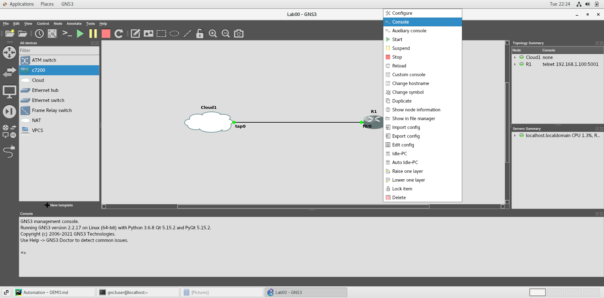

23. When the **Console** window appears, press **[Enter]** and wait for the prompt to appear:


>**Note** - If the prompt reads ```R1>```, you are in **User EXEC Mode**. Type and enter ```enable``` at the prompt to enter **Priviledged EXEC Mode** (i.e., ```R1>enable```**[Enter]**).

24. Enter the following commands to reset the device; if prompted to ```[confirm]```, press **[Enter]**:
    
         R1#write erase
         Erasing the nvram filesystem will remove all configuration files! Continue? [confirm]
         [OK]
         Erase of nvram: complete
         R1#
         *Feb 24 03:42:43.875: %SYS-7-NV_BLOCK_INIT: Initialized the geometry of nvram
         R1#reload
         Proceed with reload? [confirm]

         *Feb 24 03:42:54.111: %SYS-5-RELOAD: Reload requested by console. Reload Reason: Reload Command.
         ROM: reload requested...

25. Close the **Console** window. Right click on **R1** again and **Stop** the device:
    
>**Note** - Normally, you would enter ```reload``` at the prompt to reload the device. However, do not do this, because GNS3 may crash.


26. Right click on **R1** again and **Reload**. The device should start automatically:


27. Right click on **R1** again and reopen open a **Console**. This Cisco device stores its configuration settings (**startup-config**) in non-volatile RAM, known as NVRAM. Enter the following command to look at the contents of the NVRAM:

         R1#show startup-config
         Using 410 out of 522232 bytes!
         !
         service timestamps debug datetime msec
         service timestamps log datetime msec
         no service password-encryption
         !
         hostname R1
         !
         ip cef
         no ip domain-lookup
         no ip icmp rate-limit unreachable
         ip tcp synwait 5
         no cdp log mismatch duplex
         !
         line con 0
          exec-timeout 0 0
          logging synchronous
          privilege level 15
          no login
         line aux 0
          exec-timeout 0 0
          logging synchronous
          privilege level 15
          no login
         !
         end

         R1#
         
>**Note** - To save space, we have removed some of the exclamation points in the configuration. This does not affect the settings; the Cisco Tool Command Language (Tcl) uses exclamation points for commenting, and the Cisco command parser inserts exclamation points throughout the configuration to separate sections and improve readability.

28. Compare this to the **running-config**, which is created from the **startup-config** when the device first starts, then stored in the device's volatile RAM:

         R1#show running-config
         Building configuration...

         Current configuration : 744 bytes
         !
         version 12.4
         service timestamps debug datetime msec
         service timestamps log datetime msec
         no service password-encryption
         !
         hostname R1
         !
         boot-start-marker
         boot-end-marker
         !
         no aaa new-model
         no ip icmp rate-limit unreachable
         !
         ip cef
         no ip domain lookup
         !
         ip tcp synwait-time 5
         ! 
         interface FastEthernet0/0
          no ip address
          shutdown 
          duplex half
         !
         ip forward-protocol nd
         !
         no ip http server
         no ip http secure-server
         !
         no cdp log mismatch duplex
         !
         control-plane
         !
         gatekeeper
          shutdown
         !
         line con 0
          exec-timeout 0 0
          privilege level 15
          logging synchronous
          stopbits 1
         line aux 0
          exec-timeout 0 0
          privilege level 15
          logging synchronous
          stopbits 1
         line vty 0 4
          login
         !
         end
         
         R1#

29. Look for ```interface FastEthernet0/0``` in the running-config (comments added):

         interface FastEthernet0/0
          no ip address
          shutdown
          duplex half

    ```no ip address``` means the router does not have an IP address assigned and ```shutdown``` means that the FastEthernet port is closed. This tells us that the router is not configured and cannot be used.
    
30. We can configure the router within this console, but since we are going to use Python instead, close the console, but make sure the router is still running.

31. Normally, to configure the router, we would connect to it using an auxilary or console port, and run commands using an emulator, such as Minicom or PuTTY. For this demo, we will connect to the router using Telnet, through our host's Port 5001 (192.168.1.100:5001). Therefore, open a terminal and start a Python session:
    
         [gns3user@localhost ~]$ python
         Python 2.7.5 (default, Nov 16 2020, 22:23:17) 
         [GCC 4.8.5 20150623 (Red Hat 4.8.5-44)] on linux2
         Type "help", "copyright", "credits" or "license" for more information.
         >>> 

32. Import pexpect and spawn Telnet as a child application (note the space between it IP address and the port number). We also added a delay, just in case the router has not finished starting up:

         >>> import pexpect
         >>> import time
         >>> child = pexpect.spawn("telnet 192.168.1.100 5001")
         >>> time.sleep(30)

>**Note** - If you see ```ImportError: No module named pexpect.```, you will need to install pexpect first. In CentOS/RHEL, open another terminal and run ```yum install pexpect```.

33. Once the delay is over, let's take a look at the system information. First, we want to press **[Enter]** at least once to reach a clean prompt after any messages. Next, we want to make sure we are in **Priviledged EXEC Mode** by inputting the "enable" command. By the way, if we already are in **Priviledged EXEC Mode**, the "enable" command does not affect anything:

         >>> child.send("\r\n")
         2
         >>> child.send("enable\r\n")
         8
         >>> child.expect_exact("R1#")
         0

>**Note** - Remember, you cannot see feedback from the console yet, so you cannot identify the prompt. In addition, for some reason, ```child.sendline("...")``` did not send a full carriage-return/line-feed (CRLF), so we switched to ```child.send("...\r\n")``` instead.

34. ```child.send("...")``` returns the number of characters that were sent, while ```child.expect_exact("...")``` returns a 0 if it finds a match. If ```child.expect_exact("...")``` does not find a match, it will return an error after its built-in 30-second timeout period expires. We will demonstrate this later.

35. Now that we have looked for a match, we can use ```child.before``` and ```child.after``` to see feedback from the console. Per [pexpect's API overview](https://pexpect.readthedocs.io/en/stable/overview.html "pexpect's API overview"):
 
    *"After each call to expect() the before and after properties will be set to the text printed by child application. The before property will contain all text up to the expected string pattern. The after string will contain the text that was matched by the expected pattern."*

    Therefore, if you enter:

         >>> child.before

    You will see something like:
   
         'Trying 192.168.1.100...\r\r\nConnected to 192.168.1.100.\r\r\nEscape character is \'^]\'.\r\r\nConnected to Dynamips VM "R1" (ID 1, type c7200) - Console port\r\nPress ENTER to get the prompt.\r\nROMMON emulation microcode.\n\nLaunching IOS image at 0x80008000...\n\r\n              Restricted Rights Legend\r\n\r\nUse, duplication, or disclosure by the Government is\r\nsubject to restrictions as set forth in subparagraph\r\n(c) of the Commercial Computer Software - Restricted\r\nRights clause at FAR sec. 52.227-19 and subparagraph\r\n(c) (1) (ii) of the Rights in Technical Data and Computer\r\nSoftware clause at DFARS sec. 252.227-7013.\r\n\r\n           cisco Systems, Inc.\r\n           170 West Tasman Drive\r\n           San Jose, California 95134-1706\r\n\r\n\r\n\r\nCisco IOS Software, 7200 Software (C7200-A3JK9S-M), Version 12.4(25d), RELEASE SOFTWARE (fc1)\r\nTechnical Support: http://www.cisco.com/techsupport\r\nCopyright (c) 1986-2010 by Cisco Systems, Inc.\r\nCompiled Wed 18-Aug-10 11:54 by prod_rel_team\r\n\r\n\r\nThis product contains cryptographic features and is subject to United\r\nStates and local country laws governing import, export, transfer and\r\nuse. Delivery of Cisco cryptographic products does not imply\r\nthird-party authority to import, export, distribute or use encryption.\r\nImporters, exporters, distributors and users are responsible for\r\ncompliance with U.S. and local country laws. By using this product you\r\nagree to comply with applicable laws and regulations. If you are unable\r\nto comply with U.S. and local laws, return this product immediately.\r\n\r\nA summary of U.S. laws governing Cisco cryptographic products may be found at:\r\nhttp://www.cisco.com/wwl/export/crypto/tool/stqrg.html\r\n\r\nIf you require further assistance please contact us by sending email to\r\nexport@cisco.com.\r\n\r\nCisco 7206VXR (NPE400) processor (revision A) with 491520K/32768K bytes of memory.\r\nProcessor board ID 4279256517\r\nR7000 CPU at 150MHz, Implementation 39, Rev 2.1, 256KB L2, 512KB L3 Cache\r\n6 slot VXR midplane, Version 2.1\r\n\r\nLast reset from power-on\r\n\r\nPCI bus mb0_mb1 (Slots 0, 1, 3 and 5) has a capacity of 600 bandwidth points.\r\nCurrent configuration on bus mb0_mb1 has a total of 200 bandwidth points. \r\nThis configuration is within the PCI bus capacity and is supported. \r\n\r\nPCI bus mb2 (Slots 2, 4, 6) has a capacity of 600 bandwidth points.\r\nCurrent configuration on bus mb2 has a total of 0 bandwidth points \r\nThis configuration is within the PCI bus capacity and is supported. \r\n\r\nPlease refer to the following document "Cisco 7200 Series Port Adaptor\r\nHardware Configuration Guidelines" on Cisco.com <http://www.cisco.com>\r\nfor c7200 bandwidth points oversubscription and usage guidelines.\r\n\r\n\r\n1 FastEthernet interface\r\n509K bytes of NVRAM.\r\n\r\n8192K bytes of Flash internal SIMM (Sector size 256K).\r\nSETUP: new interface FastEthernet0/0 placed in "shutdown" state\r\n% Crashinfo may not be recovered at bootflash:crashinfo\r\n% This file system device reports an error\x07\r\n\r\n\r\nPress RETURN to get started!\r\n\r\n\r\n*Feb 25 22:03:55.399: %LINEPROTO-5-UPDOWN: Line protocol on Interface VoIP-Null0, changed state to up\r\n*Feb 25 22:03:55.511: %SYS-5-CONFIG_I: Configured from memory by console\r\n*Feb 25 22:03:55.695: %SYS-5-RESTART: System restarted --\r\nCisco IOS Software, 7200 Software (C7200-A3JK9S-M), Version 12.4(25d), RELEASE SOFTWARE (fc1)\r\nTechnical Support: http://www.cisco.com/techsupport\r\nCopyright (c) 1986-2010 by Cisco Systems, Inc.\r\nCompiled Wed 18-Aug-10 11:54 by prod_rel_team\r\n*Feb 25 22:03:55.707: %ENTITY_ALARM-6-INFO: ASSERT INFO Fa0/0 Physical Port Administrative State Down \r\n*Feb 25 22:03:55.719: %SNMP-5-COLDSTART: SNMP agent on host R1 is undergoing a cold start\r\n*Feb 25 22:03:55.747: %LINEPROTO-5-UPDOWN: Line protocol on Interface IPv6-mpls, changed state to up\r\n*Feb 25 22:03:56.119: %LINK-5-CHANGED: Interface FastEthernet0/0, changed state to administratively down\r\n*Feb 25 22:03:57.119: %LINEPROTO-5-UPDOWN: Line protocol on Interface FastEthernet0/0, changed state to down\x1b]0;R1\x07\r\n'

    To view this in human-readable format, use:
   
         >>> print(child.before.decode("utf-8"))
         Trying 192.168.1.100...
         Connected to 192.168.1.100.
         Escape character is '^]'.
         Connected to Dynamips VM "R1" (ID 1, type c7200) - Console port
         Press ENTER to get the prompt.
         ROMMON emulation microcode.
         ...

    You may also look at what was matched, using ```child.after```:

         >>> child.after
         'R1#'
         >>> print(child.after.decode("utf-8"))
         R1#

36. As promised, before we exit the Python prompt, we will look a ```child.expect_exact error```. Try it out by entering ```child.expect_exact("This won't work.")```; a detailed error message will appear after the built-in 30-second timeout period expires.

37. However, since the purpose of this tutorial is to demonstrate Python automation scripting, we will not continue to enter each command individually. Exit the Python session by entering ```exit()``` and open your favorite text editor.

38. We will turn the following commands into a repeatable script:

        R1>enable
        R1#configure terminal ! Enter Global Configuration Mode
        R1(config)#interface FastEthernet0/0 ! Enter Interface Configuration Mode
        R1(config-if)#ip address 192.168.1.10 255.255.255.0 ! Set the IP address of the router
        R1(config-if)#no shutdown ! Bring up the interface
        R1(config-if)#exit ! Exit Interface Configuration Mode
        R1(config)#ip route 0.0.0.0 0.0.0.0 192.168.1.100 ! Configure the default gateway
        R1(config)#end ! Exit Global Configuration Mode
        R1#write memory ! Save new configuration to flash memory
        R1#copy running-config startup-config ! Use the current configuration for startup

39. In your editor, enter the following script:

        child = pexpect.spawn('telnet 192.168.1.100 5001')
        time.sleep(10)
        child.sendline('\r')
        # Enter Privileged EXEC Mode
        child.sendline('enable\r')
        child.expect_exact('R1#', timeout=5)
        print(child.before.decode('utf-8'))
        print(child.after.decode('utf-8'))
        # Enter Global Configuration Mode
        child.sendline('configure terminal\r')
        child.expect_exact('R1(config)#')
        # Enter Interface Configuration Mode
        child.sendline('interface FastEthernet0/0\r')
        child.expect_exact('R1(config-if)#')
        # Set the IP address of the router
        child.sendline('ip address 192.168.1.10 255.255.255.0\r')
        child.expect_exact('R1(config-if)#')
        # Bring up the interface
        child.sendline('no shutdown\r')
        child.expect_exact('R1(config-if)#')
        # Exit Interface Configuration Mode
        child.sendline('exit\r')
        child.expect_exact('R1(config)#')
        # Configure the default gateway
        child.sendline('ip route 0.0.0.0 0.0.0.0 192.168.1.100\r')
        child.expect_exact('R1(config)#')
        # Exit Global Configuration Mode
        child.sendline('end\r')
        child.expect_exact('R1#')
        # Save new configuration to flash memory
        child.sendline('write memory\r')
        time.sleep(10)
        child.expect_exact('R1#')
        # Use the current configuration for startup
        child.sendline('copy running-config startup-config\r')
        child.expect_exact('R1#')
        # Exit Telnet
        child.sendline('exit\r')
        child.expect_exact('Press RETURN to get started.')
        child.sendcontrol(']')
        child.expect_exact('telnet>')
        child.sendline('quit\r')

Ping the router’s default gateway:

         R1#ping 192.168.1.100

         Type escape sequence to abort.
         Sending 5, 100-byte ICMP Echos to 192.168.1.100, timeout is 2 seconds:
         .!!!!
         Success rate is 80 percent (4/5), round-trip min/avg/max = 32/36/40 ms
         R1#

         R1#write memory ! Save the new configuration to flash memory
         Building configuration...
         [OK]
         R1#

Now look at the new and current configuration of the router

         R1#show running-config
         Building configuration...

         Current configuration :
         ...
         end

         #R1

Compare to the startup configuration settings in the NVRAM:

         #R1show startup-config
         Using 1985 out of 155640 bytes
         ...
         end

         R1#

Now copy the current settings to the NVRAM. At the "Destination filename" prompt, press **[Enter]** or input "startup-config":

         R1#copy running-config startup-config
         Destination filename [startup-config]?
         Building configuration...
         [OK]
         R1#
