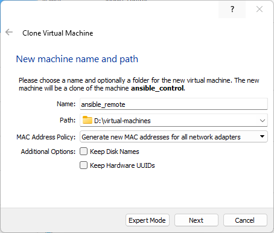

# Ansible and Ansible Automation Platform Tutorial

This tutorial will walk you through using Ansible and Ansible Automation Platform using a virtual network.

- [Prerequisites](#prerequisites)
- [Create the Virtual Machine](#create-the-virtual-machine)
- [Prepare the Control Node](#prepare-the-control-node)
- [Register the Control Node](#register-the-control-node)
- [Update the Control Node](#update-the-control-node)
- [Install Ansible](#install-ansible)
- [Create Your First Playbook](#create-your-first-playbook)
- [Create a Remote Node](#create-a-remote-node)
- [Run Playbooks against the Remote Node](#run-playbooks-against-the-remote-node)
- [Ansible Roles](#ansible-roles)
- [Encrypt Files with Ansible Vault](#encrypt-files-with-ansible-vault)
- [Enable SSH Key-Based Authentication](#enable-ssh-key-based-authentication)
- [Elevated Privileges and Ansible](#elevated-privileges-and-ansible)
- [Install the Ansible Automation Platform](#install-the-ansible-automation-platform)
- [Notes](#notes)

----

## Prerequisites

- System requirements:
  - A processor capable of running eight (8) CPU threads.
  - At least 16 GB of RAM.
  - At least 160 GB hard drive.
- An active [Red Hat Developer account](http://access.redhat.management "Red Hat Developer account").
- An optical disc image (ISO) of Red Hat Enterprise Linux operating system, version 8.4 or later, for x86_64 computers (I used RHEL 8.6 for this tutorial, available, with subscription, at https://access.redhat.com/downloads).
- A subscription to the Ansible Automation Platform (AAP) (you can use the *60 Day Product Trial of Red Hat Ansible Automation Platform* for this tutorial).
- A Type-2 hypervisor, such as VirtualBox or VMWare.

For more information on AAP requirements, see https://access.redhat.com/documentation/en-us/red_hat_ansible_automation_platform/2.2/html/red_hat_ansible_automation_platform_installation_guide/index.

----

## Create the Virtual Machine

> **NOTE** - Since the focus of this tutorial is using Ansible, and for the sake of brevity, I will avoid going into great detail on how to create virtual machines or install operating systems. In addition, the links provided in this section are maintained y their respective companies, and contain the latest instructions for creating a VM or installing RHEL 8.


1. Create a virtual machine, named *"ansible_control"*, per the hypervisor's instructions:

   - [Oracle VM VirtualBox User Manual](https://www.virtualbox.org/manual/ "Oracle VM VirtualBox User Manual")
   - [VMware Workstation Player Documentation](https://docs.vmware.com/en/VMware-Workstation-Player/index.html "VMware Workstation Player Documentation")
   - [Getting Started with Virtual Machine Manager](https://access.redhat.com/documentation/en-us/red_hat_enterprise_linux/7/html/virtualization_getting_started_guide/chap-virtualization_manager-introduction "Getting Started with Virtual Machine Manager")

   Ensure the virtual machine has:

   - At least two (2) CPUs.
   - At least 8192 MB RAM for installation of AAP, and 4096 MB RAM for operation.
   - At least 40 GB of hard drive space. If you are separating your drive into multiple partitions, you must allocate at least 20 GB to `/var`.

3. However, before you start the VM, add another network interface to your machine. Make it private and isolate it from the outside world, by connecting it to a **LAN segment** (VMWare) or attaching it to an **Internal Network** (VirtualBox, shown). This will allow you to use static Internet Protocol version 4 (IPv4) addresses in your Ansible inventories, which we will create later.


4. Start the VM. When prompted for the location of the installation media, navigate to the location of the RHEL 8 ISO, and select the ISO.

5. Install RHEL 8, per the instructions at https://access.redhat.com/documentation/en-us/red_hat_enterprise_linux/8/html/performing_a_standard_rhel_8_installation/installing-rhel-on-adm64-intel-64-and-64-bit-arm.

----

## Prepare the Control Node

1. Log into the control node and open a Terminal.

2. Check if a **control** user account exists:

    ```
    id control
    ```

   - If the **control** user account exists, make it an administrator:

       ```
       sudo usermod -aG wheel control
       ```

   - If the **control** user account does not exist, create the account and switch to it:

       ```
       # sudo useradd  --comment "Ansible Control Node Account" --create-home -groups wheel control
       sudo useradd -c "Ansible Control Node Account" -m -G wheel control
       echo <desired password> | sudo passwd control --stdin
       ```

3. Switch to the **control** user account:

    ```
    exec su - control
    ```

4. Ansible maintains a listing, or an *inventory*, of devices and their Internet Protocol (IP) version 4 addresses. However, if a device is set up to receive its IPv4 address from a Dynamic Host Configuration Protocol (DHCP) server, its IPv4 address may change from what is listed in the inventory. Therefore, for this tutorial, you will use these **static** IPv4 addresses for your devices:

    | VM Name            | Description               | Username   | Domain                 | IPv4 Address |
    | ------------------ | ------------------------- | ---------- | ---------------------- | ------------ |
    | ansible_control    | RHEL 8.6 Control Node     | control    | control.example.net    | 192.168.1.10 |
    | ansible_remote     | RHEL 8.6 Remote Node      | remote     | remote.example.net     | 192.168.1.20 |

5. Get the names of the control node's Ethernet network adapters:

    ```
    # ifconfig | grep --extended-regexp "^e[mnt]" --after-context=2
    ifconfig | grep -E "^e[mnt]" -A 2
    ```

6. Look for the Ethernet network adapter that does not have an IPv4 address. In my case, it was `enp0s8`, but your adapter's name may be different:

	```
	enp0s3: flags=4163<UP,BROADCAST,RUNNING,MULTICAST>  mtu 1500
			inet 10.0.2.15  netmask 255.255.255.0  broadcast 10.0.2.255
			inet6 fe80::a00:27ff:fe84:6b5f  prefixlen 64  scopeid 0x20<link>
	--
	enp0s8: flags=4163<UP,BROADCAST,RUNNING,MULTICAST>  mtu 1500
			ether 08:00:27:b4:ee:23  txqueuelen 1000  (Ethernet)
			RX packets 0  bytes 0 (0.0 B)
	```

7. Create a connection named **control** and add a static IPv4 address to the unassigned Ethernet network adapter:

	```
	sudo nmcli con add con-name remote ifname <the unassigned Ethernet network adapter name> type ethernet
	sudo nmcli con modify remote ipv4.method manual ipv4.address 192.168.1.10/24 ipv4.gateway 192.168.1.0
	sudo nmcli con up remote
	```

8. View the new connection's interface configuration file:

    ```
    cat /etc/sysconfig/network-scripts/ifcfg-control
    ```

9. Ensure the following lines are in the file:

    ```
    BOOTPROTO=static
    IPADDR=192.168.1.10
    GATEWAY=192.168.1.0
    NETMASK=255.255.255.0
	PREFIX=24
    ```

10. Restart the network:

	```
	sudo nmcli connection reload
	sudo systemctl restart NetworkManager.service
	```

11. Ensure you can connect to the Internet:

	``` 
	ping -c 4 8.8.8.8
	```

12. Open your `hosts` file for editing:

    ```
    sudo vim /etc/hosts
    ```

13. Press **[i]**, and replace the localhost domain with a unique, but intuitive domain name (e.g., `control.example.net`, etc.) for both the localhost IPv4 address (`127.0.0.1`) and IPv6 address (`::1`). In addition, add your Ethernet network adapter's IPv4 address, the name of the control user, and the domain name:

    > **NOTE** - In this tutorial, you will only create one control node. However, if you needed more than one control node, you can create and use a naming convention for control nodes, such as `control_01`, etc.

    ```
    127.0.0.1      localhost   control.example.net
    ::1            localhost   control.example.net
    192.168.1.10   control     control.example.net
    ```

14. Save the file by pressing **[Esc]**, then **[:]**. Enter "wq" at the **":"** prompt.

15. Open your `hostname` file for editing:

    ```
    sudo vim /etc/hostname
    ```

16. Press **[i]**, and replace the hostname of the control node with the new domain name:

    ```
    control.example.net
    ```

17. Save the file by pressing **[Esc]**, then **[:]**. Enter "wq" at the **":"** prompt.

18. Reboot the control node to incorporate the changes:

    ```
    sudo reboot now
    ```

19. Once the control node has finished rebooting, log in using the **control** user account.

    > **NOTE** - Clear out any "Welcome" dialog windows that may appear.

----

## Register the Control Node

To update the control node, as well as to use Ansible Tower or the Ansible Automation Platform, you must have a Red Hat subscription.

1. Open a Terminal.

2. Register the control node. Enter your Red Hat password when prompted:

    ```
    sudo subscription-manager register --username <Red Hat subscription username>
    ```

3. Once you have registered the control node, pull the subscription data from the server, and set the control node to automatically attach any compatible or related subscriptions:

    ```
    sudo subscription-manager refresh
    sudo subscription-manager auto-attach --enable
    ```

    > **NOTE** - You can check if the control node was registered at https://access.redhat.com/management/systems.

----

## Update the Control Node

4. Update the control node (this may take a while):

    ```
    sudo yum -y update
    sudo yum -y upgrade
    sudo yum -y clean all
    sudo yum -y autoremove
    ```

    > **NOTE** - If you are using VirtualBox, I recommend installing their Guest Additions software suite, which will make interacting with your VM easier, by adding features like cut-and-paste, shared folders, etc. Check out Aaron Kili's great article, ["Install VirtualBox Guest Additions in CentOS, RHEL & Fedora."](https://www.tecmint.com/install-virtualbox-guest-additions-in-centos-rhel-fedora/ "Install VirtualBox Guest Additions in CentOS, RHEL & Fedora.") Just remember to execute the following commands in a Terminal before running the software on the Guest Additions' ISO:
    >
    > ```
    > sudo subscription-manager repos --enable codeready-builder-for-rhel-8-$(arch)-rpms
    > sudo dnf -y install https://dl.fedoraproject.org/pub/epel/epel-release-latest-8.noarch.rpm
    > sudo yum -y install make gcc kernel-headers kernel-devel perl dkms bzip2 git
    > sudo reboot now
    > ```
    >
    > By the way, if you need to enable Guest Additions on another operating system, replace the first two lines with the appropriate lines from https://docs.fedoraproject.org/en-US/epel/.
    >
    > Once the control node has finished rebooting, log in using the **control** user account. Open a Terminal and run the **Files** application:
    >
    > ```
    > nautilus
    > ```
    >
    > Select the Guest Additions' ISO and run the software. You can also access the ISO from its mount point (`/media`, `/mnt`, etc.), and run the software from the command line (in my case, the command was `sudo ./run/media/control/VBox_GAs_6.1.38/autorun.sh`).
    >
    > Do not forget to reboot the control node again after installing the software.

----

## Install Ansible

1. Open a Terminal.

2. Before installing Ansible, ensure that Python 3.9 or higher is installed on the control node:

    ```
    python3 -V
    ```

3. If the version is less than 3.9, upgrade Python:

    ```
    sudo yum -y install python3.9
    sudo alternatives --set python3 /usr/bin/python3.9
    ```

4. Install Ansible:

    ```
    sudo yum -y install ansible
    ansible --version
    ```

5. Test Ansible by pinging the localhost, using the [ansible.builtin.ping](https://docs.ansible.com/ansible/latest/collections/ansible/builtin/ping_module.html) module:

    > **NOTE** - Ansible's built-in **ping** module is not the same as Linux ping; it does not send out Internet Control Message Protocol (ICMP) packets. Instead, the module checks that it can connect to a node, using SSH, and determine the Python version installed on the node.

    ```
    # ansible --module ping localhost
    ansible -m ping localhost
    ```

    **Output:**

    ```
    localhost | SUCCESS => {
        "changed": false,
        "ping": "pong"
    }
    ```

    > **NOTE** - If you intend to do a lot of command-line work, you can also install the optional auto-complete package, which allows you to use the **[Tab]** key to complete Ansible arguments:
    >
    > ```
    > sudo python3 -m pip install --user argcomplete
    > ```

6. [To avoid exposing your inventories, playbooks, etc., to anyone with administrator privileges](https://docs.ansible.com/ansible/latest/reference_appendices/config.html#avoiding-security-risks-with-ansible-cfg-in-the-current-directory), do not use the default `/etc/asible` directory. Instead, create an Ansible sub-directory in your Home directory, then navigate to it (if prompted, enter your password):

    ```
    # sudo mkdir --parents ~/Ansible
    sudo mkdir -p ~/Ansible
    cd ~/Ansible
    ```

7. Create an Ansible inventory file:

    ```
    sudo vim ~/Ansible/inventory.yml
    ```

    > **NOTE** - To make life easy, use *inventory.yml* for your inventory of nodes, instead of *hosts*, to avoid naming conflicts with other files named *hosts*.

8. Press **[i]**, and enter the following YAML code:

    ```
    ---

    control_nodes:
      hosts:
        control:
          ansible_host: 192.168.1.10
          ansible_connection: ssh
          ansible_user: control
          ansible_ssh_pass: <the control node password>
    ```

9. Save the file by pressing **[Esc]**, then **[:]**. Enter "wq" at the **":"** prompt.

10. Create an Ansible configuration file:

    ```
    sudo vim ~/Ansible/ansible.cfg
    ```

11. Press **[i]**, and enter the following YAML code:

    ```
    [defaults]
    # Set the location for the correct Python 3 version
    interpreter_python = /usr/bin/python3

    # Add a local log file
    log_path = ~/Ansible/ansible.log

    # Stop host key checking, as well as populating the ~/.ssh/known_hosts file, for now
    # https://docs.ansible.com/ansible/2.5/user_guide/intro_getting_started.html#host-key-checking
    host_key_checking = False

    # Use the local inventory file, instead of the default /etc/hosts file
    # https://docs.ansible.com/ansible/latest/reference_appendices/config.html#avoiding-security-risks-with-ansible-cfg-in-the-current-directory
    inventory = ~/Ansible/inventory.yml
    ```

12. Save the file by pressing **[Esc]**, then **[:]**. Enter "wq" at the **":"** prompt.

13. Ensure Ansible can read the inventory file:

    ```
    # ansible all --list-hosts --inventory ~/Ansible/inventory.yml
    ansible all --list-hosts -i ~/Ansible/inventory.yml
    ```

14. Test connectivity, using the [ansible.builtin.ping](https://docs.ansible.com/ansible/latest/collections/ansible/builtin/ping_module.html) module:

    ```
    # ansible all --module-name ansible.builtin.ping --inventory ~/Ansible/inventory.yml
    ansible all -m ping -i ~/Ansible/inventory.yml
    ```

15. Run some ad-hoc commands, using the [ansible.builtin.command](https://docs.ansible.com/ansible/latest/collections/ansible/builtin/command_module.html) module:

    ```
    # ansible all --args "ping -c 4 8.8.8.8"
    ansible all -a "ping -c 4 8.8.8.8"
    # ansible all --module-name ansible.builtin.command --args "ping -c 4 8.8.8.8"
    ansible all -m command -a "ping -c 4 8.8.8.8"
    # ansible all --module-name ansible.builtin.command --args "uptime"
    ansible all -m command -a "uptime"
    ```

----

## Create Your First Playbook

For your first playbook, you will say "Hello, World!", using the [ansible.builtin.debug](https://docs.ansible.com/ansible/latest/collections/ansible/builtin/debug_module.html) module.

> **NOTE** - Ansible playbooks use the YAML data-serialization language. Since the focus of this tutorial is using Ansible, and for the sake of brevity, I will avoid going into great detail on how to write YAML code. However, there are many YAML tutorials and resources available online. For example, Ansible provides a primer on [YAML Syntax](https://docs.ansible.com/ansible/latest/reference_appendices/YAMLSyntax.html).

1. Create the playbook:

    ```
    sudo vim ~/Ansible/first_playbook.yml
    ```

2. Press **[i]**, and enter the following YAML code:

    ```
    ---

    - name: First playbook
      hosts: control
      tasks:
      - name: Say Hello using the ansible.builtin.debug module
        ansible.builtin.debug:
          msg: Hello, World!
    ```

3. Save the file by pressing **[Esc]**, then **[:]**. Enter "wq" at the **":"** prompt.

4. Run the playbook:

    ```
    ansible-playbook ~/Ansible/first_playbook.yml
    ```

    **Output:**

    ```
    PLAY [First playbook] *********************************************************************************************************************************************************************************************

    TASK [Gathering Facts] ********************************************************************************************************************************************************************************************
    ok: [control]

    TASK [Say Hello using the ansible.builtin.debug module] ***********************************************************************************************************************************************************
    ok: [control] => {
        "msg": "Hello, World!"
    }

    PLAY RECAP ********************************************************************************************************************************************************************************************************
    control                    : ok=2    changed=0    unreachable=0    failed=0    skipped=0    rescued=0    ignored=0
    ```

    > **NOTE** - Ansible uses a custom format for output, as written in its [default.py](https://github.com/ansible/ansible/blob/devel/lib/ansible/plugins/callback/default.py) script. To change the format output, add a **stdout_callback** setting in your `ansible.cfg` file:
    >
    > ```
    > # To format playbook results
    > stdout_callback = debug
    > ```
    >
    > **Output:**
    >
    > ```
    > PLAY [First playbook] ********************************************************************************************************************************************************************
    >
    > TASK [Gathering Facts] *******************************************************************************************************************************************************************
    > ok: [remote]
    >
    > TASK [Say Hello using the ansible.builtin.debug module] **********************************************************************************************************************************
    > ok: [remote] => {}
    >
    > MSG:
    >
    > Hello, World!
    >
    > PLAY RECAP *******************************************************************************************************************************************************************************
    > remote                     : ok=2    changed=0    unreachable=0    failed=0    skipped=0    rescued=0    ignored=0
    > ```
    >
    > You can also use standard file formats, such as JSON and YAML, which is useful if you have to export a playbook's results:
    >
    > ```
    > stdout_callback = yaml
    > ```
    >
    > **Output:**
    >
    > ```
    > PLAY [First playbook] ********************************************************************************************************************************************************************
    >
    > TASK [Gathering Facts] *******************************************************************************************************************************************************************
    > ok: [remote]
    >
    > TASK [Say Hello using the ansible.builtin.debug module] **********************************************************************************************************************************
    > ok: [remote] =>
    >   msg: Hello, World!
    >
    > PLAY RECAP *******************************************************************************************************************************************************************************
    > remote                     : ok=2    changed=0    unreachable=0    failed=0    skipped=0    rescued=0    ignored=0
    > ```
    >
    > However, for this tutorial, you will use Ansible's default format.

5. Huh? Ansible performed a task that you did not explicitly ask it to do: it gathered *facts* about the node first. Create another playbook to display these facts:

    ```
    sudo vim ~/Ansible/second_playbook.yml
    ```

6. Press **[i]**, and enter the following YAML code:

    ```
    ---

    - name: Second playbook
      hosts: control
      tasks:
      - name: Print the facts, nothing but the facts
        ansible.builtin.debug:
          var: ansible_facts
    ```

7. Save the file by pressing **[Esc]**, then **[:]**. Enter "wq" at the **":"** prompt.

8. Run the playbook:

    ```
    ansible-playbook ~/Ansible/second_playbook.yml
    ```

9. To save space, I won't show the output, but that is a lot of facts! However, you can reference any of these facts, as well as restricted Ansible variables, in your playbooks. Create another playbook to display these facts and variables:

    ```
    sudo vim ~/Ansible/third_playbook.yml
    ```

10. Press **[i]**, and enter the following YAML code:

    ```
    ---

    - name: Third playbook
      hosts: all
      tasks:
      - name: Print a fact, without titles
        ansible.builtin.debug:
          var: ansible_facts.env.SSH_CLIENT

      - name: Print a magic variable, without titles
        ansible.builtin.debug:
          var: ansible_host

      - name: Print only certain facts and variables, with and without titles
        ansible.builtin.debug:
          msg:
          - Hostname - {{ ansible_facts.hostname }}
          - "{{ ansible_facts.env.SSH_CLIENT }}"

      - name: Print an environment variable
        ansible.builtin.debug:
          msg:
          - Home directory - {{ lookup('env', 'HOME') }}
          - "{{ hostvars['control'].ansible_default_ipv4.address }}"
    ```

11. Save the file by pressing **[Esc]**, then **[:]**. Enter "wq" at the **":"** prompt.

12. Run the playbook:

    ```
    ansible-playbook ~/Ansible/third_playbook.yml
    ```

    **Output:**

    ```
    PLAY [Third playbook] *********************************************************************************************************************************************************************************************

    TASK [Gathering Facts] ********************************************************************************************************************************************************************************************
    ok: [control]

    TASK [Print a fact, without titles] *******************************************************************************************************************************************************************************
    ok: [control] => {
        "ansible_facts.env.SSH_CLIENT": "192.168.1.10 XXXXX 22"
    }

    TASK [Print a magic variable, without titles] *********************************************************************************************************************************************************************
    ok: [control] => {
        "ansible_host": "control"
    }

    TASK [Print only certain facts and variables, with and without titles] ********************************************************************************************************************************************
    ok: [control] => {
        "msg": [
            "Hostname - control",
            "192.168.1.10 XXXXX 22"
        ]
    }

    TASK [Print an environment variable] ******************************************************************************************************************************************************************************
    ok: [control] => {
        "msg": [
            "Home directory - /home/control",
            "10.0.2.15"
        ]
    }

    PLAY RECAP ********************************************************************************************************************************************************************************************************
    control                    : ok=5    changed=0    unreachable=0    failed=0    skipped=0    rescued=0    ignored=0
    ```

13. Now, create a playbook that uses modules and performs the following tasks:

    - Ping the control node using the [ansible.builtin.ping](https://docs.ansible.com/ansible/latest/collections/ansible/builtin/ping_module.html) module, and save the result.
    - Print the result of the [ansible.builtin.ping](https://docs.ansible.com/ansible/latest/collections/ansible/builtin/ping_module.html) module, using the [ansible.builtin.debug](https://docs.ansible.com/ansible/latest/collections/ansible/builtin/debug_module.html) module.
    - Ping the control node using the [ansible.builtin.command](https://docs.ansible.com/ansible/latest/collections/ansible/builtin/command_module.html) module and the Linux ***ping*** command, and save the result.
    - Print the result of the [ansible.builtin.command](https://docs.ansible.com/ansible/latest/collections/ansible/builtin/command_module.html) module, using the [ansible.builtin.debug](https://docs.ansible.com/ansible/latest/collections/ansible/builtin/debug_module.html) module.
    - Print the results of the last two commands, using the [ansible.builtin.debug](https://docs.ansible.com/ansible/latest/collections/ansible/builtin/debug_module.html) module.

    ```
    sudo vim ~/Ansible/fourth_playbook.yml
    ```

14. Press **[i]**, and enter the following YAML code:

    ```
    ---

    - name: Fourth playbook
      hosts: all
      tasks:
      - name: Ping the control node using the ansible.builtin.ping module, and save the result
        ansible.builtin.ping:
        register: ansible_ping_result

      - name: Print the result of the ansible.builtin.ping module, using the ansible.builtin.debug module
        ansible.builtin.debug:
          var: ansible_ping_result

      - name: Ping the control node using the ansible.builtin.command module and the Linux ping command, and save the result
        ansible.builtin.command: 'ping -c 4 "{{ ansible_host }}"'
        register: icmp_ping_result

      - name: Print the result of the ansible.builtin.command module, using the ansible.builtin.debug module
        ansible.builtin.debug:
          var: icmp_ping_result

      - name: Print the results of the last two commands
        ansible.builtin.debug:
          msg:
          - "{{ ansible_ping_result }}"
          - "{{ icmp_ping_result }}"
    ```

15. Save the file by pressing **[Esc]**, then **[:]**. Enter "wq" at the **":"** prompt.

16. Run the playbook:

    ```
    ansible-playbook ~/Ansible/fourth_playbook.yml
    ```

    **Output:**

    ```
    PLAY [Fourth playbook] ********************************************************************************************************************************************************************************************

    TASK [Gathering Facts] ********************************************************************************************************************************************************************************************
    ok: [control]

    TASK [Ping the control node using the ansible.builtin.ping module, and save the result] ***************************************************************************************************************************
    ok: [control]

    TASK [Print the result of the ansible.builtin.ping module, using the ansible.builtin.debug module] ****************************************************************************************************************
    ok: [control] => {
        "ansible_ping_result": {
            "changed": false,
            "failed": false,
            "ping": "pong"
        }
    }

    TASK [Ping the control node using the ansible.builtin.command module and the Linux ping command, and save the result] *********************************************************************************************
    changed: [control]

    TASK [Print the result of the ansible.builtin.command module, using the ansible.builtin.debug module] *************************************************************************************************************
    ok: [control] => {
        "icmp_ping_result": {
            "changed": true,
            "cmd": [
                "ping",
                "-c",
                "4",
                "control"
            ],
            "delta": "0:00:03.064636",
            "end": "2023-01-17 23:30:06.656915",
            "failed": false,
            "msg": "",
            "rc": 0,
            "start": "2023-01-17 23:30:03.592279",
            "stderr": "",
            "stderr_lines": [],
            "stdout": "PING control (192.168.1.10) 56(84) bytes of data.\n64 bytes from control (192.168.1.10): icmp_seq=1 ttl=64 time=0.048 ms\n64 bytes from control (192.168.1.10): icmp_seq=2 ttl=64 time=0.083 ms\n64 bytes from control (192.168.1.10): icmp_seq=3 ttl=64 time=0.050 ms\n64 bytes from control (192.168.1.10): icmp_seq=4 ttl=64 time=0.056 ms\n\n--- control ping statistics ---\n4 packets transmitted, 4 received, 0% packet loss, time 3060ms\nrtt min/avg/max/mdev = 0.048/0.059/0.083/0.015 ms",
            "stdout_lines": [
                "PING control (192.168.1.10) 56(84) bytes of data.",
                "64 bytes from control (192.168.1.10): icmp_seq=1 ttl=64 time=0.048 ms",
                "64 bytes from control (192.168.1.10): icmp_seq=2 ttl=64 time=0.083 ms",
                "64 bytes from control (192.168.1.10): icmp_seq=3 ttl=64 time=0.050 ms",
                "64 bytes from control (192.168.1.10): icmp_seq=4 ttl=64 time=0.056 ms",
                "",
                "--- control ping statistics ---",
                "4 packets transmitted, 4 received, 0% packet loss, time 3060ms",
                "rtt min/avg/max/mdev = 0.048/0.059/0.083/0.015 ms"
            ]
        }
    }

    TASK [Print the results of the last two commands] *****************************************************************************************************************************************************************
    ok: [control] => {
        "msg": [
            {
                "changed": false,
                "failed": false,
                "ping": "pong"
            },
            {
                "changed": true,
                "cmd": [
                    "ping",
                    "-c",
                    "4",
                    "control"
                ],
                "delta": "0:00:03.064636",
                "end": "2023-01-17 23:30:06.656915",
                "failed": false,
                "msg": "",
                "rc": 0,
                "start": "2023-01-17 23:30:03.592279",
                "stderr": "",
                "stderr_lines": [],
                "stdout": "PING control (192.168.1.10) 56(84) bytes of data.\n64 bytes from control (192.168.1.10): icmp_seq=1 ttl=64 time=0.048 ms\n64 bytes from control (192.168.1.10): icmp_seq=2 ttl=64 time=0.083 ms\n64 bytes from control (192.168.1.10): icmp_seq=3 ttl=64 time=0.050 ms\n64 bytes from control (192.168.1.10): icmp_seq=4 ttl=64 time=0.056 ms\n\n--- control ping statistics ---\n4 packets transmitted, 4 received, 0% packet loss, time 3060ms\nrtt min/avg/max/mdev = 0.048/0.059/0.083/0.015 ms",
                "stdout_lines": [
                    "PING control (192.168.1.10) 56(84) bytes of data.",
                    "64 bytes from control (192.168.1.10): icmp_seq=1 ttl=64 time=0.048 ms",
                    "64 bytes from control (192.168.1.10): icmp_seq=2 ttl=64 time=0.083 ms",
                    "64 bytes from control (192.168.1.10): icmp_seq=3 ttl=64 time=0.050 ms",
                    "64 bytes from control (192.168.1.10): icmp_seq=4 ttl=64 time=0.056 ms",
                    "",
                    "--- control ping statistics ---",
                    "4 packets transmitted, 4 received, 0% packet loss, time 3060ms",
                    "rtt min/avg/max/mdev = 0.048/0.059/0.083/0.015 ms"
                ]
            }
        ]
    }

    PLAY RECAP ********************************************************************************************************************************************************************************************************
    control                    : ok=6    changed=1    unreachable=0    failed=0    skipped=0    rescued=0    ignored=0
    ```

----

## Create a Remote Node

In this section, you will use a virtual remote node to test your Ansible playbooks.

1. Create a virtual machine, named *"ansible_remote"*, per the instructions in [Create the Virtual Machine](#create-the-virtual-machine). However, ensure the virtual machine has:

   - At least two (2) CPUs.
   - At least 2048 MB RAM.
   - At least 20 GB of hard drive space.

   > **NOTE** - To speed up the process, you can also ***clone*** the control node, and rename it *"ansible_remote"*:
   >
   > 
   >
   > However:
   >
   > - For the **MAC Address Policy**, ensure you select `Generate new MAC addresses for all network adapters`.
   > - In addition, after cloning is complete, reduce the required RAM to **2048 MB**.
   >
   > For more information about cloning, see https://docs.oracle.com/en/virtualization/virtualbox/6.1/user/Introduction.html#clone.

2. Prepare the remote node, per the instructions in [Prepare the Control Node](#prepare-the-control-node). However, replace "remote" with "control" in all instances, and the IPv4 address with `192.168.1.20`.

   > **NOTE** - If you cloned *ansible_control*, once you have rebooted the remote node:
   >
   > - Log in using the remote user account.
   > - Clear out any "Welcome" dialog windows that may appear.
   > - Open a Terminal.
   > - Delete the control user account, using this command: `sudo userdel -frZ control`
   > - Reboot the remote node.

----

## Run Playbooks against the Remote Node

1. Open your Ansible inventory file for editing:

    ```
    sudo vim ~/Ansible/inventory.yml
    ```

2. Press **[i]**, and add the remote node information to the file:

    ```
    ---

    control_nodes:
      hosts:
        control:
          ansible_host: 192.168.1.10
          ansible_connection: ssh
          ansible_user: control
          ansible_ssh_pass: <the control node password>

    remote_nodes:
      hosts:
        remote:
          ansible_host: 192.168.1.20
          ansible_connection: ssh
          ansible_user: remote
          ansible_ssh_pass: <the remote node password>
    ```

3. Save the file by pressing **[Esc]**, then **[:]**. Enter "wq" at the **":"** prompt.

4. Change the target nodes in the playbooks from `control` to `remote`, using the Linux stream editor:

    ```
    # sed --in-place 's/hosts: control/hosts: remote/g' ~/Ansible/*_playbook.yml
    sudo sed -i 's/hosts: control/hosts: remote/g' ~/Ansible/*_playbook.yml
    ```

5. Run the first playbook and check for errors:

    ```
    ansible-playbook first_playbook.yml
    ```

    **Output:**

    ```
    PLAY [First playbook] **********************************************************************************

    TASK [Gathering Facts] *********************************************************************************
    ok: [remote]

    TASK [Say Hello using the ansible.builtin.debug module] ************************************************
    ok: [remote] => {
        "msg": "Hello, World!"
    }

    PLAY RECAP *********************************************************************************************
    remote                     : ok=2    changed=0    unreachable=0    failed=0    skipped=0    rescued=0    ignored=0
    ```

6. Run the remaining playbooks and check for errors.

----

## Ansible Roles

"Don't repeat yourself", or *DRY*, is a key software development principle. My rule is, that if you have to use the same block of code, or run the same set of commands more than once, put it in a function, a method, a class, or in its own script.

Ansible allows you to do the same thing, and a lot more, with **roles**.

1. Create and navigate to a sub-directory named "roles" in your Ansible directory:

    ```
    mkdir ~/Ansible/roles
    cd ~/Ansible/roles
    ```

2. [Ansible Galaxy](https://galaxy.ansible.com/ "Ansible Galaxy") is "Ansible’s official hub for sharing Ansible content", and it contains a collection of roles and other useful items. In some respects, it is like a cross between a collection of repositories, such as GitHub, and a package manager, like yum. The [ansible-galaxy](https://docs.ansible.com/ansible/latest/cli/ansible-galaxy.html) command allows you to interact with Ansible Galaxy, as well as perform other tasks. One of those tasks is initializing a role and its directory structure. Do that now for the `say_hello_role`:

    ```
    ansible-galaxy init say_hello_role
    ```

3. Navigate to the role's directory and take a look at its contents:

    ```
    cd ~/Ansible/roles/say_hello_role
    ls -l
    ```

    **Output:**

    ```
    drwxrwxr-x. 2 control control   22 Jan 23 16:08 defaults
    drwxrwxr-x. 2 control control    6 Jan 23 16:08 files
    drwxrwxr-x. 2 control control   22 Jan 23 16:08 handlers
    drwxrwxr-x. 2 control control   22 Jan 23 16:08 meta
    -rw-rw-r--. 1 control control 1328 Jan 23 16:08 README.md
    drwxrwxr-x. 2 control control   22 Jan 23 16:09 tasks
    drwxrwxr-x. 2 control control    6 Jan 23 16:08 templates
    drwxrwxr-x. 2 control control   39 Jan 23 16:08 tests
    drwxrwxr-x. 2 control control   22 Jan 23 16:08 vars
    ```

4. When you use a role, Ansible will look in these directories for common values (**defaults**), file names (**files**), what to do (**tasks**), etc. Many of these directories contain a `main.yml` file, which is the first place Ansible will look for instructions. Navigate to the **tasks** directory and open the `main.yml` file:

    ```
    cd tasks
    vim main.yml
    ```

5. Press **[i]**, and enter the following YAML code:

    ```
    ---
    # tasks file for say_hello_role

    - name: Say Hello using the ansible.builtin.debug module
      ansible.builtin.debug:
        msg: Hello, World!
    ```

6. Save the file by pressing **[Esc]**, then **[:]**. Enter "wq" at the **":"** prompt.

7. Return to your Ansible directory and create a playbook, named `say_hello_role_test.yml`:

    ```
    cd ~/Ansible
    vim say_hello_role_test.yml
    ```

8. Press **[i]**, and enter the following YAML code:

    ```
    ---

    - name: say_hello_role test
      hosts: all
      roles:
      - say_hello_role
    ```

9. Save the file by pressing **[Esc]**, then **[:]**. Enter "wq" at the **":"** prompt.

10. Run the playbook:

    ```
    ansible-playbook say_hello_role_test.yml
    ```

    **Output:**

    ```
    PLAY [say_hello_role test] ***************************************************************************************************************************************************************

    TASK [Gathering Facts] *******************************************************************************************************************************************************************
    ok: [control]
    ok: [remote]

    TASK [say_hello_role : Say Hello using the ansible.builtin.debug module] *****************************************************************************************************************
    ok: [control] => {
        "msg": "Hello, World!"
    }
    ok: [remote] => {
        "msg": "Hello, World!"
    }

    PLAY RECAP *******************************************************************************************************************************************************************************
    control                    : ok=2    changed=0    unreachable=0    failed=0    skipped=0    rescued=0    ignored=0
    remote                     : ok=2    changed=0    unreachable=0    failed=0    skipped=0    rescued=0    ignored=0
    ```

11. You can also run a role anywhere in a playbook, or even more than once, using the [ansible.builtin.include_role](https://docs.ansible.com/ansible/latest/collections/ansible/builtin/include_role_module.html) module. Reopen the playbook:

    ```
    vim say_hello_role_test.yml
    ```

8. Press **[i]**, and replace the YAML code:

    ```
    ---

    - name: say_hello_role test
      hosts: all
      tasks:
      - name: Say Hello
        ansible.builtin.include_role:
          name: say_hello_role
      - name: Respond
        ansible.builtin.debug:
          msg: "What?"
      - name: Say Hello again
        ansible.builtin.include_role:
          name: say_hello_role
    ```

9. Save the file by pressing **[Esc]**, then **[:]**. Enter "wq" at the **":"** prompt.

10. Run the playbook:

    ```
    ansible-playbook say_hello_role_test.yml
    ```

    **Output:**

    ```
    PLAY [say_hello_role test] ***************************************************************************************************************************************************************

    TASK [Gathering Facts] *******************************************************************************************************************************************************************
    ok: [remote]
    ok: [control]

    TASK [Say Hello] *************************************************************************************************************************************************************************

    TASK [say_hello_role : Say Hello using the ansible.builtin.debug module] *****************************************************************************************************************
    ok: [remote] => {
        "msg": "Hello, World!"
    }
    ok: [control] => {
        "msg": "Hello, World!"
    }

    TASK [Respond] ***************************************************************************************************************************************************************************
    ok: [remote] => {
        "msg": "What?"
    }
    ok: [control] => {
        "msg": "What?"
    }

    TASK [Say Hello again] *******************************************************************************************************************************************************************

    TASK [say_hello_role : Say Hello using the ansible.builtin.debug module] *****************************************************************************************************************
    ok: [control] => {
        "msg": "Hello, World!"
    }
    ok: [remote] => {
        "msg": "Hello, World!"
    }

    PLAY RECAP *******************************************************************************************************************************************************************************
    control                    : ok=4    changed=0    unreachable=0    failed=0    skipped=0    rescued=0    ignored=0
    remote                     : ok=4    changed=0    unreachable=0    failed=0    skipped=0    rescued=0    ignored=0
    ```

----

## Encrypt Files with Ansible Vault

Right now, your inventory file contains the SSH passwords for your nodes in plain text. In another section, you will learn how to fix this using SSH Key-Based Authentication. However, even with password-less authentication, there may be times that you must store credentials in your inventory file or elsewhere. You can protect these files and credentials by encrypting them, using **Ansible Vault**.

1. Encrypt the `inventory.yml`:

    ```
    ansible-vault encrypt inventory.yml
    ```

2. Enter and confirm a password when prompted.

    ```
    New Vault password:
    Confirm New Vault password:
    ```

3. Display the contents of your inventory file:

    ```
    cat ~/Ansible/inventory.yml
    ```

    **Output:**

    ```
    $ANSIBLE_VAULT;1.1;AES256
    0123456789....
    ```

4. Attempt to run a playbook:

    ```
    ansible-playbook first_playbook.yml
    ```

5. Since the playbook cannot read the encrypted inventory file, it will state that it is `"skipping: no hosts matched"` and `"[WARNING]:  * Failed to parse /home/control/Ansible/inventory.yml with auto plugin: Attempting to decrypt but no vault secrets found"`.

6. Run the playbook again, but ask it to prompt you for your inventory file's Ansible Vault password:

    ```
    ansible-playbook first_playbook.yml --ask-vault-pass
    ```

7. Enter your inventory file's Ansible Vault password when prompted.

    ```
    Vault password:
    ```

8. The playbook will run. However, to allow you easily add nodes for practice, decrypt your inventory file:

    ```
    ansible-vault decrypt inventory.yml
    ```

9. Enter your inventory file's Ansible Vault password when prompted.

    ```
    Vault password:
    ```

10. Instead of encrypting a whole file, you can also encrypt specific items, such as passwords. Create an encrypted version of the remote node password:

    ```
    ansible-vault encrypt_string "<the remote node password>" --name "remote_node_password"
    ```

11. Enter and confirm a password when prompted.

    ```
    New Vault password:
    Confirm New Vault password:
    ```

    **Output:**

    ```
    remote_node_password: !vault |
          $ANSIBLE_VAULT;1.1;AES256
          0123456789...
    ```

12. Open your Ansible inventory file for editing:

    ```
    sudo vim ~/Ansible/inventory.yml
    ```

13. Press **[i]**, and replace the remote node's `ansible_ssh_pass` value with the encrypted string:

    ```
    ansible_ssh_pass: !vault |
      $ANSIBLE_VAULT;1.1;AES256
      0123456789...
    ```

14. Save the file by pressing **[Esc]**, then **[:]**. Enter "wq" at the **":"** prompt.

15. Run the playbook again and ask it to prompt you for an Ansible Vault password that will decrypt the `ansible_ssh_pass` value:

    ```
    ansible-playbook first_playbook.yml --ask-vault-pass
    ```

16. Enter your inventory file's Ansible Vault password when prompted.

    ```
    Vault password:
    ```

17. The playbook will run. However, open your Ansible inventory file for editing again and replace the encrypted string with the plain text value for now.

> **NOTE** - Unless you save the string to a file, you cannot decrypt encrypted string, and you do not need to delete encrypted strings. Ansible does not store strings.

For more information about Ansible Vault, see https://docs.ansible.com/ansible/latest/vault_guide/vault.html.

----

## Enable SSH Key-Based Authentication

Your inventory contains passwords in plain text, which is not good. Ansible prefers that you use SSH keys as authentication credentials when accessing remote nodes, and you can use Ansible to set up SSH key-based authentication on both the control node and remote node.

Your `enable_ssh_key_auth` playbook will perform the following tasks:

- It will check if a public key file already exists in the control node, using the [ansible.builtin.stat](https://docs.ansible.com/ansible/latest/collections/ansible/builtin/stat_module.html) module.
- If the public key file does not exist, it will generate both a private key file (*id_rsa*) and a public key file (*id_rsa.pub*) for the control node, using the [ansible.builtin.command](https://docs.ansible.com/ansible/latest/collections/ansible/builtin/command_module.html) module.
- It will get and display the fingerprint and the ASCII art representation of the key, using the [ansible.builtin.command](https://docs.ansible.com/ansible/latest/collections/ansible/builtin/command_module.html) and [ansible.builtin.debug](https://docs.ansible.com/ansible/latest/collections/ansible/builtin/debug_module.html) modules.
- It will save the fingerprint and the ASCII art representation of the key in `~/.ssh/randomart`, using the [ansible.builtin.copy](https://docs.ansible.com/ansible/latest/collections/ansible/builtin/copy_module.html) module.
- It will *lookup* the RSA public key in the control node's public key file, and it will place the key in a **fact** that is accessible to all the remaining tasks in the playbook (similar to a global variable), using the [ansible.builtin.set_fact](https://docs.ansible.com/ansible/latest/collections/ansible/builtin/set_fact_module.html) module.
- It will connect to each node listed in `hosts:` and create an `.ssh` directory of each SSH user, if the directory does not exist, using the [ansible.builtin.file](https://docs.ansible.com/ansible/latest/collections/ansible/builtin/file_module.html) module.
- It will connect to each node listed in `hosts:` and create an `authorized_keys` file within the `.ssh` directory of each SSH user, if the file does not exist, using the [ansible.builtin.file](https://docs.ansible.com/ansible/latest/collections/ansible/builtin/file_module.html) module. In addition, to prevent other users from accessing the file, it will set the `authorized_keys` file's permissions to read-write by the owner only (i.e., `rw-------` or `0600`). This action will also prevent SSH password prompts when using SSH keys.
- It will add the RSA public key to the `authorized_keys` file, if the key is not already there, using the [ansible.builtin.lineinfile](https://docs.ansible.com/ansible/latest/collections/ansible/builtin/lineinfile_module.html) module.
- It will get the contents of each `authorized_keys` file, using the [ansible.builtin.command](https://docs.ansible.com/ansible/latest/collections/ansible/builtin/command_module.html) module.
- It will display the contents of each `authorized_keys` file, using the [ansible.builtin.debug](https://docs.ansible.com/ansible/latest/collections/ansible/builtin/debug_module.html) module.

Let's get started!

1. Create the playbook:

    ```
    sudo vim ~/Ansible/enable_ssh_key_auth.yml
    ```

2. Press **[i]**, and add the remote node information to the file:

    ```
    ---

    - name: Generate SSH keys for the control node, if they do not exist
      hosts: control
      tasks:
      - name: Check if the public key of the control node exists
        ansible.builtin.stat:
          path: "/home/{{ ansible_user }}/.ssh/id_rsa.pub"
        register: file_facts

      - name: Generate SSH keys
        ansible.builtin.command: 'ssh-keygen -f ~/.ssh/id_rsa -N "" -q'
        when: not file_facts.stat.exists

      - name: Get the fingerprint and the ASCII art representation of the key
        ansible.builtin.command: 'ssh-keygen -f ~/.ssh/id_rsa -lv'
        register: randomart

      - name: Display the fingerprint and the ASCII art representation of the key
        ansible.builtin.debug:
          var: randomart.stdout_lines

      - name: Save the fingerprint and the ASCII art representation of the key
        ansible.builtin.copy:
          content: "{{ randomart.stdout }}\n"
          dest: "/home/{{ ansible_user }}/.ssh/randomart"

    - name: Upload the public key of the control node to each node
      hosts: control, remote
      tasks:
      - name: Get the public key of the control node and set it as a global fact accessible by the remaining tasks in this playbook
        ansible.builtin.set_fact:
          control_public_key: "{{ lookup('ansible.builtin.file', '~/.ssh/id_rsa.pub') }}"

      - name: Create the .ssh directory if it does not exist
        ansible.builtin.file:
          path: "/home/{{ ansible_user }}/.ssh"
          state: directory

      - name: Create the authorized_keys file in the .ssh directory if it does not exist
        ansible.builtin.file:
          path: "/home/{{ ansible_user }}/.ssh/authorized_keys"
          state: touch
          owner: "{{ ansible_user }}"
          group: "{{ ansible_user }}"
          mode: "0600"

      - name: Add the public key of the control node to the authorized_keys file if not present
        ansible.builtin.lineinfile:
          state: present
          path: "/home/{{ ansible_user }}/.ssh/authorized_keys"
          line: "{{ control_public_key }}"

      - name: Get the contents of the authorized_keys file
        ansible.builtin.command: "cat '~/.ssh/authorized_keys'"
        register: command_output

      - name: Display the contents of the authorized_keys file (to ensure the control node public key is the same for all files)
        ansible.builtin.debug:
          var: command_output.stdout_lines
    ```

3. Save the file by pressing **[Esc]**, then **[:]**. Enter "wq" at the **":"** prompt.

4. Run the playbook:

    ```
    ansible-playbook ~/Ansible/enable_ssh_key_auth.yml
    ```

    **Output:**

    ```
    PLAY [Generate SSH keys for the control node, if they do not exist] **********************************************************************************************************************

    TASK [Gathering Facts] *******************************************************************************************************************************************************************
    ok: [control]

    TASK [Check if the public key of the control node exists] ********************************************************************************************************************************
    ok: [control]

    TASK [Generate SSH keys] *****************************************************************************************************************************************************************
    changed: [control]

    TASK [Get the fingerprint and the ASCII art representation of the key] *******************************************************************************************************************
    changed: [control]

    TASK [Display the fingerprint and the ASCII art representation of the key] ***************************************************************************************************************
    ok: [control] => {
        "randomart.stdout_lines": [
            "3072 SHA256:<fingerprint> control@control.example.net (RSA)",
            "+---[RSA 3072]----+",
            "|                 |",
            "|    oo     oo    |",
            "|   oooo   oooo   |",
            "|    oo     oo    |",
            "|                 |",
            "|  ..         ..  |",
            "|    ..     ..    |",
            "|      .....      |",
            "|                 |",
            "+----[SHA256]-----+"
        ]
    }

    TASK [Save the fingerprint and the ASCII art representation of the key] ******************************************************************************************************************
    changed: [control]

    PLAY [Upload the public key of the control node to each node] ****************************************************************************************************************************

    TASK [Gathering Facts] *******************************************************************************************************************************************************************
    ok: [control]
    ok: [remote]

    TASK [Get the public key of the control node and set it as a global fact accessible by the remaining tasks in this playbook] *************************************************************
    ok: [control]
    ok: [remote]

    TASK [Create the .ssh directory if it does not exist] ************************************************************************************************************************************
    ok: [remote]
    ok: [control]

    TASK [Create the authorized_keys file in the .ssh directory if it does not exist] ********************************************************************************************************
    changed: [remote]
    changed: [control]

    TASK [Add the public key of the control node to the authorized_keys file if not present] *************************************************************************************************
    changed: [remote]
    changed: [control]

    TASK [Get the contents of the authorized_keys file] **************************************************************************************************************************************
    changed: [remote]
    changed: [control]

    TASK [Display the contents of the authorized_keys file] **********************************************************************************************************************************
    ok: [control] => {
        "command_output.stdout_lines": [
            "ssh-rsa <RSA public key>= control@control.example.net"
        ]
    }
    ok: [remote] => {
        "command_output.stdout_lines": [
            "ssh-rsa <RSA public key>= control@control.example.net"
        ]
    }

    PLAY RECAP *******************************************************************************************************************************************************************************
    control                    : ok=13   changed=6    unreachable=0    failed=0    skipped=0    rescued=0    ignored=0
    remote                     : ok=7    changed=3    unreachable=0    failed=0    skipped=0    rescued=0    ignored=0
    ```

5.  Open your Ansible inventory file for editing:

    ```
    sudo vim ~/Ansible/inventory.yml
    ```

6. Press **[i]**, and remove the `ansible_ssh_pass:` entries:

    ```
    ---

    control_nodes:
      hosts:
        control:
          ansible_host: 192.168.1.10
          ansible_connection: ssh
          ansible_user: control

    remote_nodes:
      hosts:
        remote:
          ansible_host: 192.168.1.20
          ansible_connection: ssh
          ansible_user: remote
    ```

7. Save the file by pressing **[Esc]**, then **[:]**. Enter "wq" at the **":"** prompt.

8. Run the first four playbooks again. They should work the same as before, even without passwords. By the way, this is an excellent example of a playbook that can be turned into a role.

----

## Elevated Privileges and Ansible

1. Create a playbook named `sudo_demo.yml`:

    ```
    sudo vim ~/Ansible/sudo_demo.yml
    ```

2. Press **[i]**, and enter the following YAML code:

    ```
    ---

    - name: Use elevated privileges to run a command
      hosts: all
      tasks:
      - name: Update, but do not upgrade, installed packages
        ansible.builtin.yum:
          name: '*'
          state: latest
          update_only: true
    ```

3. Save the file by pressing **[Esc]**, then **[:]**. Enter "wq" at the **":"** prompt.

4. Run the playbook, but limit its actions to the control node:

    ```
    ansible-playbook ~/Ansible/sudo_demo.yml --limit control
    ```

    **Output:**

    ```
    PLAY [Use elevated privileges to run a command] ******************************************************************************************************************************************

    TASK [Gathering Facts] *******************************************************************************************************************************************************************
    ok: [control]

    TASK [Update, but do not upgrade, installed packages] ************************************************************************************************************************************
    fatal: [control]: FAILED! => {"changed": false, "msg": "This command has to be run under the root user.", "results": []}

    PLAY RECAP *******************************************************************************************************************************************************************************
    control                    : ok=1    changed=0    unreachable=0    failed=1    skipped=0    rescued=0    ignored=0
    ```

    Notice the message, "`This command has to be run under the root user`". You are trying to run `yum update`, instead of `sudo yum update`.

5. Open the playbook for editing:

    ```
    sudo vim ~/Ansible/sudo_demo.yml
    ```

6. Press **[i]**, and add the line `become: true` before `tasks:`:

    ```
    hosts: control
    become: true
    tasks:
    ```

7. Save the file by pressing **[Esc]**, then **[:]**. Enter "wq" at the **":"** prompt.

8. Run the playbook again:

    ```
    ansible-playbook ~/Ansible/sudo_demo.yml --limit control
    ```

    **Output:**

    ```
    PLAY [Use elevated privileges to run a command] ******************************************************************************************************************************************

    TASK [Gathering Facts] *******************************************************************************************************************************************************************
    fatal: [control]: FAILED! => {"msg": "Missing sudo password"}

    PLAY RECAP *******************************************************************************************************************************************************************************
    control                    : ok=0    changed=0    unreachable=0    failed=1    skipped=0    rescued=0    ignored=0
    ```

    Notice the message, "`Missing sudo password`". You are trying to run `sudo yum update`, but you did not supply a password.

9. Run the playbook again, but add the `--ask-become-pass` or `-K` option. The **control** user is an administrator, so enter their password when prompted:

    > **NOTE** - This may take a few seconds to a few minutes, depending on how up-to-date is the system.

    ```
    ansible-playbook ~/Ansible/sudo_demo.yml --limit control -K
    ```

    **Output:**

    ```
    BECOME password:
    PLAY [Use elevated privileges to run a command] ******************************************************************************************************************************************

    TASK [Gathering Facts] *******************************************************************************************************************************************************************
    ok: [control]

    TASK [Update, but do not upgrade, installed packages] ************************************************************************************************************************************
    ok: [control]

    PLAY RECAP *******************************************************************************************************************************************************************************
    control                    : ok=2    changed=0    unreachable=0    failed=0    skipped=0    rescued=0    ignored=0
    ```

    The playbook ran with no errors.

10. Run the playbook again, but remove the `--limit` option, so the playbook will run against all nodes (keep the `-K` option). Enter the **control** user's password when prompted:

    ```
    ansible-playbook ~/Ansible/sudo_demo.yml -K
    ```

    **Output:**

    ```
    BECOME password:

    PLAY [Use elevated privileges to run a command] ******************************************************************************************************************************************

    TASK [Gathering Facts] *******************************************************************************************************************************************************************
    ok: [control]
    fatal: [remote]: FAILED! => {"msg": "Incorrect sudo password"}

    TASK [Update, but do not upgrade, installed packages] ************************************************************************************************************************************
    ok: [control]

    PLAY RECAP *******************************************************************************************************************************************************************************
    control                    : ok=2    changed=0    unreachable=0    failed=0    skipped=0    rescued=0    ignored=0
    remote                     : ok=0    changed=0    unreachable=0    failed=1    skipped=0    rescued=0    ignored=0
    ```

    The **control** user password does not work for the **remote** user.

11. Open your Ansible inventory file for editing:

    ```
    sudo vim ~/Ansible/inventory.yml
    ```

12. Press **[i]**, and add an `ansible_become_password:` entry to each node:

    ```
    ---

    control_nodes:
      hosts:
        control:
          ansible_host: 192.168.1.10
          ansible_connection: ssh
          ansible_user: control
          ansible_become_password: <the control node password>

    remote_nodes:
      hosts:
        remote:
          ansible_host: 192.168.1.20
          ansible_connection: ssh
          ansible_user: remote
          ansible_become_password: <the remote node password>
    ```

13. Save the file by pressing **[Esc]**, then **[:]**. Enter "wq" at the **":"** prompt.

14. Run the playbook again, but remove the `-K` option (you will not be prompted for a password):

    > **NOTE** - This may take a few seconds to a few minutes, depending on how up-to-date is the system.

    ```
    ansible-playbook ~/Ansible/sudo_demo.yml
    ```

    **Output:**

    ```
    PLAY [Use elevated privileges to run a command] ******************************************************************************************************************************************

    TASK [Gathering Facts] *******************************************************************************************************************************************************************
    ok: [control]
    ok: [remote]

    TASK [Update, but do not upgrade, installed packages] ************************************************************************************************************************************
    ok: [control]
    ok: [remote]

    PLAY RECAP *******************************************************************************************************************************************************************************
    control                    : ok=2    changed=0    unreachable=0    failed=0    skipped=0    rescued=0    ignored=0
    remote                     : ok=2    changed=0    unreachable=0    failed=0    skipped=0    rescued=0    ignored=0
    ```

    The playbook ran with no errors.


15. Remember, to protect plain-text passwords, you can encrypt the strings, or the entire file, using **Ansible Vault**.

----

## Install the Ansible Automation Platform

1. Download and install the Ansible Automation Platform Installer:

    ```
    sudo subscription-manager repos --enable=ansible-automation-platform-2.2-for-rhel-8-x86_64-rpms
    sudo yum -y install ansible-automation-platform-installer.noarch
    cd /opt/ansible-automation-platform/installer/
    sudo vim inventory
    ```

2. Make the following changes to the `inventory` file:

    ```
    [automationhub]
    control.example.net ansible_connection=local
    ...
    [all:vars]
    admin_password='<control password>'
    ...
    pg_password='<control password>'
    ...
    registry_username='<Red Hat subscription username>'
    registry_password='<Red Hat subscription password>'
    ...
    automationhub_admin_password='<control password>'
    ...
    automationhub_pg_password='<control password>'
    ```

3. Install the Ansible Automation Platform:

    ```
    sudo ./setup.sh
    ```

4. Open a browser and navigate to control.example.net. At the login screen, login with a username of **admin** and a password of **control**:

    > **NOTE** - Since you will be working with the GNOME Graphical User Interface (GUI) and Firefox, you may want to install the **GNOME Tweaks** application. This will allow you to customize the GUI to your preferences, such as restoring the Minimize and Maximize buttons in window title bars, etc.:
    >
    > ```
    > sudo subscription-manager repos --enable=rhel-8-for-x86_64-appstream-rpms
    > sudo dnf -y install gnome-tweaks
    > ```
    >
    > Press the **[Win]** key and enter *"tweaks"* to run the application.

---

## Notes

1. Ansible Tower and the Ansible Automation Platform (AAP) only run on Red Hat and CentOS Linux, and both require a Red Hat subscription.
2. You cannot run Ansible Tower or AAP on Fedora.
3. While the free and open source AlmaLinux and Rocky 8 operating systems are bug-for-bug compatible versions of RHEL 8, neither can run Ansible Tower nor AAP.
4. The Ansible command-line-interface (CLI) can run on most versions of Linux (including the Windows Subsystem for Linux), as long as Python 3.9 or greater is installed on the host.
5. Remote nodes can use most operating systems, including Debian, Windows, and macOS, and network device operating systems, such as Cisco, Palo Alto, etc.
